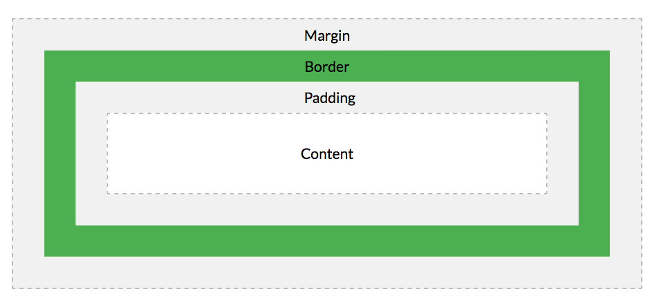
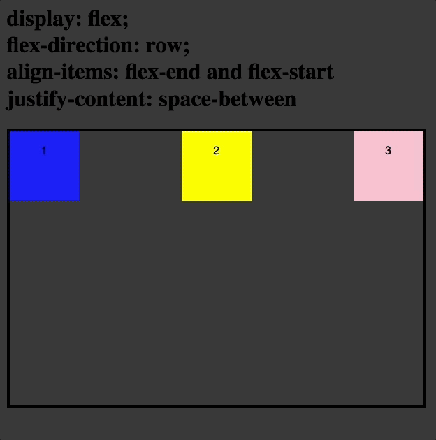
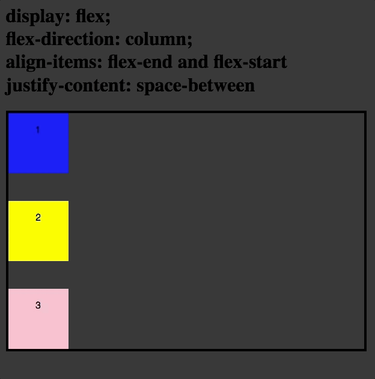
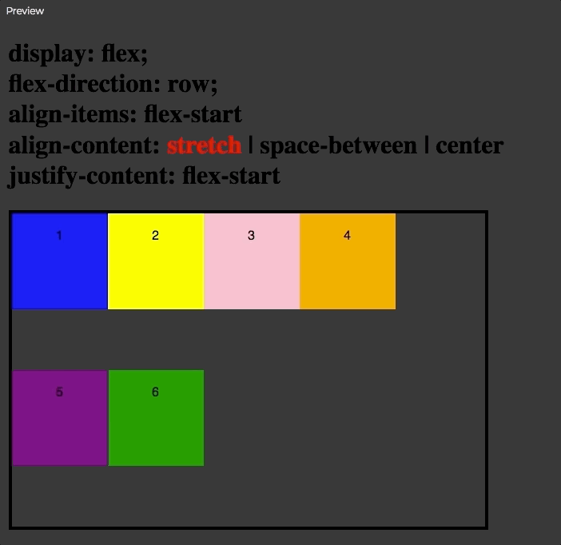
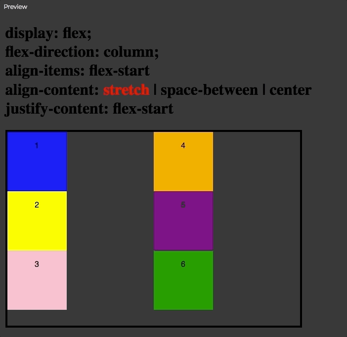
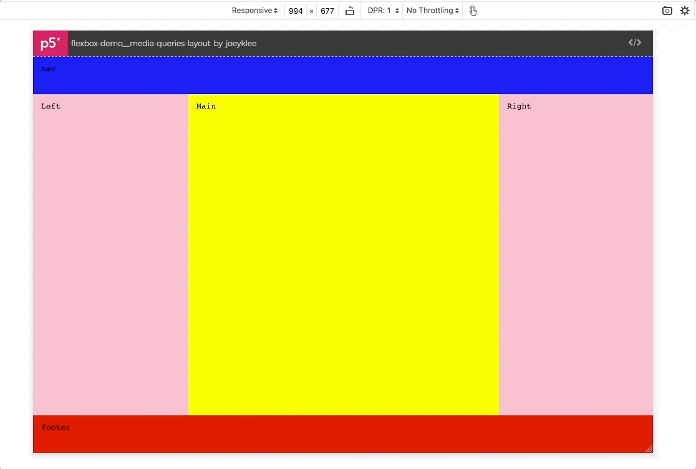

# CSS Guide

## Table of Contents

- [CSS Guide](#css-guide)
  - [Table of Contents](#table-of-contents)
  - [Quickstart](#quickstart)
  - [About](#about)
  - [HTML default styles and layouts](#html-default-styles-and-layouts)
  - [The CSS Box Model: Everything is a Box](#the-css-box-model-everything-is-a-box)
  - [CSS Selectors: naming the DOM with classes and IDs](#css-selectors-naming-the-dom-with-classes-and-ids)
  - [CSS Positioning:](#css-positioning)
    - [Absolute and Relative Positioning](#absolute-and-relative-positioning)
    - [Fixed Positioning](#fixed-positioning)
  - [Layouts: `inline` vs `block` Elements](#layouts-inline-vs-block-elements)
  - [Layouts: Flexbox](#layouts-flexbox)
    - [Flexbox essentials: parents of the flex](#flexbox-essentials-parents-of-the-flex)
    - [Flexbox essentials 1: what you need to know:](#flexbox-essentials-1-what-you-need-to-know)
    - [Flexbox essentials 2: also good to know](#flexbox-essentials-2-also-good-to-know)
    - [Flexbox essentials 3: children of the flex](#flexbox-essentials-3-children-of-the-flex)
    - [Quick flexbox reference: flexbox layouts](#quick-flexbox-reference-flexbox-layouts)
    - [Flexbox references:](#flexbox-references)
  - [Media Queries & Responsive Layouts](#media-queries--responsive-layouts)
    - [Media queries in action: `@media`](#media-queries-in-action-media)
    - [You don't need a framework](#you-dont-need-a-framework)
  - [BEM: Block Element Modifier](#bem-block-element-modifier)
    - [BEM References:](#bem-references)
  - [Supplementary -- Layouts: Grid](#supplementary----layouts-grid)
  - [Hot CSS Tips: 🔥](#hot-css-tips-%f0%9f%94%a5)
  - [CSS Recap:](#css-recap)
  - [CSS References:](#css-references)
- [Levelling up: Getting advanced with CSS and beyond](#levelling-up-getting-advanced-with-css-and-beyond)

## Quickstart

* See [Design for Developers - structuring the DOM and styling](https://www.taniarascia.com/design-for-developers/)


## About

Cascading Style Sheets (CSS). It's wonderful, it's horrible, it's the way we apply layout and style to our DOM. Love it or hate it, it's what we've got and frankly, it can feel like magic once you get an handle on it. With CSS you can create delightful animations, fancy hover effects, and dynamic and engaging visual interfaces. The trick is to practice, practice, practice and get a feel for the materiality of CSS as it interacts with HTML and JavaScript.

CSS can be broadly categorized by the properties that affect:

* **layout**: where things are on the page
  * `display`
    * `block`
    * `inline`
    * `inline-block`
    * `flex`
    * `grid`
    * `none`
  * `position`
    * `fixed`
    * `absolute`
    * `relative`
  * margins:
    * `margin`, `margin-top`,`margin-right`, `margin-bottom`, `margin-left`
* **aesthetics**: how an element looks
  * color:
    * `background-color`
    * `border`
  * typography:
    * `color`
    * `font-family`
    * `font-size`
    * `font-weight`
    * `line-height`
    * `letter-spacing`
  * size:
    * `width`
    * `max-width`
    * `min-width`
    * `height`
    * `max-height`
    * `min-height`
    * `box-sizing`
    * `padding`, `padding-top`,`padding-right`, `padding-bottom`, `padding-left`
  * shape:
    * `border-radius`

[Here is a good list of MINIMUM ESSENTIALS](https://www.taniarascia.com/overview-of-css-concepts/#css-properties) to be able to do anything with CSS. 

Those properties that can take a "length" or "size" value can be styled using different units:

The units you'll likely use most:
| unit  | description                                         | example                               |
| :---- | --------------------------------------------------- | ------------------------------------- |
| `px`  | absolute pixel units                                | `div { width: 32px; height: 32px }`   |
| `rem` | relative units to the font-size of the root element | `div { width: 2rem; height: 2rem }`   |
| `%`   | percentages                                         | `div { width: 50%; height: 50% }`     |
| `vw`  | relative to the view width                          | `div { width: 100vw; height: 200px }` |
| `vh`  | relative to the view height                         | `div { width: 100vw; height: 80vh }`  |

You can see the other absolute and relative units at the [W3 Schools Link on CSS Units](https://www.w3schools.com/CSSref/css_units.asp)


## HTML default styles and layouts 

Before we continue, I will take a second to explain that your web browser and different HTML elements have **default styles** associated with them.

For example all header tags like `h1`, `h2`, `h3` etc are all `block` level elements and take up 100% of the line that they are on. Other features like `button`s are styled with rounded borders, have a light grey background, and create the illusion of being depressed when clicked. `input` tags also have outlines and white backgrounds by default and sliders also come with their default styles as well. 

Some examples:

* **link tag**: by default they are blue with an underline
  * <a href="#">I'm a link tag</a>
* **block quote**: 
  * <blockquote>Block quotes have a mean left and right margin</blockquote>

You can see a list of those default values at the [W3 Schools - CSS Default Values Reference](https://www.w3schools.com/cssref/css_default_values.asp). 

It's helpful to know that different HTML elements have their default styling and as a result will affect your layout and views if you do not override them. 

If you want to have complete control over the the styles of your HTML elements, you can use the [CSS Normalize](https://necolas.github.io/normalize.css/) package to normalize all the CSS styles of all the HTML elements across different browsers.

## The CSS Box Model: Everything is a Box

> Everything is a box in HTML. CSS is about styling and arranging those boxes in beautiful ways.



According to the [W3 Schools -- CSS Box Model]():

> All HTML elements can be considered as boxes. In CSS, the term "box model" is used when talking about design and layout.
>
> The CSS box model is essentially a box that wraps around every HTML element. It consists of: margins, borders, padding, and the actual content. The image below illustrates the box model:
> 
> Explanation of the different parts:
> * **Content** - The content of the box, where text and images appear
> * **Padding** - Clears an area around the content. The padding is transparent
> * **Border** - A border that goes around the padding and content
> * **Margin** - Clears an area outside the border. The margin is transparent
> The box model allows us to add a border around elements, and to define space between elements. 

The **CSS Box Model** is concerned with ways of changing an element's:

  - `width`
  - `height`
  - `border`
  - `margin`
  - `padding`
  - `box-sizing: (border-box|content-box)`

How do we apply these style properties to our HTML elements? We can either apply these styles directly to the elements themselves e.g. `div` or `section` like this...

```html
<style>
section{
  width: 100%;
  height: 200px;
  border:1px solid black;
  margin: 0;
  padding: 20px;
  box-sizing:border-box;
  background-color: pink;
}

h1{
  color: white;
}
</style>

<section>
  <h1>How to make Cereal</h1>
  <p>Step 1: Pour your cereal, Step 2: Pour the Milk</p>
</section>
<section>
  <h1>How to Eat Cereal</h1>
  <p>Step 1: Spoon some cereal, Step 2: Put the spoon in your mouth, Step 3: Chew, Step 4: Swallow, Step 5: Repeat</p>
</section>
```


And we'd get: [Demo of CSS styling directly on elements](https://editor.p5js.org/joeyklee/sketches/ATi0hMSgC)


Notice how both sections are styled the EXACT same way.

Alternatively, we can apply CSS class names to our elements that allow us to apply different styles to the same elements...

```html
<style>
section{
  width: 100%;
  height: 200px;
  border:1px solid black;
  margin: 0;
  padding: 20px;
  box-sizing:border-box;
}

.bg-pink{
  background-color: pink;
}

.bg-yellow{
  background-color: yellow;
}

.title{
  font-size:32px;
}
.color-white{
  color:white;
}
.color-black{
  color:black;
}
</style>

<section class="section bg-pink">
  <h1 class="title color-white">How to make Cereal</h1>
  <p>Step 1: Pour your cereal, Step 2: Pour the Milk</p>
</section>
<section class="section bg-yellow">
  <h1 class="title color-black">How to Eat Cereal</h1>
  <p>Step 1: Spoon some cereal, Step 2: Put the spoon in your mouth, Step 3: Chew, Step 4: Swallow, Step 5: Repeat</p>
</section>
```


Notice how we have different class names (indicated by the dot `.` syntax followed by the name) that have been applied to your HTML elements. For example both `h1` tags with the `title` class BOTH are `font-size:32px` BUT one is colored `white` and the other is colored `black` given that they are given classes that apply the `color` property differently. We will cover more about **class specificity** in the section [CSS Selectors](#css-selectors-naming-the-dom-with-classes-and-ids) and discuss what it means to name HTML elements with classes and ids.

## CSS Selectors: naming the DOM with classes and IDs

There are many ways *6-ish* ways to select and apply styles to HTML elements. These are the:

| selector | description | example |
| :---      | ---         | --- |
Universal selector | selects all the things|  `* {padding:0;}`|
| Type selector | selects based on the element type (e.g. `div`, `h1`, etc)| `h1{font-size: 36px;}` |
| Class selector | selects based on the class name that has been applied to an element | `.title{color:pink}` |
| Attribute selector | selects based on an HTML attribute such as `type="text"` for form inputs or `target="_blank"` for `a` tags. | `[type="text"]{ border-radius: 4px}` | 
| ID selector |selects based on the ID name that has been applied to an element. | `#helloButton{ background-color:purple }`| 


As listed in [Tania Rascia's CSS Tutorial](https://www.taniarascia.com/overview-of-css-concepts/#css-selectors), we can target HTML elements by:

```css
* {
  /* Universal selector */
}

tag {
  /* Type selector */
}

tag::before {
  /* Type selector (psuedo element) */
}

.class {
  /* Class selector */
}

.class:hover {
  /* Class selector (pseudo class) */
}

[attr] {
  /* Attribute selector */
}

#id {
  /* ID selector */
}
```

A quirky thing about CSS is a concept called **specificity**. Again, in [Tania Rascia's CSS tutorial](https://www.taniarascia.com/overview-of-css-concepts/#css-specificity) she writes about CSS Specificity and how to keep track of how the style you try to apply take precendence depending on:
* **order** in the stylesheet
* and **heirarchy** in the specific-ness based on the id, class, and type as defined by CSS's rules on specificity.

Know that from now on, when you are styling your HTML elements, you will have to be meticulous and organized about how you organize your HTML elements structurally, how you apply the relevant class names appropriately, and sparingly apply ids only where absolutely necessary to achieve a layout and style that is readable, maintainable, and elegant. 

There are literally no rules aside from the ways that CSS handles specificty regarding how to structure your CSS which pretty much has made it a nightmare the the last X years. However, not to dispair, we have a section on the [BEM Convention](#bem-block-element-modifier) that seeks to create some guidelines to help us through this CSS ocean. 

Alternatively, you can use CSS Frameworks like [Bootstrap](https://getbootstrap.com/docs/3.3/css/), [Materialize](https://materializecss.com/getting-started.html), [Bulma](https://bulma.io/), or for the atomic CSS folks out there, [Tachyons](https://tachyons.io/) and trust that someone else has thought a lot about how to manage CSS better than you. I have to say though, coding your CSS from scratch is REALLY recommended so you can get a handle of the materiality of CSS and so that you can always produce the layouts that you want and not just what those frameworks can provide. 


## CSS Positioning: 

We should have a quick chat about CSS Positioning. When we talk about CSS positioning, what we're referring to is how HTML elements naturally **flow** on the document. 

[Tania Rascia's CSS Tutorial section on Positioning](https://www.taniarascia.com/overview-of-css-concepts/#layouts-positioning) does an excellent job explaining the `position` property of elements and how adjusting the `position` property from it's default `static` state to one that is either `relative`, `absolute`, or `fixed` come to affect the layout of your page. You should read Tania's tutorial section on CSS Positioning to understand how it all works. 

### Absolute and Relative Positioning

A few important notes are detailed below.
1. If you set `position:absolute` on a **child** element, then its **parent** element must be given the `position:relative` property. This is to say that, if you have a **child** element with absolute positioning, and you define `top|bottom` and `left|right`, you want to have that **child** element absolutely positioned **within** its **parent** container and NOT the document as a whole.


### Fixed Positioning

A few important notes are detailed below.
1. Great for sticky navigation
2. Great for creating Modal pop-ups
3. Elements with `position:fixed` are taken out of the flow and are positioned relative on the viewport. This means you must specify the properties:
   * `top|bottom: <value>`
   * `left|right: <value>`

As your HTML elements find a position on the page, whether they are defined by you are following the default flow of the page, the page layout and the position of items will depend on that element's `display` property. In the [Layout section on inline and block elements](#layouts-inline-vs-block-elements), we will start by looking at what it means when elements are displayed `inline` or `block` (or `inline-block`).


## Layouts: `inline` vs `block` Elements


As mentioned above, HTML elements come with default styles. As we begin to talk about layouts in CSS, we start our discussion at `inline` vs `block` level elements. 

In simple terms:

* `display:block`: makes an element a block level element which means it will take up the entire level that it exists on. Headers like `h1` and `h2` tags 
* `display:inline`: makes the element take up only as much space as the content within it, and it means that any other elements following it will try to fit themselves onto the the same line (assuming they are also `inline` elements). Inline elements like `input`, `button`, `a` tags are are examples of inline elements. The height and width of an`inline` element CANNOT be defined.
* `display:inline-block`: are similar to `inline` elements in that they only take up as much space as the content within them, HOWEVER, `inline-block` elements can take `height` and `width` definitions. 

A demo of these 3 display properties can be found here:

* ↳ [Block, Inline, Inline-Block Demo](https://editor.p5js.org/joeyklee/sketches/whr4o6F70)


In a more realistic scenario, you might want to try to format a page using just block and inline elements, and you'll start to see that, while powerful, you'll start to run into some limits. In the following demo, you'll see some new syntax that we've not talked about including references to:

* `transform: translate(<X>, <Y>)`
* `margin: 0 auto`
* pseudo classes for `<a>` tags such as `:active`, `:link`, `:visited`
* the `::after` pseudo class
* and `float:left` 
* `background-image: url()`

See the demo here:

* ↳ [CSS layout using block, inline-block, and float](https://editor.p5js.org/joeyklee/sketches/6pQmvN2Bs)


What is important to recognize is the existence of these properties and that we use them to create layouts when we're limited with our layout and positioning tools. To get around some of these limitations, there are more advanced and tried and true layout methodologies that you will master on your developer journey. These are `flexbox` and `grid`. In this course will focus on `flexbox`, but `grid` will no doubt be part of your CSS tool set as you continue to learn.

## Layouts: Flexbox


Flexbox! This is going to be the main focus of our discussion on CSS layouts. Why? Because, flexbox is:

* well supported across browsers,
* not hacky (e.g. using floats -- float:left, float:right, etc -- can be tricky)
* and it's well documented with lots of examples and resources to draw from. 


### Flexbox essentials: parents of the flex

### Flexbox essentials 1: what you need to know:

* `display:flex` 
  * sets the parent DOM element as a **flexbox** container. By default, if the `flex-direction` property is not set, your DOM element will be set to  `flex-direction:row`.
* `flex-direction: (row|column)` 
  * a flexbox container can organize it's child elements either **horizontally** as a `row` or **vertically** as a `column`. Setting the `row` or `column` defines the **main axis**. How the child elements are **aligned** or **justified** will depend on the the **main axis**. 
* The power of flexbox container lies in it's ability to:
  * **justify** how those child elements are distributed *along the defined main axis* and to
  * * **align** the child elements *perpendicular to the defined main axis* (aka the **cross axis**).

Let's take a look at what this means. 

When your parent flexbox container is set to: `flex-direction:row`, 
* your **main axis** is going in the *horizontal* direction
* your **cross axis** is going in the *vertical* direction
* This means that:
  * `justify-content:(flex-start | flex-end | center | space-between | space-around | justify-between)` will change how your items are distributed *horizontally*. In the gif below, the content is justified with space between each item. 
  * `align-items:(flex-start | flex-end | center | space-between | space-around | justify-between)` will change how your your items are distributed *vertically*. In the gif below, the items are switching between `flex-start` (the the vertical start of the row) and `flex-end` (the vertical end of the row).
  
  

When your parent flexbox container is set to: `flex-direction:column`, 
* your **main axis** is going in the *vertical* direction
* your **cross axis** is going in the *horizontal* direction
* This means that:
  * `justify-content:(flex-start | flex-end | center | space-between | space-around | justify-between)` will change how your items are distributed *vertically*. In the gif below, the content is justified with space between each item. 
  * `align-items:(flex-start | flex-end | center | space-between | space-around | justify-between)` will change how your your items are distributed *horizontally*. In the gif below, the items are switching between `flex-start` (the the horizontal start of the column) and `flex-end` (the horizontal end of the column).
  
  

### Flexbox essentials 2: also good to know

You can get pretty far by knowing what is in the [flexbox essential 1 section](#flexbox-essentials-1-what-you-need-to-know), however, there's more! 

**What if I want my elements to wrap in a flex container?**

You can specify: `flex-wrap: (nowrap | wrap | wrap-reverse)` on your flex container.

A flex container knows when it's child elements have wrapped onto multiple rows or columns. When you are working with flex containers where elements are **wrapping** onto **multiple** rows or columns, you will have to use **align-content** & **justify-content** appropriately depending on what you've defined as your **main axis**. 

As we did above, let's look at what happens when we change our **main axis** but change how the **align-content** property.

When your parent flexbox container is set to: `flex-direction:row`, and `flex-wrap: wrap`:

* your **main axis** is going in the *horizontal* direction
* your **cross axis** is going in the *vertical* direction
* This means that:
  * `align-content:(stretch | flex-start | flex-end | center | space-between | space-around | justify-between)` will change how each row of content is distributed within the flex container.
  
  

When your parent flexbox container is set to: `flex-direction:column`, and `flex-wrap: wrap`: 

* your **main axis** is going in the *vertical* direction
* your **cross axis** is going in the *horizontal* direction
* This means that:
  * `align-content:(stretch | flex-start | flex-end | center | space-between | space-around | justify-between)` will change how each column of content is distributed within the flex container.
  
  

### Flexbox essentials 3: children of the flex

So far we've been talking specifically about the flex container -- the parent -- and we've seen how setting different properties on the parent container affect the children elements within it. 

It turns out that the children of a flex container can take on special properties that affect their **size**, **order**, and **position**.

* **properties that affect flexbox children's size**
  * `flex-grow: <integer>`
  * `flex-shrink: <integer>`
  * `flex-basis: ( rem| % | auto)`

* **properties that affect flexbox children's order**
  * `order: <integer>`

* **properties that affect flexbox children's position**
  * `align-self: (auto | flex-start | flex-end | center | baseline | stretch);`

See: [CSS Tricks - A Guide to Flexbox, "Properties of the Children"](https://css-tricks.com/snippets/css/a-guide-to-flexbox/) to see how these properties of flexbox children take shape.


### Quick flexbox reference: flexbox layouts

* [vertically centering things](https://editor.p5js.org/joeyklee/sketches/4pHlQa7KT)
* [the holy grail](https://editor.p5js.org/joeyklee/sketches/pl_3cVLuM)


### Flexbox references:
* [CSS Tricks - A Guide to Flexbox](https://css-tricks.com/snippets/css/a-guide-to-flexbox/)
* [Flexbox Froggy Game](https://flexboxfroggy.com/)


## Media Queries & Responsive Layouts


Responsive design, whut whuuuut. In our modern web world, with so many different devices and screen sizes, responsive design is the name of the game. 

Luckily, CSS gives us the ability to apply different styles depending on the size of the screen or the device being used through **media queries**. You can learn more about the intricacies of CSS media queries later on, but for now, here's the general workflow.

For a desktop first layout (as opposed to mobile first):

* Step 1: define your CSS styles as you would normally based on the browser window of your computer. 
* Step 2: identify **screen size breakpoints** where you've identified where your web page styles start to break down or otherwise look cluttered or for lack of better words, "not good". Common break points:
  * small devices: < `600px`
  * small tablets and large phones: `768px`
  * laptops and big tablets: `992px`
  * large laptops/large screens: `1200px`
* Step 3: begin applying **media queries** based on those breakpoints throughout your stylesheet. 

### Media queries in action: `@media`

The way media queries work is by defining a **lower** and **upper** boundary for the size of screen that your styles should apply to. 

**Changing the typography size:**

* ↳ [CSS Media Query Demo - changing the title size](https://editor.p5js.org/joeyklee/sketches/s-zkOMFOZ)


**Changing the layout:**

* ↳ [CSS Media Query Demo - changing the layout](https://editor.p5js.org/joeyklee/sketches/2qOSdoNzr)



### You don't need a framework

* [You don't need a framework for responsive design](https://www.taniarascia.com/you-dont-need-a-framework/)


## BEM: Block Element Modifier

By now you've probably looked a bunch of the CSS code and the HTML and thought, "wow, what a mess!" If you haven't, then kudos, you're like a superhuman. For the rest of us, the HTML/CSS mashup can be tricky to read, write, and maintain. Without best practices and good conventions and otherwise just a compass to follow, the arbitrariness of how to structure and identify HTML elements with CSS can be totally overwhelming and confusing. 

SO, somewhere out there in the big 'ol universe, someone came up with what is called BEM or the Block-Element-Modifier convention for CSS naming and HTML structuring. 

The basic premise is that your frontend is composed of **blocks** of HTML. Within those blocks, you have **elements**. Those **blocks** and **elements** can be given **modifiers** which act add additional styling to that **block** or **element** that is appended to. 

You can read more about how to logically separate out what is a **block** vs an **element** vs a **modifier** at this [Introduction to BEM](http://getbem.com/introduction/).

As a quick example, let's take a look below. You'll notice that:
* every HTML object receives a `class` name. 
* a **block** is usually the parent container and is implemented like so: e.g. `class="header"`
* a **element** is an element that is reliant on the block and is implemented like so: e.g `class="header__title"`
* a **modifier** is an flag that changes the style of an element or block and is implemented like so: e.g. `class="header__title header__title--pink` or `class="header header--pink`.

We have a header **block**, and a **title** element, with a pink **modifier**.
```html
<body>
  <!-- our block -->
  <header class="header">
    <!-- our element with a modifier-->
    <h1 class="header__title header__title--pink">Vancouver, I love you.</h1>
  </header>
</body>
```

```css
/* our block is a 200px tall and 100% wide that aligns all the elements to the center */
.header{
  display:flex;
  flex-direction: row;
  align-items:center;
  justify-content:center;
  width:100%;
  height:200px;
}

/* our &__title element of our header */
.header__title{
  font-size: 3rem;
}
/* our title modifier */
.header__title--pink{
  color:pink;
}
```

As outlined beautifully in this article [BEM by example](https://seesparkbox.com/foundry/bem_by_example) is to resist the temptation to create complex nested BEMs with infinity underscores separating elements. (I'll admit I've broken this rule too many times and regret it every single time). Keep your BEM organized and shallow, so you can keep track of the way your styles are being applied, but don't feel like this is a hard and fast rule. Rules are (sometimes) meant to be broken. 

via [BEM by example](https://seesparkbox.com/foundry/bem_by_example) - this example does a good job expressing best practices for shallow naming for BEM. As you see the BEM convention across the web, you'll see that it isn't always so simple to keep things shallow, but you should try!
```html
<!-- DO THIS -->
<figure class="photo">
  
  <figcaption class="photo__caption">
    <blockquote class="photo__quote">
      Look at me!
    </blockquote>
  </figcaption>
</figure>

<style>
  .photo { }
  .photo__img { }
  .photo__caption { }
  .photo__quote { }
</style>


<!-- DON'T DO THIS -->
<figure class="photo">
  
  <figcaption class="photo__caption">
    <blockquote class="photo__caption__quote"> <!-- never include more than one child element in a class name -->
      Look at me!
    </blockquote>
  </figcaption>
</figure>

<style>
  .photo { }
  .photo__img { }
  .photo__caption { }
  .photo__caption__quote { }
</style>
```

### BEM References:
* [Get BEM](http://getbem.com/introduction/)
* [Maintainable CSS With BEM](https://www.integralist.co.uk/posts/bem/#4)
* [‘Why BEM?’ in a nutshell](https://blog.decaf.de/2015/06/24/why-bem-in-a-nutshell/)
* [BEM by example](https://seesparkbox.com/foundry/bem_by_example)

## Supplementary -- Layouts: Grid


We are not going to go into CSS grid here in detail, but you should know that CSS grid is quite likely going to be part of your future as a web developer. The major innovation of CSS grid is that, for the first time, you can now create 2-D layouts. This is big! With all the other CSS layout properties, we were only given the ability to create 1-D layouts that we puzzeled together in creative ways. Now with `grid` you can:

On your parent element, specify:
* the number of columns, 
* the number of rows,
* the gap between columns,
* the gap between rows,

And on your children elements, specify:
* how many columns and rows each child element should fill

In the end, using CSS grid can be verbalized like,
> "I want a 3 column grid, with 8 rows. 
> 
> In the first 2 rows, I want my header to occupy all 3 columns. 
> 
> In the next of the 4 rows, I want to have on the left, an area for an aside element that takes up 1 column, and a main element that takes up 2 columns.
> 
> Last, I want a footer element that up the last 2 rows and occupies all 3 columns."


In CSS Grid, this would look like:

```html
<html>
  </head>
    <style>
        *{
          box-sizing:border-box;
          margin:0;
          padding:0;
        }
        html, body{
          width:100%;
          height:100%;
        }
        #app{
          width:100%;
          height:100%;
          display:grid;
          grid-template-columns: 1fr 1fr 1fr;
          grid-template-rows: repeat(8,1fr); /* also: 1fr 1fr 1fr 1fr 1fr 1fr 1fr 1fr */
          grid-row-gap: 1rem;
          grid-column-gap: 1rem;
        }
        .header{
          grid-column-start: 1;
          grid-column-end: 4;
          grid-row-start: 1;
          grid-row-end: 3;
          background-color: blue;
        }
        .aside{
          grid-column-start: 1;
          grid-column-end: 2;
          grid-row-start: 3;
          grid-row-end: 7;
          background-color: yellow;
        }
        .main{
          grid-column-start: 2;
          grid-column-end: 4;
          grid-row-start: 3;
          grid-row-end: 7;
          background-color: red;
        }
        .footer{
          grid-column-start: 1;
          grid-column-end: 4;
          grid-row-start: 7;
          grid-row-end: 9;
          background-color: pink;
        }
    </style>
  </head>
  <body>
    <div id="app">
    <header class="header"></header>
    <aside class="aside"></aside>
    <main class="main"></main>
    <footer class="footer"></footer>
    </div>
  </body>
</html>
```

There's a lot more to know about CSS grid, but hopefully you can see how grid can be helpful for creating 2D layouts in the browser.

Some CSS Grid references: 
* [NYT Open, CSS Grid for Designers](https://open.nytimes.com/css-grid-for-designers-f74a883b98f5)
* [CSS Grid generator](https://cssgrid-generator.netlify.com/)


## Hot CSS Tips: 🔥

- CSS Tips and Advice
  - Don't use floats for layout because they can be confusing. Only use them to wrap text around another element.
  - Only use classes (and sometimes tag names for more general styles) to apply styles to elements.
  - `vertical-align: middle` doesn't do what you think it does.
  - Almost always use `* { box-sizing: border-box }`
  - units: `em`, `rem`, `px` ==> I'd always go for `rem` if possible.
  - Using `rem`s is sometimes hard because designs are usually in pixels, and since the default font size is 16px, then 1rem = 16px, You can make this easy on yourself by setting the font-size in html to be `62.5%`:
    ```css
    html{
      font-size: 62.5%;
    }
    ```
    then 1rem = 10px, 2rem = 20px, and so on.


* these references are GOLD:
  * Design for Developers: https://www.taniarascia.com/design-for-developers/
  * You don't need a CSS Framework: https://www.taniarascia.com/you-dont-need-a-framework/
  * CSS: An Art, A Science, a Nightmare (Everything you should know): https://www.taniarascia.com/overview-of-css-concepts/
  * CSS Units for font-size: https://medium.com/code-better/css-units-for-font-size-px-em-rem-79f7e592bb97

## CSS Recap:

* what we learned:
  * CSS can be broadly categorized by **layout** and **aesthetics**
  * In HTML everything is a box and CSS is all about styling those boxes(the box model) 
  * CSS positioning allows us to define whether our "boxes" are positioned absolute, relative, or fixed. 
  * While there are cases in which absolute positioning and fixed positioning come in handy, we almost always build our our layouts with out "boxes" relative to eachother and as a result we have to figure out ways of achieving complex and beautiful layouts with using any combination of: `display:(block|inline|inline-block|flex|grid)`
  * BEM is a convention that helps us to keep our CSS and HTML readable and maintainable. 

## CSS References:
* http://learnlayout.com/
* https://flukeout.github.io/
* https://flexboxfroggy.com/
* https://codepip.com/games/grid-garden/ 
* Introduction to the DOM: https://www.taniarascia.com/introduction-to-the-dom/
* Basic HTML File: https://www.taniarascia.com/basic-html5-file/
* Design for Developers: https://www.taniarascia.com/design-for-developers/
* You don't need a CSS Framework: https://www.taniarascia.com/you-dont-need-a-framework/
* CSS: An Art, A Science, a Nightmare (Everything you should know): https://www.taniarascia.com/overview-of-css-concepts/

***
***
***

# Levelling up: Getting advanced with CSS and beyond

Some topics to explore:

* CSS DevOps
  * [CSS normalization]() for consistency of styles across browsers
  * [CSS pre-processors]() for supporting CSS syntax across different browser types and across browser versions
  * [CSS Build Tools and SASS/SCSS]() for a more powerful, readable, and maintainable CSS experience.
* CSS Features:
  * [CSS Animations]()
    * transitions
    * keyframe animations
  * [CSS Pseudo Classes]()