# Database Services Guide

## About

This is a guide to some database services that can be a database hosting service. 

## Table of Contents

- [Database Services Guide](#database-services-guide)
  - [About](#about)
  - [Table of Contents](#table-of-contents)
  - [Services](#services)
  - [MongoDB Atlas](#mongodb-atlas)
    - [What is MongoDB Atlas?](#what-is-mongodb-atlas)
    - [Setting up MongoDB Atlas](#setting-up-mongodb-atlas)
      - [Register](#register)
      - [Create a new project](#create-a-new-project)
      - [Create a cluster](#create-a-cluster)
      - [Manage your connections](#manage-your-connections)
      - [Choosing a connection method](#choosing-a-connection-method)
    - [Glitch & MongoDB Atlas: Whitelist all IP Addresses](#glitch--mongodb-atlas-whitelist-all-ip-addresses)
    - [Examples](#examples)
  - [Firebase:](#firebase)

## Services

| Name | Database |  Upsides | Downsides | Cost | 
| :--- | --- |  --- | --- | --- | 
| [MongoDB Atlas](https://www.mongodb.com/cloud/atlas) | MongoDB |  --- | --- | [Freemium / Pay-as-you-go](https://www.mongodb.com/cloud/atlas/pricing) | 
| [Firebase](https://firebase.google.com/) | Firebase by Google |  --- | --- | [Freemium / Pay-as-you-go](https://firebase.google.com/pricing) | 


## MongoDB Atlas

### What is MongoDB Atlas?

MongoDB Atlas is a database as a service. MongoDB, the company behind the MongoDB database provides a service that allows you to deploy scalable database servers on the web. 

As written on their website:
> MongoDB Atlas is the global cloud database service for modern applications. Deploy fully managed MongoDB across AWS, Azure, or GCP. Best-in-class automation and proven practices guarantee availability, scalability, and compliance with the most demanding data security and privacy standards. Use MongoDB's robust ecosystem of drivers, integrations, and tools to build faster and spend less time managing your database.

We recommend using a database as a service provider like MongoDB Atlas because database management is tough and requires a whole different set of training and skills that are part of the DevOps engineering universe. By using databases as a service you can sleep slightly better at night knowing that quite likely the service is doing a better job at managing the databases, security, etc than if you had to do everything on your own. That being said, if you're a database person and you know about this stuff, then you're welcome to roll your own solution. For most people, using a database service is the right way to go.

### Setting up MongoDB Atlas

These steps will take you through how to set up MongoDB Atlas and point you to tips to get your Express applications up and running.

#### Register

* Register an account with [MongoDB Atlas](https://www.mongodb.com/download-center).
  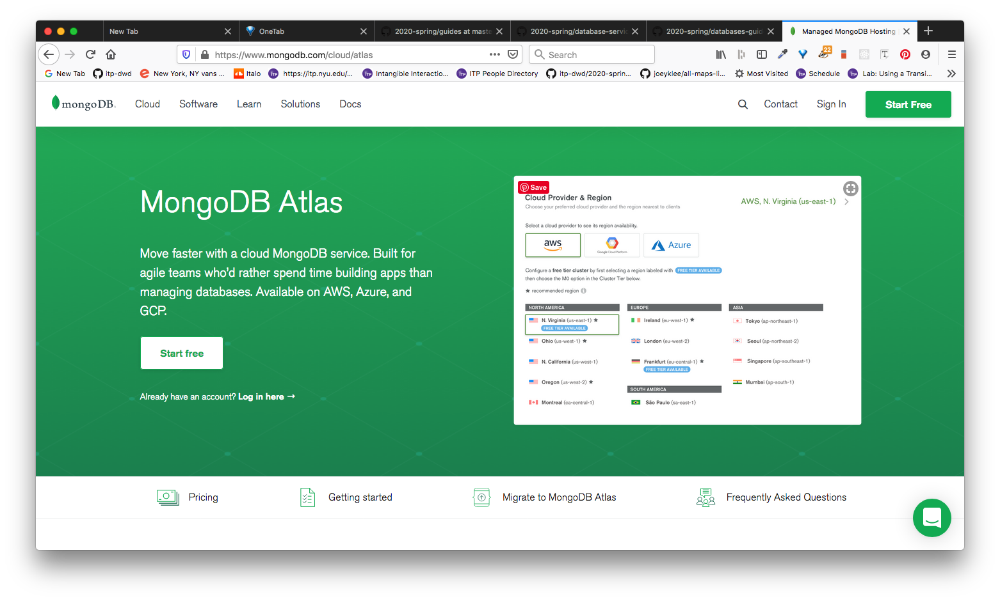

* Accounts are free / pay-as-you-go
  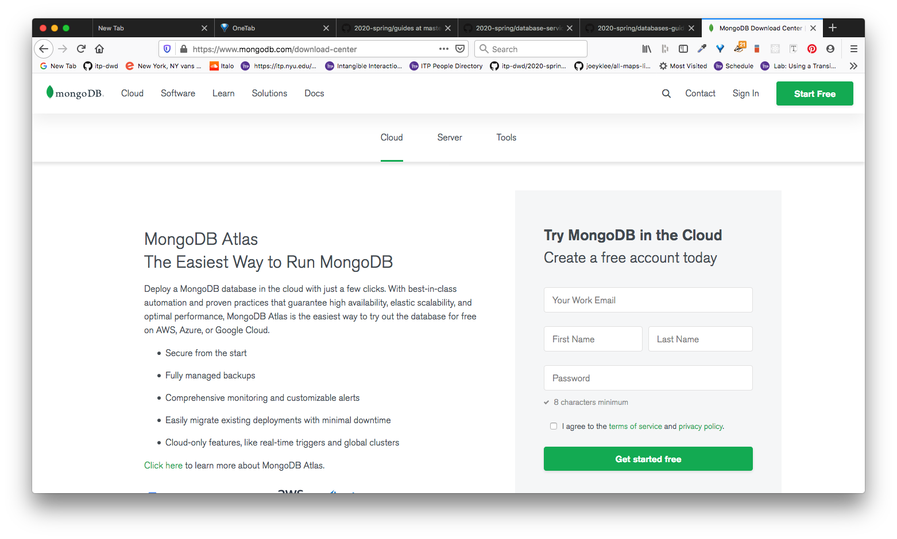

#### Create a new project

* In your admin panel, you will **create a new project**.
  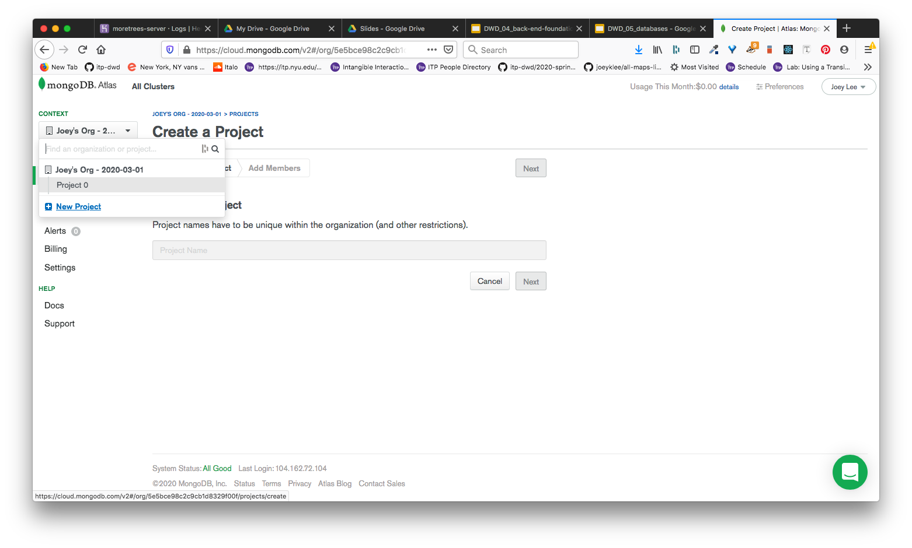

* Name the project something meaningful.
  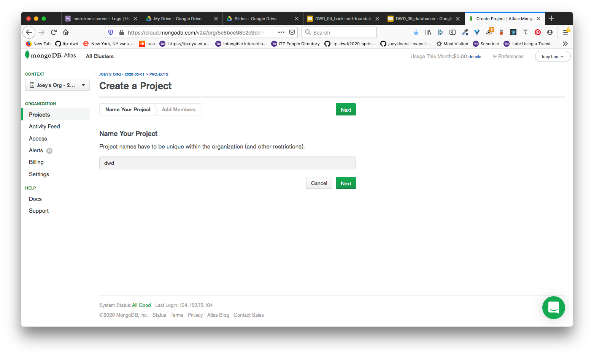

* Confirm: **create project**
  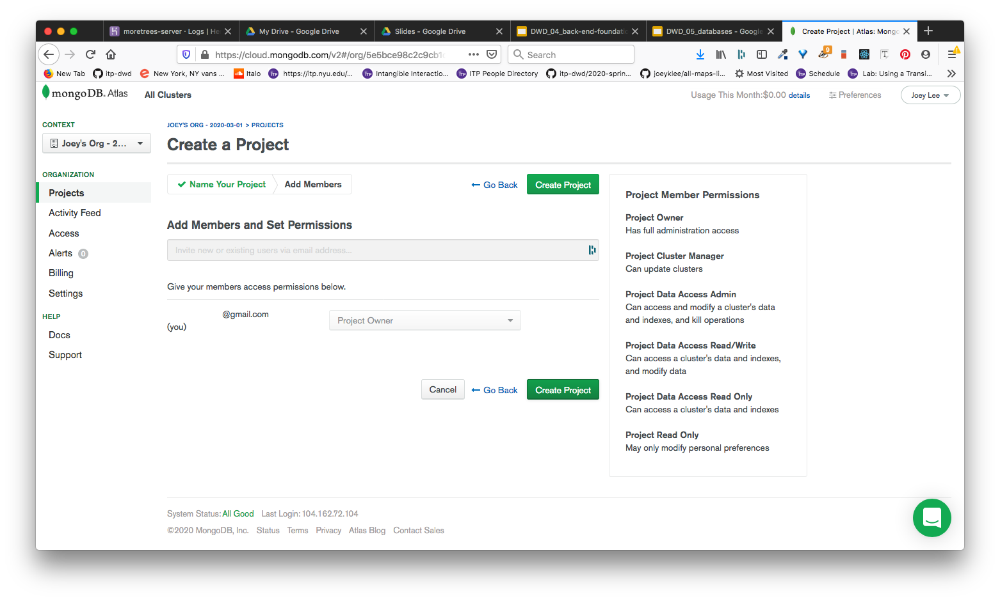

#### Create a cluster

* In your empty project, you will **build a cluster** - this is referring to a database cluster.
  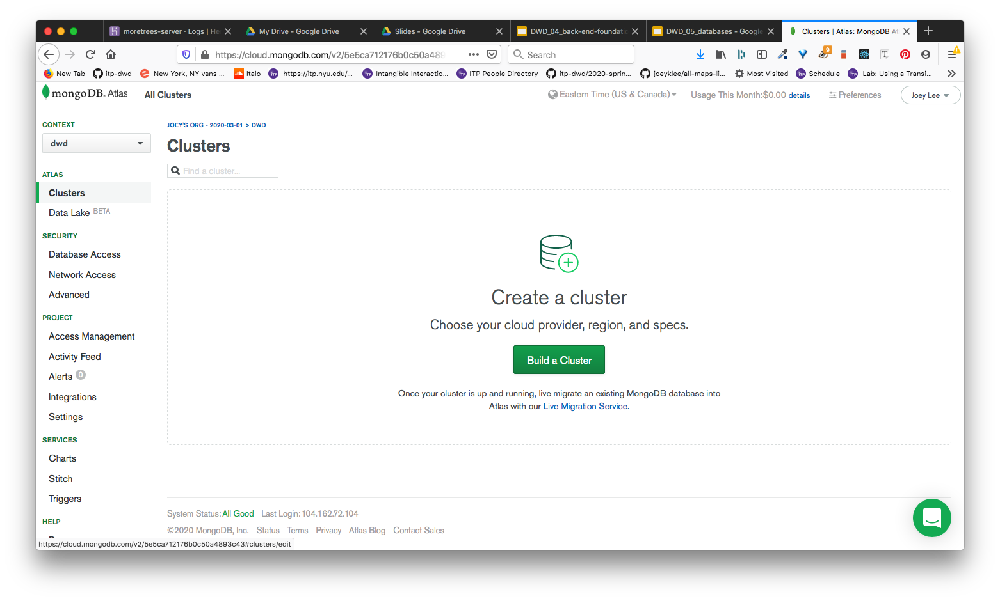

* Select the: free **starter clusters** - great for prototyping and testing
  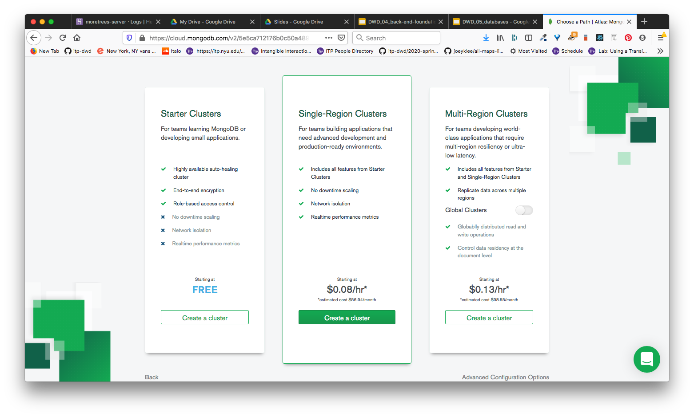

* Select the cloud provider whose infrastructure your MongoDB server instance will be hosted by. In this case, I chose "google cloud", but AWS and Azure are probably also fine. Also select the **region** - it is recommended that you select the region closest to where you expect your main traffic to be coming from (e.g. if you are in the US, then probably a US based server makes sense).
  

* Name the cluster
  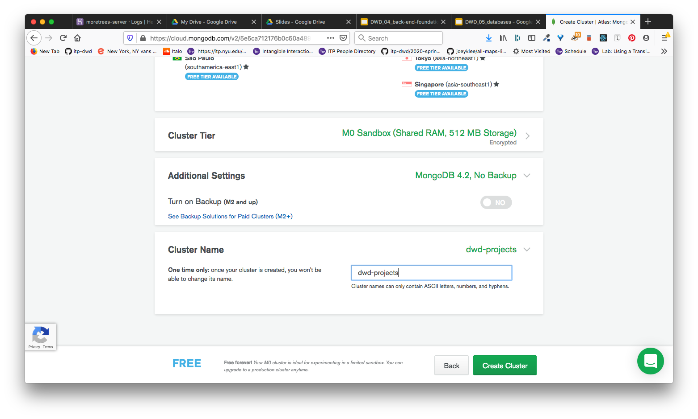

#### Manage your connections
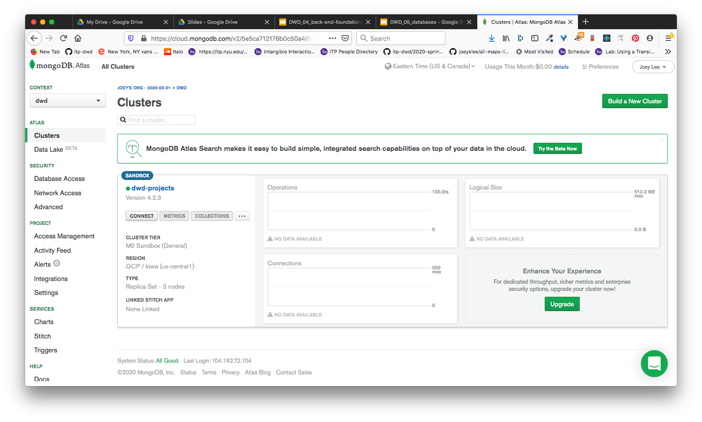
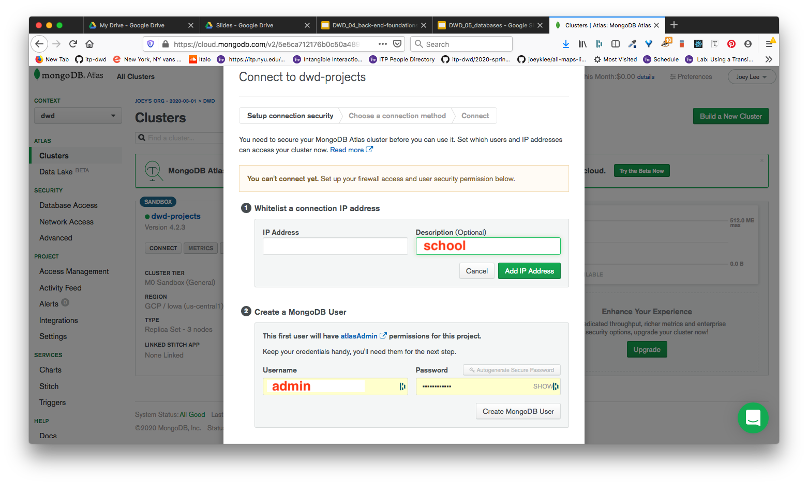
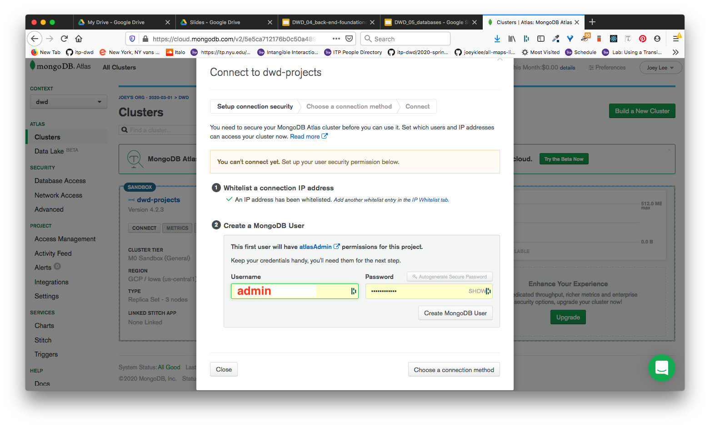

#### Choosing a connection method

* **Whitelist your IP Address**: this step is to add the IP address from the place you are looking to make database connections with. For example, your home has an IP address from which you connect to the internet. You can add that in here so that MongoDB Atlas knows not to block incoming connections from that IP Address.
* **Add a user**: this is important. You will add a database "user" which will be essential for when you connect to your database from your server-side Express.js application. By adding you **username** and **password** you will be able to connect remotely via Node.js from another server. This username and password become rolled into the URL of the MongoDB Atlas database you've just created.
  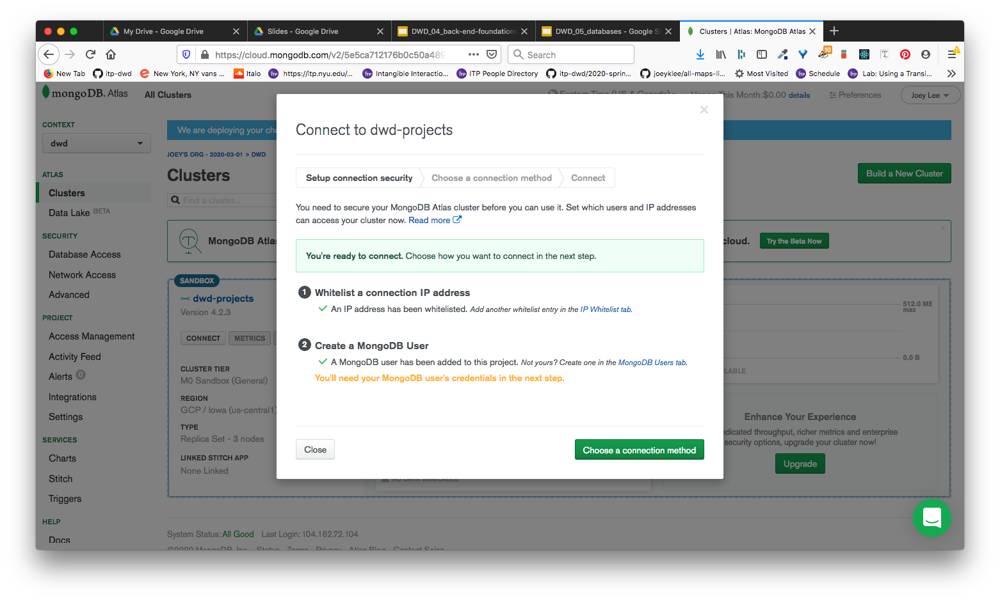

  * NOTE: you can later [whitelist all IP Addresses for use in Glitch](glitch--mongodb-atlas-whitelist-all-ip-addresses)

* Behold! The MongoDB Atlas URL to your database! You can use this URL to connect from your Express.js application.
  

  * In your Express app, you can now set the actual MongoDB Atlas URL in your .env file. During testing your mongodb was quite likely set to a local instance of mongo:
    ```
    mongodb://localhost:27017/empty-tree-db
    ```
  * with your new fancy schmancy mongodb atlas URL. In your `.env` file, you can define:
    ```
    MONGODB_URI=mongodb+srv://dwd-admin:<password>@dwd-projects-ksn8b.gcp.mongodb.net/<NameOfYourCollection>?retryWrites=true&w=majority
    ```
    * where:
      * `<password>`: is the password you defined earlier
      * `<NameOfYourCollection>`: is the name of your collection. The default is set to `test`, so if you created a collection called `empty-tree-db`, then your URL would look like: 
        ```
        mongodb+srv://dwd-admin:<password>@dwd-projects-ksn8b.gcp.mongodb.net/empty-tree-db?retryWrites=true&w=majority
        ```

### Glitch & MongoDB Atlas: Whitelist all IP Addresses

The thing with MongoDB Atlas is that it wants you to whitelist IP addresses for security reasons. However, [Glitch.com]() uses a *range of IP addresses* so there's not really a good way to tell MongoDB Atlas which IP address to allow connections to. This is documented in this thread on ["What IPs must I whitelist so my Glitch Project cna access my MongoDB Database"](https://support.glitch.com/t/what-ips-must-i-whitelist-so-my-glitch-project-can-access-my-mongodb-database/7617/8). 

However, there is one solution to this which is to whitelist ALL IP addresses:

* Go to your **network access tab**, select **add IP address**:
  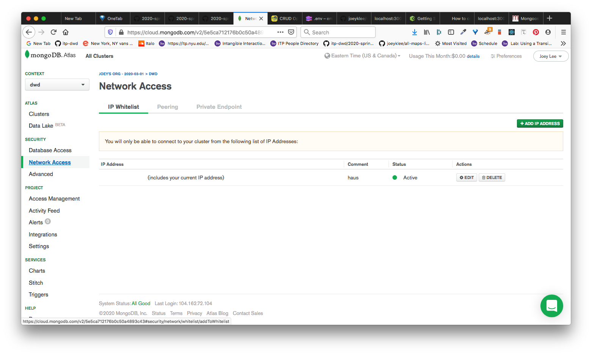
* Add `0.0.0.0/0` which will add all IP addresses:
  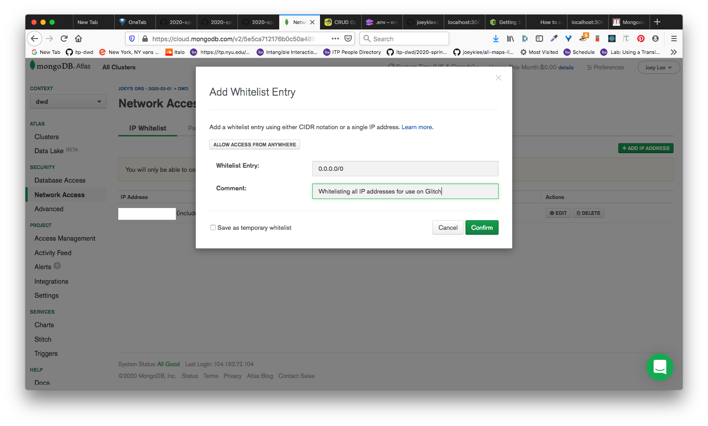
* Confirming adding all IP addresses
  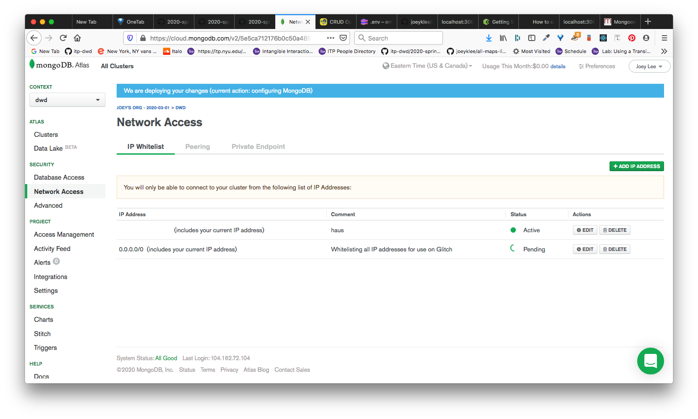

### Examples

* [Sample App: Empty Tree Database](https://glitch.com/edit/#!/empty-tree-db-mongodb?path=index.js:68:11) | [Demo](https://empty-tree-db-mongodb.glitch.me/)
  * Some highlight points:
    * `config.js`:
      ```js
      require('dotenv').config();
      module.exports = {
        PORT: process.env.PORT || 3000,
        MONGODB_URI: process.env.MONGODB_URI || 'mongodb://localhost:27017/empty-tree-db',
      }
      ```
    * `.env`:
      ```
      MONGODB_URI='mongodb+srv://dwd-admin:<yourpassword>@dwd-projects-ksn8b.gcp.mongodb.net/empty-tree-db?retryWrites=true&w=majority'
      ```


## Firebase:
* Flavio Copes has a great tutorial on this:
  * https://flaviocopes.com/firebase-firestore/
  * https://flaviocopes.com/firebase-hosting/

