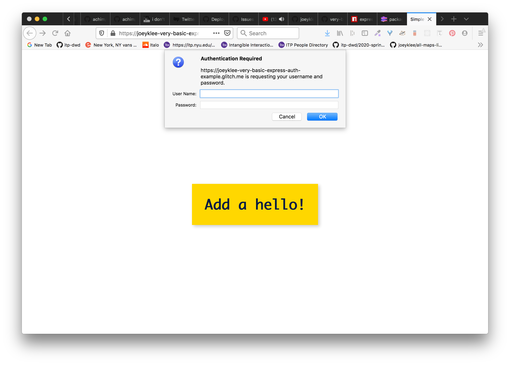

# Express Basic Auth Guide

- [Express Basic Auth Guide](#express-basic-auth-guide)
  - [About](#about)
  - [So you want users?](#so-you-want-users)
  - [Express basic Auth: A minimal (temporary) solution](#express-basic-auth-a-minimal-temporary-solution)
    - [Setup](#setup)
    - [Configurations](#configurations)
    - [Write your server code to index.js](#write-your-server-code-to-indexjs)
    - [Fill out your views](#fill-out-your-views)
    - [Fill out your clientside javascript](#fill-out-your-clientside-javascript)
    - [Test your app:](#test-your-app)
    - [Upacking the authorization step](#upacking-the-authorization-step)
  - [Multiple users?](#multiple-users)
    - [List of users](#list-of-users)
  - [References](#references)
  - [Further exploration](#further-exploration)

## About

This is an example of setting up a basic "challenge auth" with `express-basic-auth` package. This will add a "really thin" layer authentication and authorization layer around your web application which requires users to "log in" before using your application or specific routes on your API.

Note: this is by no means a replacement for handling authentication and authorization on a more robust level with things like password hashing, JWT tokens, etc. 

## So you want users?

So let's say that you work at the MTA and you're building a new application that helps commuters to better access the real-time transit data for their commute from home to work. In the app, people can save their home location and their work location and set the timing for when they usually travel to and from home and work. 

In order to build this application, you'll need to have a database of users that stores details about your users like their username, email, and a password (never store raw, plain-text passwords -- always be hashing!). By creating a users database and the appropriate API endpoints for people to POST their data to your API, you can allow people to:
1. **Register** with your application - people can create an account on your service that is stored to the users database that includes their username, email, and password (again, never store plain-text passwords, always be hashing!)
2. **Authenticate** their identity before using your application - on arrival to your application, people can log-in to your application by submitting their username/email and password and your server will be programmed (by you of course!) to match their username/email and password against your users database to deem whether or not that person's log-in details are correct. 
3. Be **Authorized** to perform certain actions - It is one thing to be logged in (authenticated) but it is another thing to have the permissions to do certain things in your application. Probably you don't want me to be able to change your settings and preferences and I certainly don't want you to be able to see where I live and go to work. Therefore, you'll need to add methods to **authorize** certain actions based on who is making the requests to your API.

Those are the key, conceptual components of supporting users in an application. Other essentials to supporting users include:
1. user verification and password resetting using automated email
2. password reset
3. log out
4. password verification - password hashing and unhashing 
5. And much more!


In this short guide, we are going to take a look at adding authentication and authorization to a web application. "Proper" user authentication and authorization is HARD and requires a lot of care, so with this in mind, I outline what this guide is and what this guide is not below.

What this guide is:
1. a conceptual and technical introduction to authentication and authorization using the `express-basic-auth` npm module best suited for prototyping or for small scale situations in which you want to password protect your application during development.
2. a gross simplification of the important needs and considerations for setting up a **complete** authentication and authorization functionality for a web application.

What is guide is not:
1. A definitive guide on user authentication and authorization. You can read about some of the [challenges to these kinds of tutorials here](https://hackernoon.com/your-node-js-authentication-tutorial-is-wrong-f1a3bf831a46)
2. a secure way of handling user data

## Express basic Auth: A minimal (temporary) solution

`express-basic-auth` is an Express.js module that is a "Simple plug & play HTTP basic auth middleware for Express."




### Setup

1. Create your project
     ```sh
     ~ $ mkdir Desktop/hello-app
     ~ $ cd Desktop/hello-app
     (hello-app) $ npm init
     ```
2. Install your dependencies. Note our `express-basic-auth` package.
   ```sh
   (hello-app) $ npm install dotenv express express-basic-auth nedb
   ```
   and install your `nodemon` devDependency
   ```sh
   (hello-app) $ npm install nodemon -D
   ```
3. Scaffold your project directories
   ```sh
   (hello-app) $ mkdir views public public/js public/styles db
   ```
4. Scaffold your project files
   ```sh
   (hello-app) $ touch index.js .env .gitignore config.js db/hellos views/index.html public/js/main.js public/styles/main.css
   ``` 

### Configurations

1. **.env**: 
   ```
   # YOU SHOULD CHANGE THESE
   USERNAME=admin
   PASSWORD=secret
   ```
2. **config.js**
   ```js
   require('dotenv').config()
   module.exports = {
       USERNAME: process.env.USERNAME,
       PASSWORD: process.env.PASSWORD,
       PORT: process.env.PORT || 3000,
       NEDB_URI: process.env.NEDB_URI || './db/hellos'
   }
   ```
3. **package.json**
   ```json
   {
     "name": "hello-app",
     "version": "1.0.0",
     "description": "",
     "main": "index.js",
     "scripts": {
       "start":"node index.js",
       "dev": "nodemon index.js"
     },
     "author": "",
     "license": "ISC",
     "dependencies": {
       "dotenv": "^8.2.0",
       "express": "^4.17.1",
       "express-basic-auth": "^1.2.0",
       "nedb": "^1.8.0"
     },
     "devDependencies": {
       "nodemon": "^2.0.2"
     }
   }
   ```
4. **.gitignore**:
   ```
   node_modules
   .env
   db/db
   ```

### Write your server code to index.js

In **index.js**:
```js
const express = require('express');
const fs = require('fs');
const path = require('path');
const nedb = require('nedb');
const basicAuth = require('express-basic-auth');
const app = express();

/****************************
 * your config will grab your approved USERNAME and PASSWORD from your .env
 ****************************/
const config = require('./config');

/****************************
 * your nedb
 ****************************/
// load up nedb
const db = new nedb({ filename: config.NEDB_URI, autoload: true });

/****************************
 * setting up important middleware functionality
 ****************************/
// Handling JSON data
app.use(express.json());
app.use(express.urlencoded({ extended: true }));

// setting your static items routes to public
app.use(express.static(path.resolve(__dirname, 'public')));

/****************************
 * your authentication
 ****************************/
const challengeAuth = basicAuth({
  authorizer: myAuthorizer,
  challenge: true,
  unauthorizedResponse: getUnauthorizedResponse
});
//Custom authorizer checking if the username starts with 'A' and the password with 'secret'
function myAuthorizer(username, password) {
  return username == config.USERNAME && password == config.PASSWORD;
}
function getUnauthorizedResponse(req) {
  return 'not authorized';
}

// PASSWORD PROTECT YOUR APP
app.use(challengeAuth);

/****************************
 * your view
 ****************************/
app.get('/', (req, res) => {
  res.sendFile(path.resolve(__dirname, 'views/index.html'));
});

/****************************
 * API endpoints
 ****************************/

/**
 * GET /api
 */
app.get('/api/v1/hellos', (req, res) => {
  db.find({}, (err, doc) => {
    if (err) {
      console.log(err);
      return err;
    }
    res.json(doc);
  });
});

/**
 * POST /api
 */
app.post('/api/v1/hellos', (req, res) => {
  console.log(req.body);
  db.insert(req.body, (err, doc) => {
    if (err) {
      console.log(err);
      return err;
    }
    res.json(doc);
  });
});

// if all fails go here
app.use((req, res) => {
  res.status(404).send('404 - either not authorized or no route');
});

/*************************
 * create http server and listen
 *************************/
app.listen(config.PORT, () => {
  console.log(`see the magic at http://localhost:${config.PORT}`);
});
```

### Fill out your views

In **views/index.html**
```html
<!DOCTYPE html>
<html lang="en">
  <head>
    <meta charset="utf-8" />
    <meta http-equiv="x-ua-compatible" content="ie=edge" />
    <meta name="viewport" content="width=device-width, initial-scale=1" />

    <title>Hellos</title>

    <link rel="stylesheet" href="./styles/main.css" />
    <link rel="icon" href="images/favicon.png" />
  </head>

  <body>
    <div id="app">
      <h1>There are <span id="hellosCounter"></span> hellos in the database</h1>
      <button id="createHelloBtn">Add a hello!</button>
    </div>
    <script src="./js/main.js"></script>
  </body>
</html>
```

### Fill out your clientside javascript

In **public/js/main.js**:
```js
class Hellos{
  constructor(){
    this.hellos = [];
    this.apiURL = '/api/v1/hellos';
    this.$app = document.querySelector("#app");
    this.$createHelloBtn = document.querySelector("#createHelloBtn");
    this.$hellosCounter = document.querySelector("#hellosCounter");

  }
  
  async init(){
     this.$createHelloBtn.addEventListener('click', async(evt) => {
       evt.preventDefault();
       
       await this.createHello();
     });

    await this.getHellos();
    this.updateView();
  }
  
  updateView(){
    this.$hellosCounter.textContent = this.hellos.length;
  }
  
  // GET
  async getHellos(){
    try{
      const result = await fetch(this.apiURL);
      const data = await result.json();
      this.hellos = data;
      this.updateView();
    } catch(err){
      console.error(err);
    }
  }

  // POST
  async createHello(){
    try{
      const newData = {
        greeting: "hello"
      }
      const options = {
        method:"POST",
        headers:{
          "Content-Type": "application/json",
        },
        body: JSON.stringify(newData)
      }
      const result = await fetch(this.apiURL, options);
      const data = await result.json();

      this.hellos.push(data);
      this.updateView();
    }catch(err){
      console.error(err);
    }
  }
}

window.addEventListener('DOMContentLoaded', async() =>{
   const hellos = new Hellos();
   console.log(hellos)
   hellos.init();
});
```

### Test your app:

Go to: `http://localhost:3000` 

### Upacking the authorization step

In the **index.js** file for the server, you can see the following code below that handles the authentication and authorization:

```js
/****************************
 * your authentication
 ****************************/
const challengeAuth = basicAuth({
  authorizer: myAuthorizer,
  challenge: true,
  unauthorizedResponse: getUnauthorizedResponse
});
//Custom authorizer checking if the username 'admin' and the password with 'secret'
function myAuthorizer(username, password) {
  return username == config.USERNAME && password == config.PASSWORD;
}
function getUnauthorizedResponse(req) {
  return 'not authorized';
}
```

* we use the `basicAuth()` which is what we called the library when we required in our libraries (e.g. `const basicAuth = require("express-basic-auth")`);
* we set the **authorizer** to the `myAuthorizer()` function that you can see defined.
* we set the authorization type to **challenge:true** which allows us to make the dropdown menu appear to ask for the user's credentials.
* we set a function named `getUnauthroizedResponse()` to be called if the right credentials aren't fulfilled.

Note: that **the order that you add middleware in Express is important**. If you want your ENTIRE application to be protected, you need to add your basic-auth middleware **BEFORE all of your API routes**. Any API endpoints that are defined before you add your basic-auth middleware will not be protected!

And voila! Just like that you have created an app that requires you - the admin - the pass in your **USERNAME** and **PASSWORD** to see the app in all it's glory.


## Multiple users?

Imagine if you had a group project that you wanted to restrict access to more than just 1 person. You could create a list of users that you could check the basic auth inputs against. 

### List of users
Imagine you have a file called: **db/users.js** - ENSURE THIS FILE IS ADDED TO YOUR **.gitignore** so you do not check it into your files.

```js
module.exports = [
    {username: "joey", password: "california"},
    {username: "cassie", password: "jersey"},
  ]


```
**Note**:
* you should NEVER store people's passwords as strings. This is just for testing purposes in case you need a very minimals solution for password protecting your application. It is NOT meant to be something for "production."

```js
/****************************
 * your authentication 
 ****************************/
const challengeAuth = basicAuth({
    authorizer: myAuthorizer,
    challenge: true,
    unauthorizedResponse:getUnauthorizedResponse
})
//Custom authorizer checking if the username and password are in your users array
function myAuthorizer(username, password) {
    return users.some(item => {
      return username == item.username && password == item.password
    })    
}
function getUnauthorizedResponse(req) {
    return 'not authorized'
}
```
* here we use the fancy JS array `Array.some()` function to check if any of the items in the database fulfill both conditions. 

Now, go forth and password protect your apps and learn more about the joys of creating authentication and authorization for web applications!

## References

* [Very Basic Express Authenication, @joeyklee](https://github.com/joeyklee/very-basic-express-auth-example)
  * [Express Basic Auth with NeDB](https://github.com/joeyklee/very-basic-express-auth-example/tree/v0.0.1-nedb)
  * [Express Basic Auth with MongoDB](https://github.com/joeyklee/very-basic-express-auth-example/tree/with-mongodb)
  * See working [DEMO](https://glitch.com/edit/#!/joeyklee-very-basic-express-auth-example?path=server.js:36:5)

## Further exploration

We only looked at the basic authorization here, but if you're feeling like learning more about this process, I can encourage you to check out the following tutorials and books and courses:

* [Fullstack User Authentication and Authorization Tutorial w/ Node.js/Express.js, MongoDB, and JWT](https://joeyklee.github.io/fullstack-user-auth/#/)
  * [CODE](https://github.com/joeyklee/list-project) | [DEMO](https://joeyklee-list-project.glitch.me/)
* [Express in Action](https://www.manning.com/books/express-in-action)
* [UDEMY Advanced Web Developer Bootcamp](https://www.udemy.com/course/the-advanced-web-developer-bootcamp/)