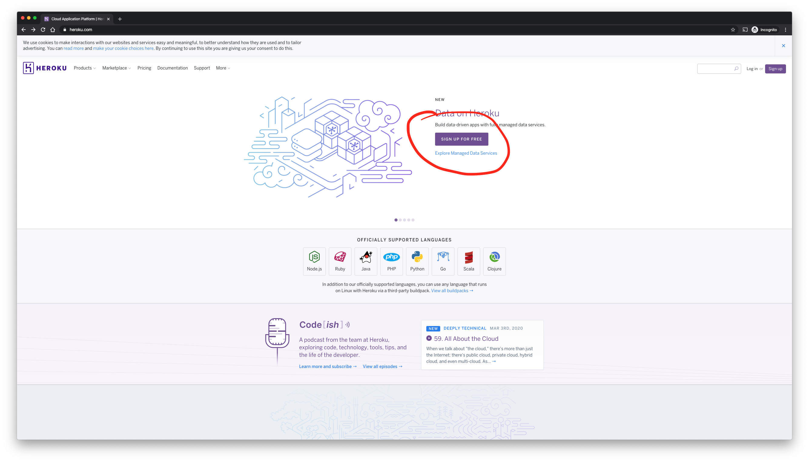
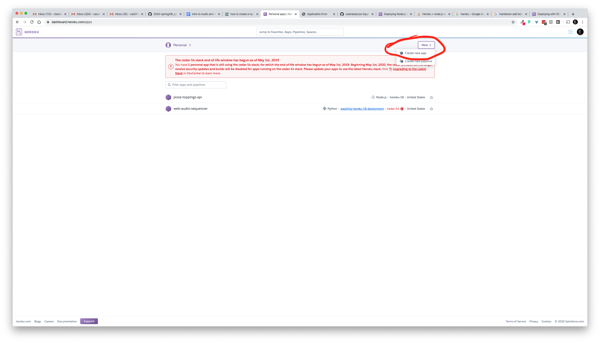
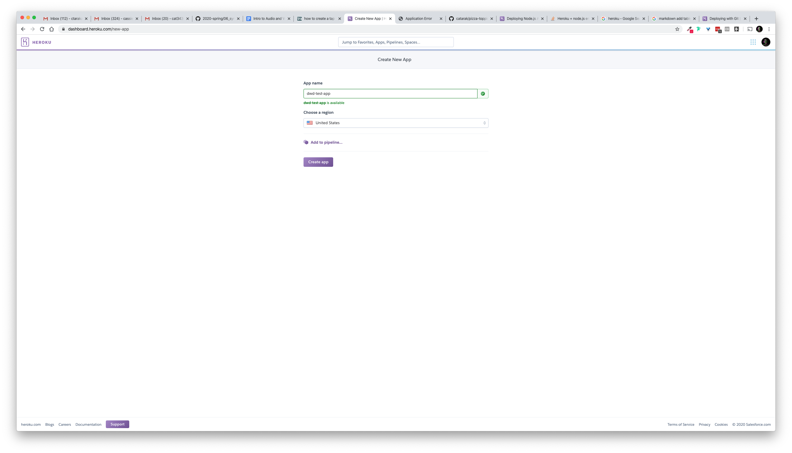
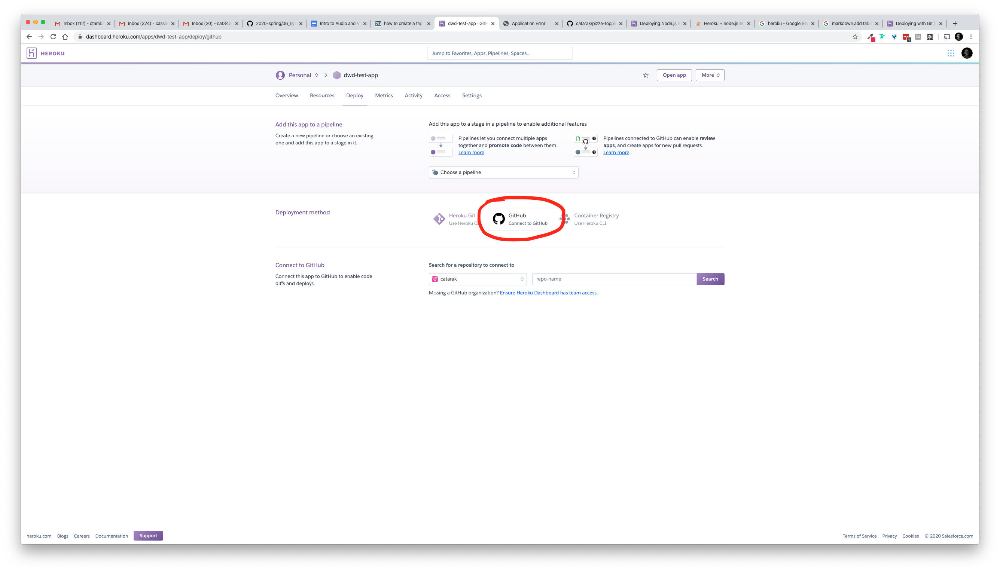
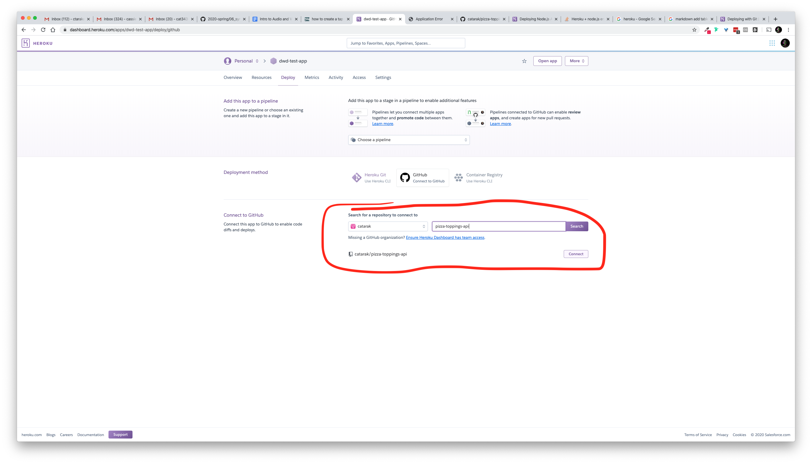
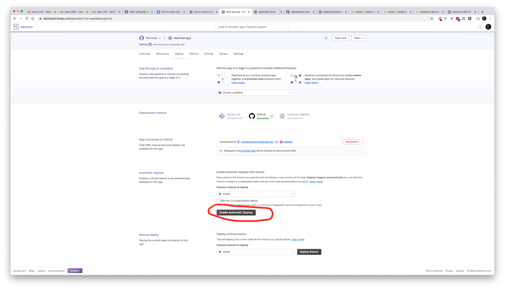
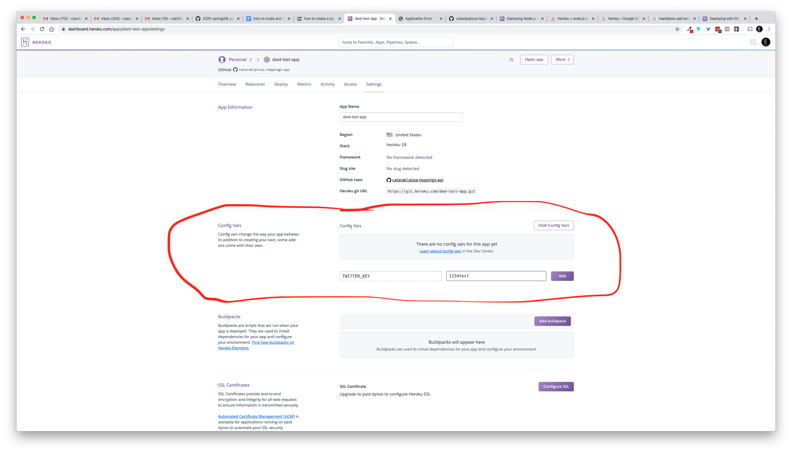

# Deploying to Heroku Guide

- [Deploying to Heroku Guide](#deploying-to-heroku-guide)
  - [What is Heroku?](#what-is-heroku)
  - [Deployment Steps](#deployment-steps)
  - [Project Configuration Steps](#project-configuration-steps)

## What is Heroku?

From the Heroku website: "Heroku is a platform as a service (PaaS) that enables developers to build, run, and operate applications entirely in the cloud."

Heroku is a service for hosting web applications. It has a lot of nice stuff that makes the process from creating our applications locally to deploying them to the Internet.

## Deployment Steps

1. Create a Heroku Account.
   

2. Create a new app.
   
  It must have a unique name.
   

3. Go to your new app's page, and set the Deployment method to Github. You'll have to connect your Heroku Account to your GitHub Account if you haven't already.
   

4. Connect your app to the GitHub repository you want to deploy.
   

5. Enable automatic deploys. This option makes it so every time you push to a specified branch, your Heroku app will redeploy your latest code. By default this branch is `master`.
   
   
6. Adjust your project settings. Add "config vars", which are the same as the variables you define in your `.env` file, accessible in Node through `process.env.variable_name` which are things like API keys, MongoDB Connection URI, and so on.
   
   

Now, every time you push to `master`, your changes will get redeployed! This is called **continuous deployment** (or CD).

## Project Configuration Steps

In order for your Node project to work with Heroku, you'll need configure it in a few specific ways:

1. Make sure your `package.json` has a `start` script to start your server:
   ```json
   {
     "scripts": {
       "start": "node server.js"
     }
   }
   ```

2. Make sure all npm libraries that your project needs in order to run are listed under `dependencies`:
   ```json
   {
     "dependencies": {
       "dotenv": "^8.2.0",
       "express": "^4.17.1"
     }
   }
   ```

3. Make sure all environment variables you need are defined in your `.env` file, and you access them in Node scripts through `process.env.variable_name`:
   ```sh
   TWITTER_KEY=test1234
   MONGO_URL=mongo://example.com
   ```

4. You have a `.gitignore` file that will remove `.env` and `node_modules` from git:
   ```
   .env
   node_modules
   ```

5. Heroku sets an environment variable `PORT` for your server, so you'll need to configure your express server to run on that port:
   ```js
   const port = process.env.PORT || 3000;
   app.listen(port, () => {
     console.log(`Express server listening on port ${port}!`));
   });
   ```
   The syntax `process.env.PORT || 3000` gives the port a default value—if `process.env.PORT` is not defined (for example, if you're running the app locally), then the port will be set to `3000`. 
