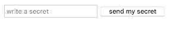

# The HTML Guide

## Table of Contents
- [The HTML Guide](#the-html-guide)
  - [Table of Contents](#table-of-contents)
  - [Prelude: You Should really read](#prelude-you-should-really-read)
  - [Tags and their attributes](#tags-and-their-attributes)
  - [Syntax](#syntax)
  - [Structure](#structure)
  - [Special HTML Tags](#special-html-tags)
    - [HTML Forms](#html-forms)
  - [HTML as the "dependency manager"](#html-as-the-%22dependency-manager%22)

## Prelude: You Should really read

This guide is based heavily on these blog posts by [Tania Rascia](https://www.taniarascia.com/):

* [Introduction to the DOM](https://www.taniarascia.com/introduction-to-the-dom/)
* [Understanding the DOM Tree and Nodes](https://www.taniarascia.com/understanding-the-dom-tree-and-nodes/)

## Tags and their attributes

At the most basic level, you can think of HTML as the **content** and **structure** of your user/client facing web page. 

The **content** is all of the text, images, videos, and just stuff that you want to reach your users. 

That content is **structured** using HTML in what is called the DOM or Document Object Model. The DOM, as its name suggests is a model for structuring a document with objects. 

The document is your webpage and your objects are the various things on your webpage. Those "things" on the webpage include things like paragraphs of text, headlines, titles, forms, buttons, images, videos, and more. 

The objects on your web page are expressed as **HTML tags** that generally have semantic meaning to the content those tags hold.

For example, the `<p> </p>` tag stands for "paragraph" 
```html
<p> This is my love letter to you.</p>
```

Another example, the `<h1> </h1>` tag stands for "header 1", or the main header or title of your page: 
```html
<h1>My Ode to Rainbows</h1>
```


## Syntax

Here's some HTML tags you might start exploring

| Tag     | HTML tags                                | description                                         | example                                                                                                                                                                      |
|---------|------------------------------------------|-----------------------------------------------------|------------------------------------------------------------------------------------------------------------------------------------------------------------------------------|
| h1      | `<h1></h1>`                              | Header 1                                            | <h1>Hello</h1>                                                                                                                                                               |
| h2      | `<h2></h2>`                              | Header 2                                            | <h2>Hello</h2>                                                                                                                                                               |
| h3      | `<h3></h3>`                              | Header 3                                            | <h3>Hello</h3>                                                                                                                                                               |
| h4      | `<h4></h4>`                              | Header 4                                            | <h4>Hello</h4>                                                                                                                                                               |
| h5      | `<h5></h5>`                              | Header 5                                            | <h5>Hello</h5>                                                                                                                                                               |
| p       | `<p></p>`                                | paragraph                                           | <p>I love you</p>                                                                                                                                                            |
| img     | ``                    | image tag                                           |  |
| video   | `<video src="" alt="funny video of puffy animals">`                 | image tag                                           | <video src="https://thumbs.gfycat.com/PortlyMealyAfricanparadiseflycatcher-mobile.mp4" alt="funny video of puffy animals" autoplay width="200px">                            |
| a       | `<a href="" target="" rel=""></a>`       | link tags                                           | <a href="https://github.com/itp-dwd/2020-spring" target="_blank" rel="noreferrer">Link to ITP DWD course</a>                                                                 |
| form    | `<form method=""></form>`                | form                                                | <form method=""><input type="text" name="search" placeholder="e.g. search"> <input type="submit" value="submit"></form>                                                      |
| input   | `<input type="" name="" placeholder="">` | input                                               | <input type="text" name="search" placeholder="e.g. search">                                                                                                                  |
| button  | `<button></button>`                      | button                                              | <button>Click me</button>                                                                                                                                                    |
| div     | `<div></div>`                            | div, a generic box                                  | <div>I'm a div</div>                                                                                                                                                         |
| section | `<section></section>`                    | a section of content                                | <section>This is a section</section>                                                                                                                                         |
| nav     | `<nav></nav>`                            | navigation                                          | <nav>Navigation goes here</nav>                                                                                                                                              |
| ol      | `<ol></ol>`                              | ordered list, 1,2,3                                 | <ol><li>item number 1</li><li>item number 2</li> </ol>                                                                                                                       |
| ul      | `<ul></ul>`                              | unordered list                                      | <ul><li>item number 1</li><li>item number 2</li> </ul>                                                                                                                       |
| li      | `<li></li>`                              | list element, usually goes inside `ul` or `ol` tags | <li>item number 1</li>                                                                                                                                                       |
| aside   | `<aside></aside>`                        | an aside                                            | <aside>This is an aside</aside>                                                                                                                                              |
| article | `<article></article>`                    | an article                                          | <article>This is an article</article>                                                                                                                                        |

More tags and their suggested usage can be found at the [HTML5 Doctor Element Index](http://html5doctor.com/).


## Structure

As we spoke about earlier, the DOM is comprised of objects that are defined by those HTML tags we see above. Your role in creating the structure of an HTML page is to take those tags and to create meaningful "parent and child" relationships between those elements. This means that your role as a front end developer is to think about **meaningful heirarchies** ideally reflect your information architecture and semantically organize your content into the DOM tree.

As you're reading this, you might get the feeling that what goes into an HTML page are pretty arbitrary. It's true that you can pretty much swing however you'd like, but there are some essentials. The boilerplate below has the key components:

This is via [Tania Rascia's Basic HTML5 Skeleton File](https://www.taniarascia.com/basic-html5-file/):
```html
<!DOCTYPE html>
<html lang="en">
  <head>
    <meta charset="utf-8" />
    <meta http-equiv="x-ua-compatible" content="ie=edge" />
    <meta name="viewport" content="width=device-width, initial-scale=1" />

    <title>Add your own title here</title>

    <link rel="stylesheet" href="css/main.css" />
    <link rel="icon" href="images/favicon.png" />
  </head>

  <body>
    <script src="js/scripts.js"></script>
  </body>
</html>
```
Notice we have:

* `<!DOCTYPE html>`: definition specifying `html` as the type of document
  * `<html lang="en">`: we have the outer-most `html` tag with a specification that this is `en` for english
    * `<head>`: we have a `head` tag that contains:
      * `meta` tags describing our page
      * `title` 
      * and our css `link` tags that link to our css style sheet
      * and a css `link` tag to a `favicon` which is the little icon that is shown in your browser tab
    * `</head>`: closing head tag
    * `<body>`: we have a `body` tag which is where the rest of our HTML will go:
      * (this is where all of your HTML would go: the divs, sections, header, main, etc)
      * at the very end we have our `script` tags
    * `</body>` : closing body tag
  * `</html>`: closing html tag


Now with this boilerplate, you can start adding the structure and content of the page you'd like to build within the `<body></body>` tags.

Here's a quick example of a basic HTML page:

```html
<!DOCTYPE html>
<html lang="en">
  <head>
    <meta charset="utf-8" />
    <meta http-equiv="x-ua-compatible" content="ie=edge" />
    <meta name="viewport" content="width=device-width, initial-scale=1" />

    <title>Add your own title here</title>

    <!-- CSS can be read in via file reference or within the style tags -->
    <style>
      body{ 
        background-color: tomato;
        color:black;
      }
    </style>
    <!-- <link rel="stylesheet" href="css/main.css" /> -->
    <link rel="icon" href="images/favicon.png" />
  </head>

  <body>
    <div id="app">
        <!-- Navigation -->
        <nav>
          <p>Quick Links</p>
          <ul>
            <li> <a href="https://itp.nyu.edu/registration/Schedule.php?year=2019&semester=Fall" target="_blank">ITP Schedule</a></li>
            <li> <a href="https://tisch.nyu.edu/itp" target="_blank">ITP Home</a></li>
          </ul>
        </nav>
        <!-- header -->
        <header>
          <h1>My ITP Favorites</h1>
          <h2>A webpage for all my ITP favorite things</h2>
        </header>
        <!-- main body content -->
        <main>
            <!-- section -->
            <section>
              <h2>The People of ITP</h2>
              <ul>
                <li><a href="https://tisch.nyu.edu/itp/itp-people/faculty" target="_blank">Faculty</a></li>
                <li><a href="https://tisch.nyu.edu/itp/itp-people/staff" target="_blank">Staff</a></li>
                <li><a href="https://tisch.nyu.edu/itp/itp-people/alumni" target="_blank">Alums</a></li>
                <li><a href="https://tisch.nyu.edu/itp/itp-people/current-students" target="_blank">Current Students</a></li>
                <li><a href="https://tisch.nyu.edu/itp/itp-people/faculty/somethings-in-residence-sirs" target="_blank">Fellows</a></li>
              </ul>
            </section>
            <!-- section -->
            <section>
              <h2>My favorite courses at ITP</h2>
              <!-- article 1 -->
              <article>
                <header>
                  <h3>ICM</h3>
                </header>
                <p>I love ICM because the instructors are SO smart and cool and they care about my learning SO much. It's crazy.</p>
              </article>
              <!-- article 2 -->
              <article>
                <header>
                  <h3>Dynamic Web</h3>
                </header>
                <p>I love Dynamic Web Development because the instructors are SO smart and cool and they care about my learning SO much. It's crazy.</p>
              </article>
            </section>
        </main>  
    </div>
    <!-- JavaScript can be read in via file reference or within the script tags -->
    <script>
        setInterval( function(){
            const r = Math.random()*255;
            const g = Math.random()*255;
            const b = Math.random()*255;
            document.body.style.backgroundColor = `rgb( ${r}, ${g}, ${b})`
        }, 1000)
    </script>
  </body>
</html>
```

If you copy & paste the above code into a blank text file ==> then save it as `index.html` or `my-itp-page.html` ==> and double-click on that file, you'll see something like this in your browser:


The point of the above exercise is to see how HTML can be nested within tags to create relationships between `parent` and `children` tags and how there might also be `sibling` tags, and more. 

We know that our page has some structure that is semantically meaningful, but to our website viewers, they just see the content we've provided to them in the rawest form. What if we wanted to create our own layout, apply styling to the links and titles, add new typography, and make some better color choices? That's where CSS comes in. Read on for more.

NOTE: explore defining the HTML structure before putting too much or any CSS onto the page. A well structured HTML page will naturally reveal the architecture it is meant to showcase. 

## Special HTML Tags

HTML is organized into the DOM, aka the DOM tree. Some HTML conventions aren't intuitive so it is helpful to have a few clues as to how they are usually structured. Some of these can be seen below:

### HTML Forms

If you're asking for any information from your users, this will likely come in the form of well... a form! Forms act as the parent element which wrap various `<input>` tags that are relevant to that `<form>` element.



```html
<form>
<input type="text" name="form-secret" placeholder="write a secret">
<input type="button" value="send my secret">
</form>
```
As you can see, by defining different values for the `type` attribute of the `<input>` the input will be rendered differently to the browser window. Furthermore, their function will differ. 
* `type="text"` will accept text input
* `type="button"` will submit the data within the form when that button is pressed

Important to also note is the attribute `name`. The `name` attribute allows you to retrieve the value of data submitted via a form. For example, if the above form was submitted, you could retrieve the inputs submitted by the form by selecting `.theNameYouGave.value`:

```html
<form id="secretForm">
<input type="text" name="secretInput" placeholder="write a secret">
<input type="submit" value="send my secret">
</form>

<script>
document.querySelector("#secretForm").addEventListener('submit', (event) => {
  // this prevents the page from reloading on submit which is the default behavior for forms!
  event.preventDefault(); 
  // console log the input DOM element text input 
  // NOTICE: that the event knows which target element was clicked and you can reference the name attribute
  console.log(event.target.secretInput);
  // a popup will show with the value you type in!
  alert(event.target.secretInput.value); 
})
</script>
```

You can see the other `input` types here: [HTML Input Types](https://www.w3schools.com/html/html_form_input_types.asp)

Upon inspecting those other inputs, you'll notice the importance of the names for getting back the `value` of the input. For example, notice the [Radio Button Example](https://editor.p5js.org/joeyklee/sketches/yH9dbjA4K) input where all of the radio options take the attribute `name="food"`. When you submit the form containing these buttons, you'll be able to get the value from the `.food.value`.


## HTML as the "dependency manager"

HTML acts as the "glue" to your websites by brining in any external CSS and JavaScript files that may be used in your project. Please see [The JavaScript Front End Guide -- prelude](javascript-frontend-guide.md#prelude-including-js-files-in-html) for more details.

