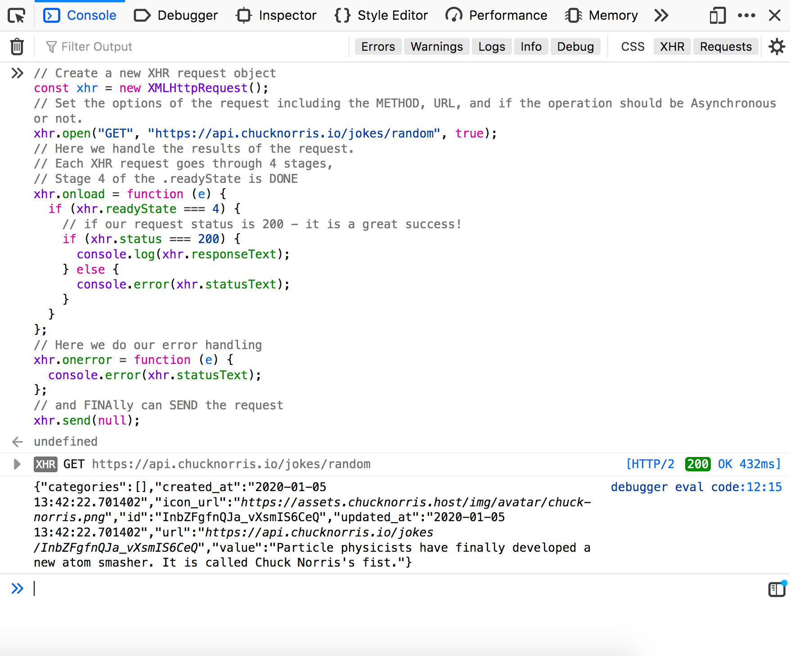

# Frontend Javascript Guide

## About

This frontend JavaScript guide is a roadmap to having a solid JavaScript foundation. Like any language, learning JavaScript for the frontend not only means having a strong grasp of the syntax of JavaScript, but also how it works with and applies to other contexts (e.g. interacting with the DOM, communicating with APIs, etc).

In this guide we focus on the foundational knowledge of JavaScript rather than on frameworks and libraries. You can read about the importance of focusing specifically on these core skills as they relate to this post on [How it feels to learn JavaScript in 2016](https://hackernoon.com/how-it-feels-to-learn-javascript-in-2016-d3a717dd577f) (yes it is 2020 now, but if anything the insights in that post are increasingly relevant).

## Table of Contents
- [Frontend Javascript Guide](#frontend-javascript-guide)
  - [About](#about)
  - [Table of Contents](#table-of-contents)
- [JavaScript Foundations](#javascript-foundations)
  - [Prelude: Including JS files in HTML](#prelude-including-js-files-in-html)
  - [Introduction: The Basics](#introduction-the-basics)
  - [ES6/ES2015 New Features](#es6es2015-new-features)
    - [Reference: Overview of New Features](#reference-overview-of-new-features)
    - [Template Strings](#template-strings)
    - [Arrow Functions](#arrow-functions)
      - [References](#references)
  - [Javascript Array Methods:](#javascript-array-methods)
    - [Creation](#creation)
      - [Creating a new Array: `new Array()`](#creating-a-new-array-new-array)
      - [Creating a new Array: `[]`](#creating-a-new-array)
    - [Looping Through Arrays](#looping-through-arrays)
      - [A "classic" for loop:](#a-%22classic%22-for-loop)
      - [The "For...Of" loop:](#the-%22forof%22-loop)
      - [The forEach Loop: `.forEach( callback )`](#the-foreach-loop-foreach-callback)
    - [Transforming Arrays](#transforming-arrays)
      - [The map function: `.map( callback )`](#the-map-function-map-callback)
      - [The filter function: `.filter( callback )`](#the-filter-function-filter-callback)
      - [The reduce function: `.reduce( callback, ?initialValue )`](#the-reduce-function-reduce-callback-initialvalue)
    - [Searching Arrays](#searching-arrays)
      - [The indexOf function: `.indexOf()`](#the-indexof-function-indexof)
      - [The find function: `.find()`](#the-find-function-find)
    - [Other Helpful Array Functions](#other-helpful-array-functions)
      - [`.fill()`](#fill)
    - [Reference: JavaScript Array Iteration Methods](#reference-javascript-array-iteration-methods)
  - [Javascript Object Methods:](#javascript-object-methods)
    - [The `Object.keys()` method](#the-objectkeys-method)
    - [The `Object.values()` method](#the-objectvalues-method)
    - [The `Object.entries()` method](#the-objectentries-method)
  - [JavaScript Scope: A world of functions and scope - Unpacking `this`, `bind`, `apply` and `call`](#javascript-scope-a-world-of-functions-and-scope---unpacking-this-bind-apply-and-call)
    - [This `this` keyword and implicit context](#this-this-keyword-and-implicit-context)
    - [Explicitly setting the context of `this`:](#explicitly-setting-the-context-of-this)
      - [The `.call()` and `.apply()` function methods](#the-call-and-apply-function-methods)
      - [The `.bind()` function method](#the-bind-function-method)
    - [Arrow functions and `this`](#arrow-functions-and-this)
    - [Reference: JavaScript Object Methods](#reference-javascript-object-methods)
  - [Callbacks, Promises and Async/Await](#callbacks-promises-and-asyncawait)
    - [Async: Callbacks - the joys and pains of Callbacks](#async-callbacks---the-joys-and-pains-of-callbacks)
    - [Async: Promises - I promise when I'm done, I'll do whatever you want me to do...](#async-promises---i-promise-when-im-done-ill-do-whatever-you-want-me-to-do)
    - [Using promises](#using-promises)
    - [Constructing promises](#constructing-promises)
      - [Promise chaining `.then()` and `.then()` and `.then()` ...](#promise-chaining-then-and-then-and-then)
    - [Async: Async/Await - Finally asynchronous JavaScript is more readable!](#async-asyncawait---finally-asynchronous-javascript-is-more-readable)
    - [Reference: Callbacks, Promises, and Async/Await](#reference-callbacks-promises-and-asyncawait)
  - [References: JavaScript Foundations](#references-javascript-foundations)
- [JavaScript and the DOM](#javascript-and-the-dom)
    - [Selecting DOM elements](#selecting-dom-elements)
    - [Updating the dom: styles & adding/removing CSS classes](#updating-the-dom-styles--addingremoving-css-classes)
      - [Updating the content of a DOM selection](#updating-the-content-of-a-dom-selection)
    - [Aside: HTMLElement and the JavaScript Classes of HTML](#aside-htmlelement-and-the-javascript-classes-of-html)
    - [Adding DOM Elements with JavaScript](#adding-dom-elements-with-javascript)
      - [Additional Notes on Creating and Appending DOM Elements](#additional-notes-on-creating-and-appending-dom-elements)
      - [Removing Elements](#removing-elements)
      - [Updating the style of a DOM element](#updating-the-style-of-a-dom-element)
    - [Javascript Events:](#javascript-events)
      - [Event Handlers and Event Listeners](#event-handlers-and-event-listeners)
      - [Table of common events](#table-of-common-events)
      - [Event Listeners](#event-listeners)
      - [Event Handlers](#event-handlers)
    - [Event Objects](#event-objects)
    - [When is a website finished loading?](#when-is-a-website-finished-loading)
  - [References: JavaScript and the DOM](#references-javascript-and-the-dom)
- [JavaScript Networking, AJAX, talking to APIs, and CORs](#javascript-networking-ajax-talking-to-apis-and-cors)
  - [What is an API?](#what-is-an-api)
  - [Connecting to RESTful APIs with JavaScript: AJAX and the Fetch API](#connecting-to-restful-apis-with-javascript-ajax-and-the-fetch-api)
  - [Public APIs and Terms](#public-apis-and-terms)
  - [Background: XHR: XMLHttpRequest](#background-xhr-xmlhttprequest)
  - [Fetch API](#fetch-api)
    - [Fetch: default](#fetch-default)
    - [Fetch with options: GET, POST, PUT, DELETE](#fetch-with-options-get-post-put-delete)
      - [GET](#get)
      - [POST](#post)
      - [PUT](#put)
      - [DELETE](#delete)
  - [A quick note on Axios](#a-quick-note-on-axios)
  - [CORs: Cross origin Resource Sharing](#cors-cross-origin-resource-sharing)
  - [References: JavaScript and APIs](#references-javascript-and-apis)
- [FUNCTIONAL PROGRAMMING, UI COMPONENTS, & REACTIVE USER INTERFACES](#functional-programming-ui-components--reactive-user-interfaces)
- [The Web Platform](#the-web-platform)
  - [Browser Platform: `localStorage`](#browser-platform-localstorage)
      - [Examples](#examples)
        - [`setItem(key, value)`](#setitemkey-value)
        - [`getItem(key)`](#getitemkey)
        - [`removeItem(key)`](#removeitemkey)
    - [Reference: local Storage](#reference-local-storage)
  - [Browser Platform: Geolocation API](#browser-platform-geolocation-api)
      - [Examples](#examples-1)
        - [`navigator.geolocation.getCurrentPosition()`](#navigatorgeolocationgetcurrentposition)
        - [`navigator.geolocation.watchPosition()`](#navigatorgeolocationwatchposition)
        - [`navigator.geolocation.clearWatch()`](#navigatorgeolocationclearwatch)
    - [Reference: Geolocation API](#reference-geolocation-api)
  - [References: The Web Platform](#references-the-web-platform)
- [Conclusion & Recap](#conclusion--recap)
- [History of JavaScript](#history-of-javascript)
- [Advanced: JavaScript Patterns](#advanced-javascript-patterns)
- [Advanced: JavaScript Frameworks](#advanced-javascript-frameworks)

***
***
***

# JavaScript Foundations

In this section we cover foundational JavaScript knowledge. Note that we assume some prior exposure to JavaScript in this section.

## Prelude: Including JS files in HTML

Before we get started, you will need to know that HTML is the "glue" that brings together all of your HTML5 dependencies. This means your HTML page will allow you to reference external CSS and JavaScript files that your project is built in. 

So, let's say you write your javascript in a file called `main.js`:

```js
console.log("hello world");
```

And you have a CSS file called `main.css`:

```css

body{
  background: pink;
}

h1 {
  font-size:36px;
  color: #333333;
}

```
In order to include those files into your `index.html` file, you can reference them like so:

```html
<!DOCTYPE html>
<html lang="en">
  <head>
    <meta charset="utf-8" />
    <meta http-equiv="x-ua-compatible" content="ie=edge" />
    <meta name="viewport" content="width=device-width, initial-scale=1" />

    <title>My Demo Page</title>
    <!-- Step 1: use the link tag to include css -->
    <link rel="stylesheet" href="main.css" />
    <link rel="icon" href="images/favicon.png" />
  </head>

  <body>
    <header>
      <h1>I Love You</h1>
    </header>
    <!-- Step 2: use the script tag to include css -->
    <script src="main.js"></script>
  </body>
</html>
```

Notice how:

1. Your CSS is included within the **Head** tag using the `<link href="link/to/your/css/file.css"/>`
2. Your JavaScript is included within the `<script src="link/to/your/javascript/file.js">` just **before the last body tag**.

You can include as many external CSS and JavaScript files as you'd like, but remember, **order matters**. The order that you include your JS and CSS files matters, so depending on the order of how you include your files will determine which if a JS variable or function is available or if a CSS style will be overridden by another, etc. 

TBD: Also, if you're using external JavaScript files, you'll need to run a local web server. This is covered in [TBD]()


## Introduction: The Basics

You can skip this section if the following topics are familiar or you have a grasp of these concepts:
1. ✅ [JavaScript Comments, Variables, Data Types, and Hello, World!](https://www.taniarascia.com/javascript-day-one/)
2. ✅ [Understanding Variables, Scope and Hoisting in JavaScript](https://www.taniarascia.com/understanding-variables-scope-hoisting-in-javascript/)
   - Differentiating between: `var`, `const`, and `let`.
3. ✅ [Doing Math with JavaScript](https://www.digitalocean.com/community/tutorials/how-to-do-math-in-javascript-with-operators)
4. ✅ [For loops and looping in JavaScript](https://www.digitalocean.com/community/tutorials/how-to-construct-for-loops-in-javascript) and [While loops in JavaScript](https://www.digitalocean.com/community/tutorials/using-while-and-do-while-loops-in-javascript)
5. ✅ [Writing Conditionals in JavaScript](https://www.taniarascia.com/how-to-write-conditional-statements-in-javascript/) and the super cool [Switch statement in JavaScript](https://www.digitalocean.com/community/tutorials/how-to-use-the-switch-statement-in-javascript)
6. ✅ [JavaScript Objects](https://www.digitalocean.com/community/tutorials/understanding-objects-in-javascript) and [Working with JSON objects in JavaScript](https://www.digitalocean.com/community/tutorials/how-to-work-with-json-in-javascript) and [Using JavaScript Object Methods](https://www.digitalocean.com/community/tutorials/how-to-use-object-methods-in-javascript)
7. ✅ [JavaScript Arrays](https://www.digitalocean.com/community/tutorials/understanding-arrays-in-javascript) and [Accessing data from JavaScript Arrays](https://www.digitalocean.com/community/tutorials/how-to-use-array-methods-in-javascript-accessor-methods) and [Mutating JavaScript Arrays](https://www.digitalocean.com/community/tutorials/how-to-use-array-methods-in-javascript-mutator-methods)
8. ✅ [Defining Functions in JavaScript](https://www.digitalocean.com/community/tutorials/how-to-define-functions-in-javascript)
9. ✅ [JavaScript Classes](https://www.digitalocean.com/community/tutorials/understanding-classes-in-javascript) and encapsulating functionality and data.
10. ✅ Handling [Date and Time in JavaScript](https://www.taniarascia.com/understanding-date-and-time-in-javascript/) or at least being aware of dates in time in computer land.

NOTE: While different languages have different syntax for things, you can consider the above list of skills and awarenesses that are generally considered foundational. If you decide to explore other programming languages, you can consider creating your own list of these skills.

## ES6/ES2015 New Features

JavaScript is an evolving language. Because its popularity has surged within the past 10 years, many new features have been added to make it easier to use and more powerful. In this class, we will take advantage of some of these new features. 

### Reference: Overview of New Features
[ES6 Features](https://github.com/lukehoban/es6features#readme)

### Template Strings
Template strings are the same as strings that use "" or '', except they can do more. You can insert variables in a simpler way:
```js
// Old ES5 Way
var name = "Cassie";
var greeting = "Hello, " + Cassie + "!";

// New ES6 Way
const name = "Cassie";
const greeting = `Hello, ${name}!`;
```

You can also create multiline strings, which is hard to do the old way:
```js
// Old ES5 Way
var paragraph = "<p>\n" + 
  "    JavaScript was created in 1995.\n" + 
  "</p>";
console.log(paragraph);
// <p>
//     JavaScript was created in 1995.
// </p>

// New ES6 Way
const paragraph = `<p>
    JavaScript was created in 1995.
</p>`;
console.log(paragraph);
// <p>
//     JavaScript was created in 1995.
// </p>
```

### Arrow Functions
Arrow functions are similar to a regular function expression, but have a few gotcha's. They are usually more compact:
```js
// Regular function expression
function add(a, b) {
  return a + b;
}
add(3, 4); // returns 7

// Arrow function
const add = (a, b) => a + b;
add(3, 4); // returns 7

// Longer arrow function
const add = (a, b) => {
  return a + b;
}
add(3, 4); // returns 7
```
Notice that if you don't include the `{}`, the value of the statement is **implicitly returned**, but otherwise the syntax just replaces `function()` with `() =>`.

You can even leave out the `()` if there is one argument:
```js
const timesTwo = param => param * 2;
console.log(timesTwo(6)); // returns 36
```

The big benefit of using arrow functions is that `this` within the function body never changes, wherever the function is called. You may not have run into any issues yet with `this` and scope, but to avoid them, you can follow a few simple rules about when to use arrow functions, and when to use regular function expressions (from [Stack Overflow](https://stackoverflow.com/a/23045200)):
* Use `function` in the global scope and for `Object.prototype` properties.
* Use `class` for object constructors.
* Use `=>` everywhere else.

#### References
* (When (and why) you should use ES6 arrow functions — and when you shouldn’t)[https://www.freecodecamp.org/news/when-and-why-you-should-use-es6-arrow-functions-and-when-you-shouldnt-3d851d7f0b26/]
* (Stack Overflow - When should I use Arrow functions in ECMAScript 6?)[https://stackoverflow.com/a/23045200]


## Javascript Array Methods:

This is a primer on JavaScript Array methods that will become part of your JavaScript toolbox. JavaScript **Arrays and Objects** (which we will explore further in the next section) and knowing how to **create**, **read**, and **update** them are absolutely essential for frontend development. 

### Creation

In this section we take a quick look and review of the ways to create an array.

#### Creating a new Array: `new Array()`
> Creates an empty array
```js
const myArray = new Array()
// console.log(myArray)
// []
```

> Creates an array filled with X undefined positions
```js
const myArray = new Array(5)
// console.log(myArray)
// [undefined, undefined, undefined, undefined, undefined]
```

#### Creating a new Array: `[]`
> you can also use the square braces to define and array

```js
const myArray = [];
```

> similarly you can define the values in that array

```js
const myArray = [1, 2, 3,4, 5];
```


### Looping Through Arrays

In this section we take a look at how to loop through an array. We focus specifically on ways to looping through, and not ways of transforming them which we will see in the next section.


#### A "classic" for loop:
> If you've made it this far, you should know how to write "for" loops. 

```js
const myArray = ['rainbow', 'butterfly', 'cupcake']; 

for(let i = 0; i < myArray.length; i++){
  console.log(myArray[i])
}
```

#### The "For...Of" loop: 
> The "for...of" loop is a new-ish JavaScript feature that allows you to iterate through values and objects in an array.

```js
const myArray = ['rainbow', 'butterfly', 'cupcake']; 

for(val of myArray){
  console.log(val);
}
```


#### The forEach Loop: `.forEach( callback )`
> The `.forEach()` function allows you to iterate through all the values or objects in an array.

**where** your `callback(value, ?index, ?array)`:

* value: the value or object in that position of the interation
* ?index (optional): the index position at that point in the loop iteration
* ?array (optional): the reference to the array being iterated.

**Option 1: forEach loop with only the `value` specified for iteration**

```js
const myArray = ['rainbow', 'butterfly', 'cupcake'];

myArray.forEach( item => {
  console.log(item);
});
```

**Option 2: forEach loop with the `value` AND `index` specified for iteration**

```js
const myArray = ['rainbow', 'butterfly', 'cupcake'];

myArray.forEach( (item, idx) => {
  console.log( `Index position: ${idx}, for value: ${item}`)
});
```

**Option 3: forEach loop with the `value`, `index`, AND `array` specified for iteration**

```js
const myArray = ['rainbow', 'butterfly', 'cupcake'];

myArray.forEach( (item, idx, arr) => {
  console.log( `Index position: ${idx}, for value: ${item}, and the value referenced from the array object is: ${arr[idx]}`)
});
```

### Transforming Arrays

In this section we will focus on 

#### The map function: `.map( callback )`
> The map function is probably one of the most commonly used array functions. It is used to **create an array of new values based on an existing array**. The `.map()` function will go through each value or object in an array and expects you to `return` a value for each iteration.

**where** your `callback(value, ?index, ?array)`:

* value: the value or object in that position of the interation
* ?index (optional): the index position at that point in the loop iteration
* ?array (optional): the reference to the array being iterated.

```js
const myArray = ['rainbows', 'butterflies', 'cupcakes'];

const myNewArray = myArray.map( item => {
  return `I love ${item}`
})

console.log(myNewArray); // ['I love rainbows', 'I love butterflies', 'I love cupcakes']
```
Notice how we `return` a new string in each iteration of the loop. Our `myNewArray` variable now contains the values from the `myArray` array, but with the addition of `I love ...` concatenated with those strings.

#### The filter function: `.filter( callback )`
> The filter function is another commonly used array function used to return a new array based on conditions that filter out values from the source array.
> 
> The values that are returned from the `.filter()` method are those that evaluate to `true`. 

**where** your `callback(value, ?index, ?array)`:

* value: the value or object in that position of the interation
* ?index (optional): the index position at that point in the loop iteration
* ?array (optional): the reference to the array being iterated.

```js
const myArray = ['rainbows', 'butterflies', 'cupcakes'];

// Return any value that DOES NOT EQUAL 'butterflies'
const myNewArray = myArray.filter( item => {
  return item !== 'butterflies'
})

console.log(myNewArray); // [ 'rainbows', 'cupcakes']
```

A common use case is to filter out objects in an array like so:

```js
const myArray = [
  {name: 'Joey', role:'instructor'},
  {name: 'Cassie': role:'instructor'},
  {name: 'Winnie', role: 'student'}
];

// Return any object where the role is 'instructor'
const myNewArray = myArray.filter( item => {
  return item.role === 'instructor'
})

console.log(myNewArray); // [ {name: 'Joey' ,role:'instructor'}, {name: 'Cassie': role:'instructor'}]
```

#### The reduce function: `.reduce( callback, ?initialValue )`
> To be honest, the reduce function is conceptually the most challenging and as a result, is not used as often as it probably could be. However, knowing about the reduce function doesn't hurt and may come in handy for a coding interview or for certain tasks. Most likely you'll be able to achieve what you're going for without the use of `.reduce()` but there are times when the reduce function makes the most sense.


...**where** your `callback(accumulator, currentValue, ?index, ?array)`:

* accumulator: the value or object that is passed through each iteration and "accumulates" the results of the previous iterations.
* currentValue: the value or object in that position of the interation
* ?index (optional): the index position at that point in the loop iteration
* ?array (optional): the reference to the array being iterated.
  
...and your `?initialValue` is an optional value with which you can start accumulating on. This could be a value or an object. Otherwise, the initial value will begin at the first element in the array.


**Example 1: Simple reduction of text in an array WITHOUT an initial value**
```js
const myArray = [ "I", "Love", "You"]

const myNewObject = myArray.reduce( (accumulator, currentValue) => {
  return accumulator + " " + currentValue
})

console.log(myNewObject); // "I Love You"
```

**Example 1.1: Simple reduction of text in an array WITH an initial value**
```js
const myArray = [ "I", "Love", "You"]

const myNewObject = myArray.reduce( (accumulator, currentValue) => {
  return accumulator + " " + currentValue
}, "New York,")

console.log(myNewObject); // "New York, I Love You"
```

**Example 2: Simple reduction of numbers to total the array values in an array**
```js
const myArray = [ 1, 2, 3]

const total = myArray.reduce( (accumulator, currentValue) => {
  return accumulator + currentValue
})

console.log(total); // 6
```

**Example 3: Reduce an array of objects to an array of specified values**
```js
const myArray = [ {gift:'bike'}, {gift:'dog'}, {gift:'color pencils'} ]

const wishList = myArray.reduce( (accumulator, currentValue, idx) => {
  accumulator[idx] = currentValue.gift
  return accumulator
}, [])

console.log(wishList); // [ 'bike', 'dog', 'color pencils' ]
```

**Example 4: Reduce an array of objects to an object of key, value pairs**
```js
const myArray = [ {gift:'bike', price:'350'}, {gift:'dog', price:'0'}, {gift:'color pencils', price:'15'} ]

const wishList = myArray.reduce( (accumulator, currentValue) => {
  accumulator[currentValue.gift] = currentValue.price;
  return accumulator
}, {})

console.log(wishList); // { bike: '350', dog: '0', 'color pencils': '15' }
```

The best way to getting comfortable with `.reduce()` is to try using it in practice.

### Searching Arrays

Sometimes you just want to know if a value or object exists in your array. Below are some of the ways of checking and retrieving values or objects from an array. This is not an exhaustive list so be sure to look up the other array search functions when you're looking for other solutions for searching values in an array.

#### The indexOf function: `.indexOf()`
> "The indexOf() method returns the first index at which a given element can be found in the array, or -1 if it is not present." - [MDN Docs](https://developer.mozilla.org/en-US/docs/Web/JavaScript/Reference/Global_Objects/Array/indexOf)

Sometimes you need to know *where* a value lives within an array. TBD on why this is helpful (TODO)

```js
const myArray = ['rainbows', 'butterflies', 'cupcakes'];

// Return the index position of the "cupcakes"
const cupcakesPosition = myArray.indexOf('cupcakes')

console.log(cupcakesPosition); // 2
```

Similarly see: [`MDN Docs for .findIndex()`](https://developer.mozilla.org/en-US/docs/Web/JavaScript/Reference/Global_Objects/Array/findIndex)


#### The find function: `.find()`
> "The find() method returns the value of the first element in the provided array that satisfies the provided testing function." - [MDN docs](https://developer.mozilla.org/en-US/docs/Web/JavaScript/Reference/Global_Objects/Array/find)

Sometimes you want to extract out a value or object from an array. This is useful, for example, if you are requesting data from an API about, let's say weather data, and you want to find a specific object pertaining to a city e.g. "Brookyln". Or in the example below, maybe you want to get the first instance of an object where `role:student` evaluates to true.

```js
const myArray = [
  {name: 'Joey', role:'instructor'},
  {name: 'Cassie': role:'instructor'},
  {name: 'Winnie', role: 'student'},
  {name: 'Billie', role: 'student'}
];

// Return the first object where the role is 'student'
const myFirstStudent = myArray.find( item => {
  return item.role === 'student'
})

console.log(myFirstStudent); // {name: 'Winnie', role: 'student'}
```


### Other Helpful Array Functions

As you can see there are a zillion array functions and tons we didn't cover. For a more comprehensive list, see: [The Front-end Roadmap -- JavaScript Array Methods](https://github.com/itp-dwd/2020-spring/wiki/Front-end-Roadmap)

#### `.fill()`
> fills an array with a given value

```js
const myArray = new Array(3);
const myHeartArray = myArray.fill("❤️");
console.log(myHeartArray); // ["❤️", "❤️", "❤️"]
```

### Reference: JavaScript Array Iteration Methods
* [JavaScript Iteration Methods](https://www.digitalocean.com/community/tutorials/how-to-use-array-methods-in-javascript-iteration-methods)

## Javascript Object Methods:

Everything is an Object in JavaScript! But not all Objects are the same. In this section we discuss JSON Objects that are structured as key/value pairs and how to get at your data living within an Object.

### The `Object.keys()` method
> You can get back all the keys as an array by calling `Object.keys(yourObject)` on an object.

```js
const myObject = {
  streetAddress: "370 Jay Street",
  city: "Brooklyn",
  state: "New York",
  coordinates: [40.693, -73.987]
}
const myKeys = Object.keys(myObject)
console.log(myKeys);
// [ 'streetAddress', 'city', 'state', 'coordinates' ]
```

### The `Object.values()` method
> You can get back all the values as an array by calling `Object.values(yourObject)` on an object.

```js
const myObject = {
  streetAddress: "370 Jay Street",
  city: "Brooklyn",
  state: "New York",
  coordinates: [40.693, -73.987]
}
const myValues = Object.values(myObject);
console.log(myValues);
// [ '370 Jay Street', 'Brooklyn', 'New York', [ 40.693, -73.987 ] ]
```

### The `Object.entries()` method
> You can get back an array of arrays that contains `[[yourKey, yourValue], [yourKey, yourValue], [yourKey, yourValue] ]` based on an object.

```js
const myObject = {
  streetAddress: "370 Jay Street",
  city: "Brooklyn",
  state: "New York",
  coordinates: [40.693, -73.987]
}
const myEntries = Object.entries(myObject);
console.log(myEntries);
/*
[ 
  [ 'streetAddress', '370 Jay Street' ],
  [ 'city', 'Brooklyn' ],
  [ 'state', 'New York' ],
  [ 'coordinates', [ 40.693, -73.987 ] ] 
]
*/
```

## JavaScript Scope: A world of functions and scope - Unpacking `this`, `bind`, `apply` and `call`
> A secret to JavaScript mastery is keeping track of  what `this` is referring to. Is it referring to where you think `this` is referring to? Is it within the function you're calling? Is it referring to the browser? In your JavaScript journey, you'll see that where `this` is referring to can make or break your code!
> 
> This section is dedicated to unpacking the `apply`, `bind`, `call` methods to specify where `this` is referring to.

To be honest, this blog post on [This, bind, call, and apply in JavaScript](https://www.digitalocean.com/community/conceptual_articles/understanding-this-bind-call-and-apply-in-javascript) is excellent and does a great job explaining how to consider JavaScript Context and how to address it with those methods. 

Below are just some notes extracted from the blog post above.

### This `this` keyword and implicit context

As per the blog post on [This, bind, call, and apply in JavaScript](https://www.digitalocean.com/community/conceptual_articles/understanding-this-bind-call-and-apply-in-javascript):

>There are four main contexts in which the value of this can be implicitly inferred:
> * the global context
>   * when working in the browser: the global context is the `window` object
>   * when working in node.js: the global context is the `global` object
> * as a method within an object:
>   * within an `object`, if `this` is used within a function, it will reference the context of the parent object of that function.
> * as a constructor on a function or class:
>   * within the constructor of a function or a class, if `this` is defined within the constructor and a `new` class or function has been created, `this` will be bound to the "bound to any new instance" of that class or function. 
> * as a DOM event handler:
>   * within a dom event handler (e.g. `.addEventListener()`), `this` will refer to the targeted element where the event listener has been attached to.  


### Explicitly setting the context of `this`:

As per the blog post on [This, bind, call, and apply in JavaScript](https://www.digitalocean.com/community/conceptual_articles/understanding-this-bind-call-and-apply-in-javascript):

> In all of the previous examples, the value of this was determined by its context—whether it is global, in an object, in a constructed function or class, or on a DOM event handler. However, using call, apply, or bind, you can explicitly determine what this should refer to.

In order to explicity set the context where `this` is referring to, we have `.call()`, `.apply()`, and `.bind()` functions. 


#### The `.call()` and `.apply()` function methods
> These are one-time use that set the context of `this` per function call.

The difference between `.call()` and `.apply()` is that:
* passing arguments to `.call()` is done by adding additional arguments after the `this` context you're setting.
* passing arguments to `.apply()` is done by adding those arguments as an array.

For more details please read: [This, bind, call, and apply in JavaScript](https://www.digitalocean.com/community/conceptual_articles/understanding-this-bind-call-and-apply-in-javascript)

#### The `.bind()` function method
> bind sets the context of `this` to another context. 

Passing arguments to `.bind()` is achieved the same way as it is done with the `.call()` function.

The `.bind()` method comes in handly 

Aside: You will often see the `.bind()` function used with `React` classes where the methods are explicitly bound to the class like:

```jsx
class GoButton extends React.Component {
  constructor(){
    super();
    this.name = "GoButton";
    // NOTE: see how the .handleClick() is bound to this class
    this.handleClick = this.handleClick.bind(this);
  }
  handleClick(){
    console.log(this.name);
  }

  render(){
    return (
      <button onClick={this.handleClick}>{this.name}</button>
    )
  }
}

```

For more details please read: [This, bind, call, and apply in JavaScript](https://www.digitalocean.com/community/conceptual_articles/understanding-this-bind-call-and-apply-in-javascript)

### Arrow functions and `this`
> Arrow functions explicitly set the `this` context to the "next level of execution", meaning that the arrow function (as opposed to using `function(){}`) will set the context of the `this` value to the object or function which is the parent of that arrow function.

For more details please read: [This, bind, call, and apply in JavaScript](https://www.digitalocean.com/community/conceptual_articles/understanding-this-bind-call-and-apply-in-javascript)


### Reference: JavaScript Object Methods
* [Using JavaScript Object Methods](https://www.digitalocean.com/community/tutorials/how-to-use-object-methods-in-javascript)
* [This, bind, call, and apply in JS](https://www.digitalocean.com/community/conceptual_articles/understanding-this-bind-call-and-apply-in-javascript)

## Callbacks, Promises and Async/Await

Much of JavaScript has been design to run asynchonously, meaning that JavaScript is designed to be "non blocking". When a function is fired, it doesn't block the rest of your code until it is finished, but rather will continue to allow the rest of your program to run in the meantime. Making network requests an example of this -- e.g. while your email client is fetching your emails, you can still click around, open sub menus, etc instead of locking up your page.

### Async: Callbacks - the joys and pains of Callbacks

In asynchronous JavaScript, the data or the results from asynchronous functions are passed to a callback function. Callback functions are functions that are defined by you, the programmer, to handle the results of an asynchronous function as you see fit. 

Sometimes it is not possible to avoid using callback functions. Deeply nested callbacks can be a nightmare as communicated in the [Callback Hell Blogpost](http://callbackhell.com/). 

You might be familiar with a callback function that looks like the following. This is an example of an imaginary asynchronous image classification function that takes and image, runs it through an image classification algorithm, and takes an [error first callback function](http://thenodeway.io/posts/understanding-error-first-callbacks/) that passes the results of the image classification as `results` on to the callback. If not error is found, then the results are printed to the console.

```js
imageClassifier.classify( "MrBubz.jpg", (error, results) => {
  if(error){
    console.log(error)
    return
  }
  console.log(results); // dog
})
```

It can also be written like this:

```js
imageClassifier.classify( "MrBubz.jpg", handleResults);

function handleResults( error, results) {
  if(error){
    console.log(error)
    return
  }
  console.log(results); // dog
}
```

If you're unable to use Promises or Async/Await to keep your code from entering "Callback Hell", there are strategies to keeping your code clean such as keeping your code shallow or modularizing. 

However, in recent years, JavaScript has incorporated support for what are known as JavaScript Promises which we will discuss in the next section that help in keeping asynchronous JavaScript code cleaner and more readable. 

We will look at JavaScript Promises in the following sections and their even more "friendly" syntax `Async/Await`

### Async: Promises - I promise when I'm done, I'll do whatever you want me to do...

Promises are a handy way of handling the results of asynchronous javascript functions. As we saw earlier, the javascript way of handling asynchronous functions is through callbacks. Promises offer way of wrapping up callbacks in such a way that allows you to indicate whether a call to an asynchronous function is successful and can be *resolved* or if it has failed and should be *rejected*. 

By structuring asynchronous javascript as a promise, or in other words returning **the result** or **error** of a callback as a javascript Promise, you can clean your javascript code (as we can see in the following sections) and have better control over the flow of your programs (and when they break!).

### Using promises

Most likely, you'll be using promises either with the `.then() / .catch()` syntax or with the `async/await` syntax as we'll see in the next couple sections. 

The way you will know if you can uses promises is if in the documentaiton of whatever function you're trying to use says, "returns a promise". 

In a first example, we can imagine using an function that allows us to classify if an animal might be in an image. In this case let's say our imageClassifer object has a function called `.classify()` that returns a promise. Given an image like this, we can imagine some code that looks like the following:


```js
imageClassifier.classify( "MrBubz.jpg")
  .then(result => {
    console.log(result); // [{label: 'dog', confidence: 0.8}, {label: 'rat', confidence: 0.4}]
    document.body.textContent = "The animal in the picture looks like a..." + result[0].label;
  })
  .catch(err => {
    console.error(err);
    return err;
  })

// returns: The animal in the picture looks like a...dog"
```

The above demonstrates the `.then()` and `.catch()` syntax for using promises. You can see that there is:
1. an initial function call 
2. the `.then()` function is called after the first function returns a promise. `.then()` takes a callback function where the argument **result** is the result of the first function call, in this case, `.classify()`
3. the end of the promise call is `.catch()` which is used to handle any errors that occur along the promise chain.

The above code snippet using callbacks (if they are supported) might look something like:

```js
imageClassifier.classify("MrBubz.jpg", (error, result) => {
  if(error){
    console.error(error)
    return error;
  }
  document.body.textContent = "The animal in the picture looks like a..." + result[0].label;
})
```

Now the above might not look so bad, but imagine, if you wanted to do more with the results of that `.classify()` function. You'd then have to next more callbacks within that callback which could lead to difficulties debugging down the road or result in a messy set of nested callbacks. Promises can help alleviate some of this mess.

Next, let's look at a different real-world example where we make an API call using the `fetch()` function which returns a promise. If this is the case, then you can do something like this:

```js
const ronSwansonAPI = "https://ron-swanson-quotes.herokuapp.com/v2/quotes";

fetch(ronSwansonAPI)
  .then(result => {
    return result.json()
  })
  .then(result => {
    console.log(result)
  })
  .catch(err => {
    console.error(err);
    return err;
  })

// log: ["I've cried twice in my life. Once when I was seven and hit by a school bus. And then again when I heard that Li'l Sebastian has passed."]
```

3 things are happening here:

1. the `fetch()` function returns a promise therefore we can use the `.then()` method to get the results of that GET request.
2. we `return result.json()`: `result.json()` is a function that also returns a promise. What this does is turn the result object that was returned in the first `fetch` function and turn it into a json object that we can work with. We handle the results in the next `.then()` function.
3. we include a `.catch()` function at the end to handle the results of any errors that arise within our "promise chain". 


You can also construct promises on your own in the case that the asynchronous function you're trying to use does not support Promises out of the box. 

### Constructing promises

You can construct promises from asynchronous functions. Occasionally you might have to do this in the case that the API or function you're using does not support promises out of the box. 

To do this, let's take an example of a function that we'll call `loadImage()` that you might have seen in p5.js to load images into your program. What it does is take the **path** to an image, and allows you to use a p5Image object once it has finished loading and passes it to the callback. 

A typical use would look like htis:

```js
function setup() {
  createCanvas(400, 400);
  loadImage('MrBubz.jpg',  img => {
    image(img, 0,0, 200, 200)
  })
}
```

If we wanted to **promisify** the loadImage() function, we could do something like this:

```js
function loadImageWithPromise(imageUrl) {
    return new Promise( (resolve, reject) => {
      loadImage(imageUrl, img => {    
      if(img){
        resolve(img)  
      } else {
       reject("image not loading") 
      }
    })
  })
}

function setup() {
  createCanvas(400, 400);
  
  // with the default loadImage function
  loadImage('MrBubz.jpg',  img => {
    image(img, 0,0, 200, 200)
  })
  
  // with our custom promisified version
  loadImageWithPromise('MrBubz.jpg')
    .then(result => {
      image(result, 200, 200, 200, 200);
    })
  .catch(err => {
    console.error(err);
    return err;
    })
}
```

Notice a few things here:

1. our custom `loadImageWithPromise()` returns a `new Promise()`. 
2. Our `new Promise()` takes a callback function with two arguments `resolve` or `reject`. 
3. within the callback function of our `new Promise()` we put in the function we want to "promisify"
4. We use our `loadImage()` function as usual, BUT instead of drawing the image as we might normally, we **wrap the `img` result in** the `resolve()` function which is what will get passed to `.then()`. 

You can see a working demo here: [Creating a promisified function](https://editor.p5js.org/joeyklee/sketches/qHbnGHrPx)


#### Promise chaining `.then()` and `.then()` and `.then()` ...

If your asynchronous function returns a promise, you can chain together promises to ensure that your asynchronous functions are called in the order you specify. A common case for this might be if you need to make multiple asynchronous API calls and the **order matters**:

```js
let randomStory = "There once was a planet named..."
const ronSwansonAPI = "https://ron-swanson-quotes.herokuapp.com/v2/quotes";
const starWarsAPI = "https://swapi.co/api/"

fetch(starWarsAPI + "planets/1")
  .then( result => {
    return result.json()
  })
  .then( result => {
    randomStory += result.name
    randomStory += " On that planet, there was someone named..."

    return fetch(result.residents[0])
  })
  .then(result => {
    return result.json()
  })
  .then(result => {
    randomStory += result.name
    randomStory += " who loved to say..."

    return fetch(ronSwansonAPI)
  })
  .then( result => {
    return result.json()
  })
  .then( result => {
    randomStory += result[0]
    console.log(randomStory)
  })
  .catch(err => {
    console.error(err);
    return err;
  });
```

The result of this will be something like:
```txt
There once was a planet named...Tatooine On that planet, there was someone named...Luke Skywalker who loved to say...America: The only country that matters. If you want to experience other ‘cultures,’ use an atlas or a ham radio.
```

### Async: Async/Await - Finally asynchronous JavaScript is more readable!

So we've just seen how promises can clean up our code and improve the readability of our asynchronous JavaScript. Lucky for us, there is now an even cleaner syntax that is becoming the standard for handling asynchronous JavaScript. This syntax is commonly referred to as `async/await`. 

`Async/await` allows you to use the `await` keyword in a `async function()` to mirror what a promise chain would do with `.then()`. Here's what that means:

```js
const ronSwansonAPI = "https://ron-swanson-quotes.herokuapp.com/v2/quotes";
const starWarsAPI = "https://swapi.co/api/"

// define the async function
async function myStoryGenerator(){
  // async function 1
  let planet = await fetch(starWarsAPI + "planets/1")
  planet = await planet.json();
   // async function 2
  let person = await fetch(planet.residents[0])
  person = await person.json();
   // async function 3
  let quote = await fetch(ronSwansonAPI)
  quote = await quote.json();

  const randomStory = `There once was a planet named...${planet.name}. On that planet, there was someone named... ${person.name} who loved to say...${quote[0]}`

  console.log(randomStory);

  return randomStory
}

// call the function
myStoryGenerator();
```

As you can see, our code become much more readable. We can read our code from top to bottom with the `await` keyword indicating that the function being called is asynchronous. 

How might we handle errors here you might ask? Well, lucky for us we can add waht is called the `try...catch` block like so:


```js
const ronSwansonAPI = "https://ron-swanson-quotes.herokuapp.com/v2/quotes";
const starWarsAPI = "https://swapi.co/api/"

// define the async function
async function myStoryGenerator(){
  try{
     // async function 1
     let planet = await fetch(starWarsAPI + "planets/1")
     planet = await planet.json();
      // async function 2
     let person = await fetch(planet.residents[0])
     person = await person.json();
      // async function 3
     let quote = await fetch(ronSwansonAPI)
     quote = await quote.json();

     const randomStory = `There once was a planet named...${planet.name}. On that planet, there was someone named... ${person.name} who loved to say...${quote[0]}`

     console.log(randomStory);

     return randomStory
  } catch(err){
    console.error(err);
    throw new Error(err);
  }
  
}

// call the function
myStoryGenerator();
```

What the `try...catch` block does is to try and evaluate everything within the `try` block. If an error arises, then the error gets sent to the `catch` block. We can then handle the error in the `catch` block as we see fit.

Another example you might see a `async/await` function is making asynchronous calls on an event. 

Let's take the case of a button that makes an async call to the `ronSwansonAPI`. Now whenever that button is clicked, a new quote will appear:

```html
<button id="myButton">Generate Quote</button>
  <p id="quote"></p>
  <script>
    const quoteP = document.querySelector('#quote');
    const button = document.querySelector('#myButton');
    button.addEventListener('click', handleClick);

    async function handleClick() {
      try{
        const ronSwansonAPI = "https://ron-swanson-quotes.herokuapp.com/v2/quotes";
        let quote = await fetch(ronSwansonAPI)
        quote = await quote.json();
        quoteP.textContent = quote[0]
      } catch(err){
        throw new Error(err);
      }
    }
  </script>
```

You can see a working demo here: [Async/await demo on button click](https://editor.p5js.org/joeyklee/sketches/WNQVt_zfH)

### Reference: Callbacks, Promises, and Async/Await
* [Coding Train: Async/Await -- Part 1](https://www.youtube.com/watch?v=XO77Fib9tSI)
* [Coding Train: Async/Await -- Part 2](https://www.youtube.com/watch?v=chavThlNz3s)
* [Coding Train: Async/Await -- Part 3](https://www.youtube.com/watch?v=01RTj1MWec0)
* [Async/Await](https://javascript.info/async-await)
* [Modern Async JS](https://flaviocopes.com/javascript-async-await/)
* [Promise.all and handling multiple async functions](https://www.taniarascia.com/promise-all-with-async-await/)
* [How to promisify an ajax call](https://www.taniarascia.com/how-to-promisify-an-ajax-call/)

## References: JavaScript Foundations
* [How to Code in JavaScript](https://www.digitalocean.com/community/tutorial_series/how-to-code-in-javascript)
* [JavaScript Comments, Variables, Data Types, and Hello, World!](https://www.taniarascia.com/javascript-day-one/)
* [How To Write Conditional Statements in JavaScript](https://www.taniarascia.com/how-to-write-conditional-statements-in-javascript/)
* [Understanding Date and Time in JavaScript](https://www.taniarascia.com/understanding-date-and-time-in-javascript/)
* [How To Use the Switch Statement in JavaScript](https://www.taniarascia.com/how-to-use-the-switch-statement-in-javascript/)
* [https://www.taniarascia.com/understanding-classes-in-javascript/](https://www.taniarascia.com/understanding-classes-in-javascript/)
* [Understanding Variables, Scope and Hoisting in JavaScript](https://www.taniarascia.com/understanding-variables-scope-hoisting-in-javascript/)
* [Real World Examples of Map, Filter and Reduce in JavaScript](https://www.taniarascia.com/real-world-examples-of-map-filter-and-reduce-in-javascript/)


***
***
***

# JavaScript and the DOM

When JavaScript was first created back in the 90's, one of the original uses was to dynamically change a page's HTML after the website had loaded. This is still the most common usage of JS in the browser.

In this section we discuss the wonderful role of JavaScript and its ability to interact with the DOM. This is where we really dive into what it means for JavaScript to not only create the ability for pages to be *interactive*, but also *reactive*. So far, we've been talking mostly about JavaScript as a language, but now it is time to explore the ways in which JavaScript completes the HTML5 trifecta of HTML/CSS/JavaScript.

By mastering JavaScript as a language, understanding how to work with JavaScript in relation to CSS and HTML, and building up your sensibilities for software architectures and JavaScript patterns, you'll be well equipped to approach the development client side applications with confidence and across many contexts.


Let's begin applying our JavaScript knowledge in relation to interacting to DOM. You can create a new `index.html`, a new empty JS file `script.js`, and have the HTML link to the script. Then start a simple static server to start building and testing if you haven't already been doing so while you follow along.


### Selecting DOM elements

JavaScript in HTML5 is infuses web sites with interactivity. Using the browser's `document` object, you can use JavaScript in the browser to select elements living on the DOM to update styles, handle form submission, add event listeners, and much more. 

If you want to brush up on terminology, you should read:
* [Introduction to the DOM](https://www.taniarascia.com/introduction-to-the-dom/)
* [Understanding the DOM Tree and Nodes](https://www.taniarascia.com/understanding-the-dom-tree-and-nodes/)

What we're going to discuss in this section is how to access elements in the DOM and how to traverse the DOM tree:
* [How to access elements in the DOM](https://www.taniarascia.com/how-to-access-elements-in-the-dom/)
* [How to traverse the DOM](https://www.taniarascia.com/how-to-traverse-the-dom/)

As noted in [How to access elements in the DOM](https://www.taniarascia.com/how-to-access-elements-in-the-dom/), there are 3 types of selectors -- css id, css class, the name of the tag -- and 5 methods to select those elements based on those selectors.

Gets 	| Selector Syntax 	| Method
| :--- | --- | --- |
| ID 	| #demo 	| `document.getElementById()`
| Class 	| .demo 	| `document.getElementsByClassName()`
| Tag 	| demo 	| `document.getElementsByTagName()`
| Selector (single)|  		| `document.querySelector()`
| Selector (all)|  		| `document.querySelectorAll()`

Important to note that when using these selectors, the number of elements that you're attempting to select matters and will determine if you need to loop through a group of selected elements or just apply your changes to 1 element.

Here's an example that updates the background and border colors color 
```html
<div id="demo">
  <p class="paragraph">1</p>
  <p class="paragraph">2</p>
  <p class="paragraph paragraph--border-red">3</p>
</div>

<script>
  // make the the background black
  const $demo = document.getElementById("demo");
  $demo.style.backgroundColor = 'black';
  // select all paragraphs and make them orange
  const $paragraphs = document.querySelectorAll(".paragraph");
  // looping through each paragraph to apply an orange background
  $paragraphs.forEach(item => {
    item.style.backgroundColor = 'orange';
  })
  // select the paragraph and make the border red
  const $pRed = document.querySelector(".paragraph--border-red");
  $pRed.style.border = '1px solid red';
</script>
```

See a working demo here: [JS selectors demo](https://editor.p5js.org/joeyklee/sketches/nVMfhYzrS)

### Updating the dom: styles & adding/removing CSS classes

We just saw above how we can:
1. select DOM elements with JavaScript and 
2. use the selection as stored in a variable to update their CSS styles. 

In this section we are going to look how to:
1. Update the content of a DOM element
2. Change the style of a DOM element(s) based on the addition or removal of a CSS class.

#### Updating the content of a DOM selection

You can update the content of a DOM selection in a number of ways. 

As written in [How to Make Changes to the DOM ](https://www.taniarascia.com/how-to-make-changes-to-the-dom/), we can **create**, **insert**, and **remove** nodes from the DOM. The methods to achieve these are listed below.

* **Creating Nodes:** The methods of creating new DOM nodes can be summarized as:

  | Property/Method | 	Description |
  | :---            |   ----       |
  | `createElement()` 	| Create a new element node | 
  | `createTextNode()` 	| Create a new text node| 
  | `node.textContent` 	| Get or set the text content of an element node | 
  | `node.innerHTML` 	| Get or set the HTML content of an element | 

* **Inserting Nodes:** The methods of inserting nodes into the DOM can be summarized as:

  |Property/Method| 	Description|
  | :---          |     ----     |
  | `node.appendChild()` 	| Add a node as the last child of a parent element| 
  | `node.insertBefore()` 	| Insert a node into the parent element before specified sibling node| 
  | `node.replaceChild() `	| Replace an existing node with a new node| 

* **Removing Nodes:** The methods of removing nodes from the DOM can be summarized as:

  | Method|  	Description| 
  | :---  | ---          |
  | `node.removeChild()` 	| Remove child node| 
  | `node.remove()` 	| Remove node| 


### Aside: HTMLElement and the JavaScript Classes of HTML

Every single HTML element is a subclass of [HTMLElement](https://developer.mozilla.org/en-US/docs/Web/API/HTMLElement). This means that every single element shares some of the same methods and properties, and also have their own (for example, a `<p>` tag can do different stuff from a `<canvas>` element). Also, HTMLElement is a subclass of a few different classes—[Element](https://developer.mozilla.org/en-US/docs/Web/API/Element), [Node](https://developer.mozilla.org/en-US/docs/Web/API/Node), and [EventTarget](https://developer.mozilla.org/en-US/docs/Web/API/EventTarget)—therefore, all elements also include any of the methods/properties from these classes as well.

The best reference for web development tools is the [Mozilla Developer Network](https://developer.mozilla.org/en-US/docs/Web). It's impossible to memorize all of the different attributes and methods and properties!


### Adding DOM Elements with JavaScript

This section showcases how you can add DOM elements to your HTML with JavaScript. Specifically, we look at the combination of `.createElement()` and `.appendChild()`, and the use of `.innerHTML`.

* `.createElement() & .appendChild()`: sometimes you'll need/want to create your DOM nodes in javascript. This is often the case if you're creating [reactive UIs](https://css-tricks.com/reactive-uis-vanillajs-part-1-pure-functional-style/):

```html
<div id="app">
</div>

<script>
  const $app = document.querySelector("#app");

  // create and unordered list:
  const $myList = document.createElement('ul');
  //  create 10 list items
  for(let i =0; i < 10; i++){
    const $item = document.createElement("li");
    $item.textContent = `Hi! I'm item #${i}`;
    // append each list item to the unordered list
    $myList.appendChild($item);
  }

  // append the unordered list to the $app dom element
  $app.appendChild($myList);
</script>
```

* `.innerHTML`: innerHTML is an easy way to add HTML to the DOM, however note that this can open up your application for [Cross-site scripting attacks](https://owasp.org/www-community/attacks/xss/).

```html
  <div id="app">
  </div>

  <script>
    const $app = document.querySelector("#app");

    let $listItems = '';

    for (let i = 0; i < 10; i++) {
      $listItems += `<li>Hi I'm item #:${i}</li>`
    }

    $app.innerHTML = `
    <header>
      <h1>Hello World<h1>
    </header>
    <main>
      <ul>
      ${$listItems}
      </ul>
    </main>
  `;
  </script>
```

* `.textContent`: if you're looking to update the text content of a DOM selection, you can use the `.textContent` property:

```js
yourDomSelection.textContent = "new text"
```

For example:

```html
<p class="message">I'm a <span class="job"></span></p>

<script>
const $jobSpan = document.querySelector(".job");

// after 2 seconds, set the textContent
setTimeout( function(){
  $jobSpan.textContent = "javascript ninja!";
}, 2000);

</script>
```

#### Additional Notes on Creating and Appending DOM Elements

See [Reference: JavaScript and the DOM](#references-javascript-and-the-dom) for an in-depth guide. 

*Note*: You cannot create or append DOM elements until the website is loaded. Therefore you'll need to wrap all of the code in this section in a `window.onload` handler.

To create a new element, the code looks like

```js
const newParagraph = document.createElement("p");
newParagraph.textContent = "I'm a new paragraph";
```

If you then reload your webpage, you won't see the new element? Why? Because you didn't say where you want to put it. You must manually append it to the DOM. You need to include the line
```js
document.body.appendChild(newParagraph);
```

Often, you don't want to append your new element to the end of your DOM, but in a specific location. Rather then specifying an index, it's most common to specify the parent element to add the element to. For example, if your HTML body looked like this
```html
<section id="post">
</section>
<ul id="comments">
</ul>
<footer>
</footer>
```
And you wanted to add a new element to the `#comments` section, you first need to select the element to append to, using `document.getElementById`:
```js
const commentsContainer = document.getElementById("comments");
const newComment = document.createElement("li");
newComment.textContent = "This is an amazing post.";
commentsContainer.appendChild(newComment);
```
Once you selected an element, you can access that elements attributes/properties/methods. This allows you to set, for example, the `textContent` or `innerHTML`, or call methods like `removeChild()`. These depend on the type of HTML element, but you can get the gist from looking at the [HTMLElement](https://developer.mozilla.org/en-US/docs/Web/API/HTMLElement) documentation on MDN (Mozilla Developer Network).

#### Removing Elements

After you've selected an element, you can remove it directly by calling `.remove()`, or remove a child element by calling `.removeChild(childElement)`:
```js
const postElement = document.getElementById("post");
postElement.remove();

const commentContainer = document.getElementById("comments");
commentContainer.removeChild(commentContainer.lastChild);
```


#### Updating the style of a DOM element

So far we've learned how to add, update, and remove DOM nodes. In JavaScript, many times we'll want to selectively apply styling changes to the DOM as a way of indicating state changes. This could range from anything from setting `display:none` to `display:block` on an element to hide/show it based on a user interaction to changing the border color if a form input has been incorrectly filled out. 

The nice thing about adding and removing CSS classes to handle your style change updates is that you can separate your concerns - styling is handled in CSS where as interaction is handled by JS. 


```html
<style>
.hidden {
  display:none;
}

</style>

<header class="header hidden">
  <h1>Surprise!</h1>
</header>
<main>
The word of the day today is: "anthropocene"
</main>

<script>
const $header = document.querySelector(".header");

setTimeout( function(){
  $header.classList.remove('hidden');
}, 1000);
</script>

```

You can also `toggle` a class in the case that you want to "toggle" between an active an inactive state:

```html
<style>
* {
  box-sizing:border-box;
}
.header{
  border:1px solid black;
}

.active {
  border:3px solid pink;
}
</style>

<header class="header active">
  <h1>Surprise!</h1>
</header>

<script>
const $header = document.querySelector(".header");

setInterval( function(){
  $header.classList.toggle('active');
}, 1000);
</script>

```

See the demo: [JS Selectors - Class Toggle Demo](https://editor.p5js.org/joeyklee/sketches/FqdzcrMEa)

So far we've been showcasing how DOM elements change depending on the JavaScript timing functions like `setInterval` or `setTimeout`, but the power of JavaScript lies in attaching event listeners like `click`, `mouseover`, `scroll`, etc on various elements and the window. In the next section we will explore how to add and handle JavaScript events.


### Javascript Events:

#### Event Handlers and Event Listeners

JavaScript Events are the core of making interactive websites and web applications. When you click on a link, it takes you to a new page, you click a button and it makes a purchase. Every HTML element has **event handlers** so that you can listen for these events, and take actions (i.e. execute code) when these events occur. 

If you've been coding in p5.js, then you'll have had many experiences building in interactivity to web applications. You will have seen functions like `mousePressed()` provided by p5 which makes it easier for you to handle click events and `keyPressed()` which helps you handle when a user types on their keyboard. 

In this section we will cover how **to add** and **to handle** events attached to DOM elements. 

The following sections are a summary of the content found in the [Blog Post, Understanding Events in Javascript](https://www.taniarascia.com/understanding-events-in-javascript/). Please read the post for the most detailed explanations and commentary. 

#### Table of common events

For your reference the following tables are a selection of events that you will likely use in the development of your web applications. An exhaustive list can be found at [MDN's Event Reference](https://developer.mozilla.org/en-US/docs/Web/Events).

**Mouse events**
| Event 	| Description |
| :---    | ---         |
|`click` | 	Fires when the mouse is pressed and released on an element|
|`dblclick` | 	Fires when an element is clicked twice|
|`mouseenter` | 	Fires when a pointer enters an element|
|`mouseleave` | 	Fires when a pointer leaves an element|
|`mousemove` | 	Fires every time a pointer moves inside an element|

**Form events**

|Event 	|Description|
| :---  | ---       |
|`submit` 	|Fires when a form is submitted|
|`focus` 	|Fires when an element (such as an input) receives focus |
|`blur` 	|Fires when an element loses focus|

**Keyboard events**

| Event 	|Description |
| :---    | ---        |
| `keydown` 	|Fires once when a key is pressed |
| `keyup` 	|Fires once when a key is released |
| `keypress` 	|Fires continuously while a key is pressed |


#### Event Listeners

DOM elements can "listen" to events like when a user "clicks" or "hovers" over a `<div></div>` or `<button></button` or if they "submit" a `<form></form>`. 

When we refer to javascript **event listeners**, what we are talking about is a DOM element's ability to "listen" to an event that is attached to it. 

Let's take the example of this button here:

```js
<button id="myButton">Click Me!</button>
```

This button currently doesn't do a darn thing. It's just a beautiful HTML button that says, "click me." However we can breath some life into it by attaching an event listener to it:

```html
<button id="myButton">Click Me!</button>

<script>
const $button = document.querySelector("#myButton");

$button.addEventListener( 'click', handleButtonClick);

function handleButtonClick(event){
  console.log('button clicked!', event.target);
}
</script>
```

Notice we:

1. select the button using our `.querySelector()` then,
2. use `.addEventListener()` to attach a `click` event to the button that was selected.
3. include a callback function -- our **event handler** -- called `handleButtonClick` as the second argument to `.addEventListener()` after the first argument which is the name of the event we want to button to be listening for. We will talk about **event handlers** next.

There are multiple ways to attach events to DOM elements, which you can read more about in [Understanding Events in JavaScript](https://www.taniarascia.com/understanding-events-in-javascript/#event-handlers-and-event-listeners). For this guide, we will stick to the convention of using the `.addEventListener()` function.

#### Event Handlers

When we refer to **event handlers** we are talking about the functions that get triggered when an event has occurred. So if a button is listening to a "click" event and that button is clicked, then the **event handler** is the function that will get called that has been programmed to turn the background pink, for example.

As we showed in the above example, we can:

1. attach an event to a DOM node with an **event listener** then
2. handle the event with an **event handler** like so:

```html
<body>
  <button id="myButton">Click Me!</button>
</body>

<script>
const $button = document.querySelector("#myButton");

$button.addEventListener( 'click', handleButtonClick);

function handleButtonClick(event){
  document.querySelector('body').style.backgroundColor = 'pink';
}
</script>
```

Event handlers are callback functions that are passed the `event` object, which is discussed in the following section on [Event Objects](#event-objects).


### Event Objects

The event object refers to the event that has just occured on the element on which your event as been attached. 

By using the `.target` property of your `event`, you can get the DOM node (i.e. the target) of that event or you can check to see the `.originalTarget` that the event was attached to, among other properties.

```html
<div id="app">
  <section class="section section--1">Section 1</section>
  <section class="section section--2">Section 2</section>
  <section class="section section--3">Section 3</section>
</div>

<script>
  const $app = document.querySelector("#app");
  $app.addEventListener('click', evt => {
    console.log(evt.target);
    alert(evt.target.textContent)
  })
</script>
```

### When is a website finished loading?
Back in week 1, we talked about all of the steps that happen when you load a website in a browser. Part of that process is when the server sends back an HTML file, and the browser starts rendering the HTML. The browser interprets the HTML and builds the DOM (Document Object Model) of the website. This process isn't instantaneous—it takes some time. If we want to make changes to the DOM, we have to wait until it's finished loading. How do we know (in code) when it's done? The browser fires a `load` event, which we can listen for:
```js
window.onload = function() {
  initialize();
  appendToDOM();
}
```
You'll need to call any code that accesses the DOM, whether you are selecting elements, binding event handlers, or adding or removing elements, after this function had been called. It's common wrap calls to any initialization code in this function.

You can read more here about the details about [Browser Page Lifecycle](/guides/browser-guide.md##the-page-lifecycle)

An additional handy thing about wrapping your entire code with the `.onload` event handler is that you can also wrap your entire code with an `async` function so that you can use the `await` feature for asynchronous functions:

```js
window.onload = function() {
  initialize();
  appendToDOM();

  await getData();
  updatePosts();
}
```


## References: JavaScript and the DOM 

* [Understanding JavaScript Events](https://www.digitalocean.com/community/tutorials/understanding-events-in-javascript)
* [How to Access Elements in the DOM](https://www.taniarascia.com/how-to-access-elements-in-the-dom/)
* [How to Traverse the DOM](https://www.taniarascia.com/how-to-traverse-the-dom/)
* [How to Make Changes to the DOM](https://www.taniarascia.com/how-to-make-changes-to-the-dom/)

***
***
***

# JavaScript Networking, AJAX, talking to APIs, and CORs

This section is about using client side JavaScript to communicate (aka network) with the outside world. There are a number of ways we can make network connections to servers from our web browser -- e.g. web sockets, webRTC, and HTTP -- but we will focus our attention specifically on communicating over HTTP using **XHR** and its more friendlier API, the **Fetch API**.

In this section you will learn about how you can use JavaScript to communicate with outside servers and APIs from the browser.

For a nice blog post about interacting with APIs and building dynamic frontend interfaces see: [How to Connect to an API with JavaScript](https://www.taniarascia.com/how-to-connect-to-an-api-with-javascript/).

## What is an API?

In ICM, we used p5.js to get data from API's using [loadJSON()](https://p5js.org/reference/#/p5/loadJSON). Our p5.js sketch, the front end JavaScript code, was making an HTTP request, specifically an AJAX request (Asychronous JavaScript Request), and fetching JSON data. This specific type of API is called a REST (Relational State Transfer) API, which specifically defines the interface for computer systems connected to the Internet. I just named a lot of terms, so let's take a step back and talk about all of these different pieces.

What is an API? API stands for "Application Programming Interface," which I don't think does a great job of actually explaining what an API is. The thing is, it's actually a pretty general term—basically, every piece of software has an interface, and therefore an API. You use the API in *code*—for example, you can open the website [Twitter](https://twitter.com) to write a tweet, or you can use the Twitter API to write a tweet from code. Why would you want to do this? For example, you could make a Twitter bot that tweets a programmatically generated [Emoji Aquarium](https://twitter.com/emojiaquarium) every three hours.

What you can do with an API depends on the underlying software. Sometimes an API gives you access to JSON weather data, or sometimes it lets you create a Tweet, or control another application like Ableton Live.

In this class, we will use the term API mostly in the context of RESTful API's and Browser API's. In reality, you're using tons of APIs (VSCode API, Node API, etc.) but we may not talk about them.

* **Reading: ** [Nobody Introduced Me to the API](https://www.robinwieruch.de/what-is-an-api-javascript)

## Connecting to RESTful APIs with JavaScript: AJAX and the Fetch API
When you load a website or web application, the server is communicating with the browser using HTTP. This is called a **communication protocol**. When you want to load data from an API, you also need to make the request using HTTP. In JavaScript, this is done using AJAX (Asynchronous JavaScript and XML). 

The syntax for making AJAX requests is quite verbose, and while some libraries have been created to make AJAX easier to use (jQuery, Axios), the standard now is to use the Fetch API. To use the Fetch API, you must understand Promises and async/await.

* **Promises and async/await**: [Callbacks, Promises, and async/await](#callbacks-promises-and-asyncawait)
  
* **In-depth guide**: [JavaScript Networking, AJAX, talking to APIs, and CORS](#javascript-networking-ajax-talking-to-apis-and-cors)

We will look at how to communicate with APIs from the client-side more below. Before we get started with the technical parts of API communication, let's cover a few more details about different APIs and some important terminology.

## Public APIs and Terms

Many websites and web applications have created publicly available APIs, to let you access their data or use their services from code. There's tons to choose from!

* **Resource**: [Free, Public APIs](https://github.com/public-apis/public-apis)

If you look through this list, and look through the documentation for each API, you'll notice they look pretty different. Some are minimal, for example, the [Bored API](https://www.boredapi.com/documentation) simply gives you suggestions for activities to do if you are bored. [The New York Times APIs](https://developer.nytimes.com/apis) are much more complicated, and therefore the [documentation](https://developer.nytimes.com/docs/articlesearch-product/1/overview) is more complicated.

There are a few terms to get comfortable with when using APIs:
* **Authentication (or Auth)**: Some APIs require you to authenticate before you can use them. Why? Think of it like logging into a website like Twitter—it gives the API developers and maintainers control over your access to the service, as well as see how you are using it. If they perceive that you are abusing their service, they can turn off your access.
* **AJAX and Fetch**: see [#javascript-networking-ajax-talking-to-apis-and-cors](../guides/javascript-frontend-guide.md)
* **CORS**: Cross-Origin Resource Sharing gives API controls over which websites can access the API. APIs decide which origins can access them, and how. If CORS is enabled, then you should be able to use it. If you are making the requests server-side, this is irrelevant, as CORS is only important for AJAX requests, but that's a topic for next week.
* **origin**: an origin is the protocol (http, https) + hostname (localhost, twitter.com) + port (8000, 80). For example, the full origin running your website locally using the python simple server is `http://localhost:8000`, and the full origin of Wikipedia is https://wikipedia.org:443
* **API Key**: a string of letters/numbers that gives you access to an API, that you can think of like a password.
* **OAuth**: A system for authenticating with an API service in which you can enter a username and password and get back a token. Usually more complicated to use than an API key.
* **Base URL**: Every API has base URL that all of its endpoints are appended to. It usually looks something like `https://www.potterapi.com/v1/`
* **Endpoint**: Also known as a path, an endpoint gives you the slice of data, or service within an API, which is appended to the base url. This also includes the HTTP verb (GET, POST, etc.) ([What is an HTTP verb?](https://developer.mozilla.org/en-US/docs/Web/HTTP/Methods)) This could be something like GET `/characters`, where the full URL would be GET `https://www.potterapi.com/v1/characters`. 
* **URL Query Parameters**: Often endpoints allow you filter and search the data at an endpoint using query string parameters. For example, `https://www.potterapi.com/v1/characters?house=Gryffindor`. `house` is the name of the parameter, and `Gryffindor` is the value. In the documentation, it's usually specified what these parameters can be, just be sure to [URL encode](https://developer.mozilla.org/en-US/docs/Web/JavaScript/Reference/Global_Objects/encodeURI) them.
* **Response format**: Usually the response is JSON, very rarely it will not be.

## Background: XHR: XMLHttpRequest

> "XMLHttpRequest (XHR) is an API in the form of an object whose methods transfer data between a web browser and a web server." -- [From Wikipedia, the free encyclopedia](https://en.wikipedia.org/wiki/XMLHttpRequest)

While most of the time you will not be using the raw XHR or XMLHttpRequest request object and its functions to make network requests, it is important to know that the integration of this feature into web browsers back in the 2000s was a major innovation and game changer for our web experiences using browsers and the ability to network with the outside world.

It is also important to know that the syntax for using the raw XHR request in JavaScript is not as friendly as using the **fetch API** or better yet, the [Axios](https://github.com/axios/axios) library for making HTTP requests.


```js
// Create a new XHR request object
const xhr = new XMLHttpRequest();
// Set the options of the request including the METHOD, URL, and if the operation should be Asynchronous or not.
xhr.open("GET", "https://api.chucknorris.io/jokes/random", true);
// Here we handle the results of the request.
// Each XHR request goes through 4 stages,
// Stage 4 of the .readyState is DONE
xhr.onload = function (e) {
  if (xhr.readyState === 4) {
    // if our request status is 200 - it is a great success!
    if (xhr.status === 200) {
      console.log(xhr.responseText);
    } else {
      console.error(xhr.statusText);
    }
  }
};
// Here we do our error handling
xhr.onerror = function (e) {
  console.error(xhr.statusText);
};
// and FINAlly can SEND the request
xhr.send(null); 
```
* you can see that the `xhr.readyState` has a few specific numbers, lets take a look at what they mean here in the reference on [MDN's guide to the XMLHttpRequest.readyState](https://developer.mozilla.org/en-US/docs/Web/API/XMLHttpRequest/readyState). As written in the post the `.readyState` value of `4` means that the operation is complete! 

If you copy and paste the above code to your javascript console, you should see:

```json
{"categories":[],"created_at":"2020-01-05 13:42:22.701402","icon_url":"https://assets.chucknorris.host/img/avatar/chuck-norris.png","id":"InbZFgfnQJa_vXsmIS6CeQ","updated_at":"2020-01-05 13:42:22.701402","url":"https://api.chucknorris.io/jokes/InbZFgfnQJa_vXsmIS6CeQ","value":"Particle physicists have finally developed a new atom smasher. It is called Chuck Norris's fist."}
```



Notice, it took us several dozens of lines of code to make a simple GET request. Lucky for us the **fetch API** provides and easier way to network with the outside world.

For more information, see [Flavio Copes's post on XHR](https://flaviocopes.com/xhr/)

## Fetch API

Earlier we saw the `fetch` API in the context of showcasing how JavaScript Promises work. By default, the `fetch()` function makes a **GET** AJAX request like we saw above with XHR request. The `fetch()` function however is syntactically much cleaner and easier to read. For these reasons, we use the `fetch()` function to make our network requests from the client side.

### Fetch: default

As noted above, the `fetch()` function by default makes a **GET** request to the given URL. Since the `fetch` function returns a promise, we can strucutre our `fetch()` requests with the `.then()` promise chain or using `async/await`.

**Fetch with promises:**
```js
const url = ""
fetch(url)
  .then(result => {
    return result.json()
  })
  .then(result => {
    console.log(result);
  })
  .catch(err => {
    return err;
  })
```

**Fetch with async/await:**
```js
const specialUrl = ""
// define a custom function to wrap your await
async function mySpecialRequest(url){
  try{
    const data = await fetch(url);
    const result = await data.json();

    console.log(result);
  } catch(err){
    return err;
  }  
}
// call your function
mySpecialRequest(specialUrl)
```

### Fetch with options: GET, POST, PUT, DELETE

The beauty of `fetch()` is displayed when we moved beyond the **GET** request and begin to use other HTTP methods, namely: **POST**, **PUT**, and **DELETE**. The following examples will showcase how to use the `options` parameter to specify the nature of the HTTP request being sent using `fetch()`.

NOTE: usually, **GET**, **POST**, **PUT**, and **DELETE** requests will either require authentication and authorization on behalf of the API you're using. This means that usually you'll be logged into a service so that they know who you are (authentication) and depending on who you are and whether or not you are the owner of certain content or data on the service, you'll be able to see, add, edit, or delete data from that service (authorization). None of the following examples requires authentication or authorization. 

#### GET

Explicitly setting **GET** in the methods property of the options argument
```js
async function getUsers(){
  const usersAPI = "https://jsonplaceholder.typicode.com/users";

  const options = {
    method:"GET"
  }
  
  let users = await fetch(usersAPI, options);
  users = await users.json();

  console.log(users);
}
getUsers();
```

#### POST

We can **POST** data to a server using the **POST** method. We can send our data in the **body** property of the options, specifying the **Content-Type** as **application/json** since we're sending JSON data.

```js
async function postUser(){
  const usersAPI = "https://jsonplaceholder.typicode.com/users";

  const newUser = {
    name:"Mr. Bubz",
    username: "Bubz",
    email: "mrbubz@mrbubz.net"
  }
  
  const options = {
    method:"POST",
    headers: {
      "Content-Type": "application/json"
    },
    body: JSON.stringify(newUser)
  }
  
  let newUser = await fetch(usersAPI, options);
  newUser = await newUser.json();

  console.log(newUser);
}
postUser();

```

#### PUT

PUT works similarly to POST, except that in this case, we specify the id of the user in URL parameter to indicate to the API that we want to update the user where the `id:1`.

```js
async function putUser(){
  const usersAPI = "https://jsonplaceholder.typicode.com/users/1";

  const updateUser = {
    name:"Mr. Bubz",
    username: "Bubz",
    email: "mrbubz@mrbubz.net"
  }
  
  const options = {
    method:"PUT",
    headers: {
      "Content-Type": "application/json"
    },
    body: JSON.stringify(updateUser)
  }
  
  let updatedUser = await fetch(usersAPI, options);
  updatedUser = await updatedUser.json();

  console.log(updatedUser);
}
putUser();

```

#### DELETE

In this last example, we specify the DELETE method in our fetch request to indicate to the API that we'd like to DELETE the feature specified in the API url parameter.

```js
async function deleteUser(){
  const usersAPI = "https://jsonplaceholder.typicode.com/users/1";

  
  const options = {
    method:"DELETE"
  }
  
  let deletedUser = await fetch(usersAPI, options);
  deletedUser = await deletedUser.json();

  console.log(deletedUser);
}
deleteUser();
```


## A quick note on Axios

In some cases the `fetch()` function is not supported and as a result, your AJAX requests may not work if you've written all of your requests with that syntax. See: [CanIUse.com results for fetch](https://caniuse.com/#search=fetch) as of the time of this writing, IE11 and Opera Mini do not support fetch at all. There are other 3rd party libraries that ensure that your requests should always behave the same across browsers. While this should be a major concern, it is something to keep in mind. 

In case you're worried about cross-browser and legacy support, it might be worth looking into something like [Axios](https://github.com/axios/axios) which is a promise based HTTP client for the browser and node.js

## CORs: Cross origin Resource Sharing

CORs - Cross origin resource sharing - is a network security protocol that is set as a standard for ensuring that resources be shared only if they are coming from the same domain. This is the standard way that networking between clients and servers works and often times creates issues when you're trying to communicate with a third-party API from the browser. 

In this blog post, [Flavio Copes explains what CORs is](https://flaviocopes.com/cors/). In your previous JavaScript experience coding in P5, you might have experienced CORs issues trying to communicate with another data API e.g. getting weather data or communicating with the International Space Station API. 

It is important to note that if you are trying to communicate with another 3rd-party API OR your own API and your client is not being served from the same domain, you will either have to:
1. for communication with a 3rd party API that is blocking CORs: set up your own server to retrieve data from that 3rd party API to be sent to your client 
2. for communication with your own API: you'll need to enable cors for the API routes you want your client to be able to get data from.

You can read more in this blog post by [Flavio Copes where he explains what CORs is](https://flaviocopes.com/cors/).


## References: JavaScript and APIs 
* https://www.taniarascia.com/how-to-use-the-javascript-fetch-api-to-get-json-data/

***
***
***

# FUNCTIONAL PROGRAMMING, UI COMPONENTS, & REACTIVE USER INTERFACES


***
***
***

# The Web Platform

The Browser is a treasure trove of goodies. It is comprised of many exciting APIs that can be accessed through JavaScript. This section is about the **web platform** that will enable and enhance your users' frontend experiences. 

Below is a (non-exhaustive) list, that you can explore deeper on your frontend development journey:

* [The DOM](https://developer.mozilla.org/en-US/docs/Web/API/Document_Object_Model)
* [DevTools](https://flaviocopes.com/browser-dev-tools/)
* [Web API](https://developer.mozilla.org/en-US/docs/Web/API)
  * Events:
    * [Scroll events](https://developer.mozilla.org/en-US/docs/Web/API/Document/scroll_event)
    * [Drag and Drop](https://developer.mozilla.org/en-US/docs/Web/API/HTML_Drag_and_Drop_API)
    * [Mouse Events](https://developer.mozilla.org/en-US/docs/Web/API/MouseEvent)
    * [Touch Events](https://developer.mozilla.org/en-US/docs/Web/API/Touch_events)
    * [Keyboard Events](https://developer.mozilla.org/en-US/docs/Web/API/KeyboardEvent)
  * [History API](https://developer.mozilla.org/en-US/docs/Web/API/History_API)
  * [Web Speech Synthesis API](https://developer.mozilla.org/en-US/docs/Web/API/Web_Speech_API)
  * [Geolocation API](https://developer.mozilla.org/en-US/docs/Web/API/Geolocation_API)
  * [Canvas API](https://developer.mozilla.org/en-US/docs/Web/API/Canvas_API)
  * [Web workers](https://developer.mozilla.org/en-US/docs/Web/API/Web_Workers_API/Using_web_workers)
* [Web storage API](https://developer.mozilla.org/en-US/docs/Web/API/Web_Storage_API)
  * [cookies](https://developer.mozilla.org/en-US/docs/Web/HTTP/Cookies)
  * [indexedDB](https://developer.mozilla.org/en-US/docs/Web/API/IndexedDB_API)
  * [localStorage](https://developer.mozilla.org/en-US/docs/Web/API/Window/localStorage)
* Networking:
  * [XHR](https://developer.mozilla.org/en-US/docs/Web/API/XMLHttpRequest)
  * [Fetch API](https://developer.mozilla.org/en-US/docs/Web/API/Fetch_API)
  * [CORS](https://developer.mozilla.org/en-US/docs/Web/HTTP/CORS)
  * [web sockets](https://developer.mozilla.org/en-US/docs/Web/API/WebSockets_API)
  * [Stream API](https://developer.mozilla.org/en-US/docs/Web/API/Streams_API)
  * [webRTC](https://developer.mozilla.org/en-US/docs/Web/API/WebRTC_API)

  
In addition adding plugins for the browser in the form of  Bookmarklets and Browser Extensions (commonly referred to as Chrome Extensions) is a very exciting aspect of web development.

From the exciting list of features above, this section will highlight just a few features. The idea is that you should work through these functionalities as they become relevant for your projects. 

## Browser Platform: `localStorage`

`localStorage` is like a "database" that lives in your browser that allows you to store data as strings in "key/value" pairs. Like a database, `localStorage` will persist data that is stored there, HOWEVER, if you clear your browser data, all your `localStorage` data will be removed and, unlike a database, the data in `localStorage` is specific to browser context that is visiting your web app. In other words, generally I can't access your `localStorage` and you can't access mine (though there are ways to so it is good not to store anything sensitive there!).

There are many uses for `localStorage` (e.g. quick prototypes or storing data while offline, etc) and adds a wonderful capability for your clientside web applications to persist data in a lightweight (though precarious) way.

One of my favorite uses of `localStorage` is [Maya Man's Glance Back Project](https://mayaontheinter.net/glanceback/) where she stores images taken automatically by her webcam on her local storage. 

You can read more about [how to use local storage with JavaScript](https://www.taniarascia.com/how-to-use-local-storage-with-javascript/). In simplistic terms, you can think about it as JSON object that is available at your project's URL that you can add string data to as a set of "Key/Value" pairs. The following functions allow you to add, retrieve, and remove data living in your `localStorage`:

|Method 	|Description|
| :---    | ---       |
| `localStorage.setItem()`| 	Add key and value to local storage|
| `localStorage.getItem()`| 	Retrieve a value by the key|
| `localStorage.removeItem()`| 	Remove an item by key|
| `localStorage.clear()`| 	Clear all storage|

#### Examples

#####  `setItem(key, value)`
> sets data to localStorage provided a key and value.

```js
const wishlist = [
  {item: 'cupcakes', price: 20},
  {item: 'pretzels', price: 8},
  {item: 'marshmallows', price: 6},
];

localStorage.setItem('wishlist', JSON.stringify(wishlist))
```

NOTICE: We need to `JSON.stringify()` the JSON array before adding it to local storage.

##### `getItem(key)`
> retrieves the specified key/value pair based on a give key

```js
const myWishList = JSON.parse(localStorage.getItem('wishlist'));
```
NOTICE: we use `JSON.parse()` to parse the results of `.getItem()` because what we retrieve is a stringified version of the JSON array.

##### `removeItem(key)`
> removes the specified key/value pair

```js
// check if that key exists
console.log(JSON.parse(localStorage.getItem('wishlist')))

// remove it
localStorage.removeItem('wishlist');

// check if that key exists
console.log(JSON.parse(localStorage.getItem('wishlist')))
```

**clear()**
> removes everything in your localStorage

```js
localStorage.clear();
```

### Reference: local Storage
* [How to use local storage with JavaScript](https://www.taniarascia.com/how-to-use-local-storage-with-javascript/)

## Browser Platform: Geolocation API

Over secure HTTPS connections your web browser can access the geolocation capabilities that are part of the web platform.

The geolocation API for the browser has 3 main methods:

| method | description |
| :---  | --- |
| `navigator.geolocation.getCurrentPosition()`| gets the current user's position just once on function call |
| `navigator.geolocation.watchPosition()` | continuously gets the the user's position |
| `navigator.geolocation.clearWatch()` | stops watching the user's position |

#### Examples

##### `navigator.geolocation.getCurrentPosition()`

```js
navigator.geolocation.getCurrentPosition( position => {
  console.log(position);
})
```

NOTICE: the `.getCurrentPosition()` takes a callback function that is passed the `position` object that contains all of the geolocation information. 

##### `navigator.geolocation.watchPosition()`

```js
navigator.geolocation.watchPosition( position => {
  console.log(position);
})
```

NOTICE: the `.watchPosition()` takes a callback function that is passed the `position` object that contains all of the geolocation information. 

##### `navigator.geolocation.clearWatch()`

```js
const myGeoTracker = navigator.geolocation.watchPosition( position => {
  console.log(position);
})

setTimeout(function(){
  navigator.geolocation.clearWatch(myGeoTracker);
}, 3000);

```

NOTICE: the `.clearWatch()` takes the variable name associated that contains the reference to the function that is watching the location. 


### Reference: Geolocation API
* [How to use the Geolocation API](https://flaviocopes.com/geolocation-api/)

## References: The Web Platform

* https://www.taniarascia.com/how-to-use-local-storage-with-javascript/


***
***
***

# Conclusion & Recap

In this guide, we covered a lot. By now, you have been introduced to the fundamental front-end JavaScript skills, syntax, and features that are central to your understanding of clientside web development. 

This guide is just the beginning and is a prompt for you to continue discovering more about the wonders and complexities of JavaScript. The only way to develop your skills is to continue practicing, learning to break things, resolving errors, and working through the materiality of the ways that JavaScript, CSS, and HTML work together. 

We've provided a set of guidelines in this document, but as you develop your own style and preferences, you will learn to develop your own mechanics for structuring and developing web applications in the way that makes sense to you right now and with your current skills and understanding. The beauty of it all is that learning to program, particularly in the context of the web, is an ever evolving process that is shaped directly by your engagement with these various tools and features. 

Keep going! 

***
***
***

# History of JavaScript

* A short [History of JavaScript](https://roadmap.sh/guides/history-of-javascript)


# Advanced: JavaScript Patterns

For continued learning, you will start to get into a place where you'll want to develop and eye for and an ability to implement different JavaScript patterns. These software development patterns allow you to handle increasing complexity in your applications such as handling state, managing data, variable and function scoping, and general modularity, scalability, and maintenance of frontend applications. 

There are many JavaScript Patterns that exist and many which are reliant on a firm grasp of [JavaScript Classes]. I can recommend the following references for beginning to understand how JavaScript Patterns can be used in practice to build increasingly complex software:

* [MVC Pattern: Model-view-controller](https://www.taniarascia.com/javascript-mvc-todo-app/)
* [PubSub Pattern: The Publish-Subscribe Pattern]()
  * Examples of the PubSub pattern
    * [a-simple-pubsub-module-in-javascript](https://bdadam.com/blog/a-simple-pubsub-module-in-javascript.html)
    * [pub-sub boilerplate](https://github.com/joeyklee/pubsub-boilerplate)
* [Observer Pattern](https://pawelgrzybek.com/the-observer-pattern-in-javascript-explained/)
* Writing on JS Patterns:
  * Additional patterns are discussed here in [Josh Bedo's JS Design Pattern's Blogpost](https://joshbedo.github.io/JS-Design-Patterns/) 
  * [Observer vs PubSub Pattern](https://hackernoon.com/observer-vs-pub-sub-pattern-50d3b27f838c)

# Advanced: JavaScript Frameworks

At the heart and soul of many JavaScript frameworks is the implementation and application of JavaScript Patterns into a system that allows software to be maintainable and scalable. Many frontend frameworks these days implement some kind of JavaScript pattern like a [MVVM or Model-View-ViewModel](https://en.wikipedia.org/wiki/Model%E2%80%93view%E2%80%93viewmodel) and [Flux pattern](https://facebook.github.io/flux/).

These days, there are A LOT of front end frameworks out there. 

Below are the cool kids in town these days:

* (My personal recommendation) [Vue.js](https://vuejs.org/) with [Vuex](https://vuex.vuejs.org/) ==> [Nuxt.js](https://nuxtjs.org/) which is a framework built in Vue.js
* [React.js](https://reactjs.org/) with React Hooks or [Redux](https://redux.js.org/) & [Next.js](https://nextjs.org/) which is a framework built on React.js

Still relevant and widely used:
 
 * [Backbone.js](https://backbonejs.org/)
 * [Angular.js](https://angularjs.org/)

And recent and somehow seems too good to be true:

* [Svelte](https://svelte.dev/)


<!-- 

Structure

* JS foundations
* JS Array Methods
* JS and the DOM
* Async Foundations
* The Browser API


 -->

<!-- 
Essential Questions

- How does the web browser work?
- What is the DOM? 
  - Why is it important to use semantically relevant tags instead of just "divs"?
- What are events? What are event listeners?
- How do we handle user inputs using HTML Forms? 
- What are the unique roles of HTML, CSS, and JavaScript?
- What does it mean to be "asynchronous" in development? How and why is this relevant for web development?
- What are JavaScript Array functions and how can they be used to achieve different tasks?

- "Vanilla JavaScript"
- Selecting DOM Elements by DOM type or CSS class or ID
  - Accessing Elements in the DOM: https://www.taniarascia.com/how-to-access-elements-in-the-dom/
  - Traversing the DOM: https://www.taniarascia.com/how-to-traverse-the-dom/
  - Making Changes to the DOM: https://www.taniarascia.com/how-to-make-changes-to-the-dom/
- Event binding / Event firing / listening
- Handling forms (only in the browser)
- `fetch`, AJAX requests


 -->

