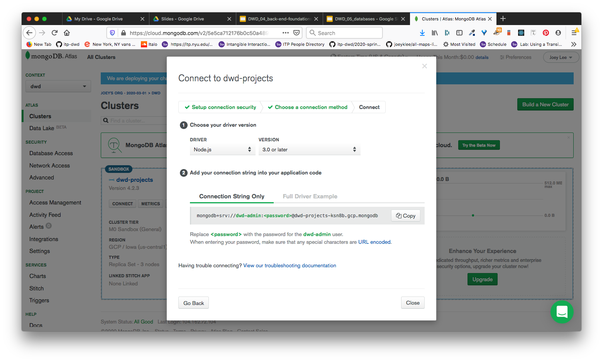
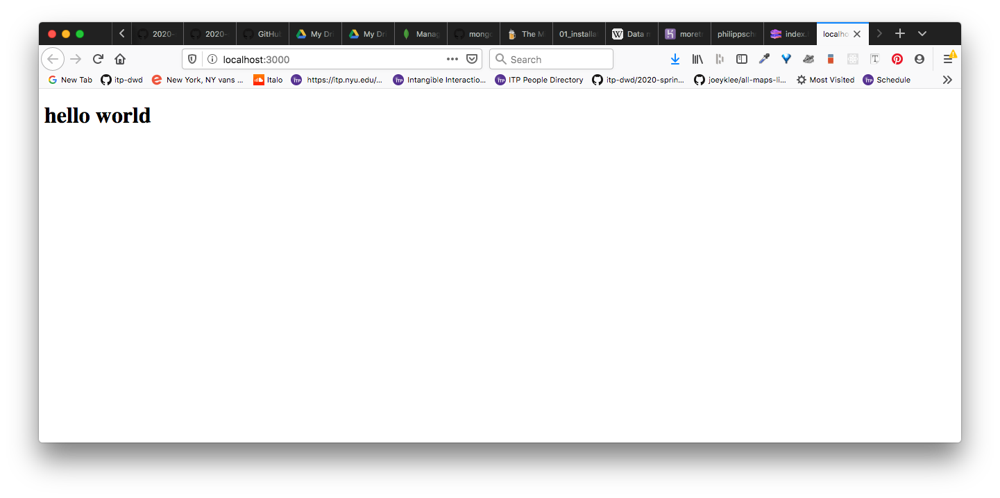
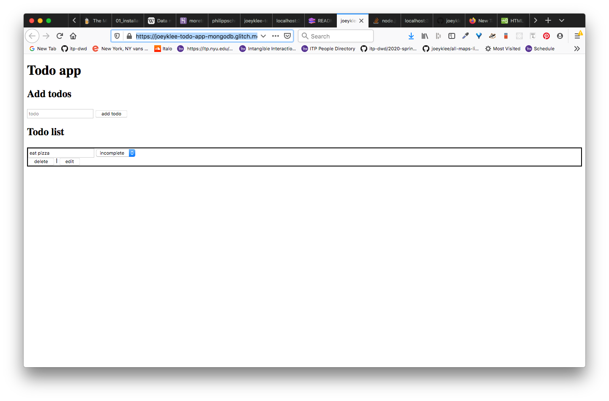

# MongoDB Guide

## About

The MongoDB Guide!

## Table of Contents

- [MongoDB Guide](#mongodb-guide)
  - [About](#about)
  - [Table of Contents](#table-of-contents)
  - [Getting Started](#getting-started)
    - [Option 1: Database in the cloud](#option-1-database-in-the-cloud)
    - [Option 2: Database local installation](#option-2-database-local-installation)
      - [MacOS](#macos)
      - [Windows](#windows)
- [MongoDB: Local Development](#mongodb-local-development)
  - [Running MongoDB](#running-mongodb)
    - [Starting](#starting)
    - [Stopping](#stopping)
  - [Interactive Mongo](#interactive-mongo)
    - [MongoDB GUI: Studio3T App](#mongodb-gui-studio3t-app)
    - [MongoDB via Commandline](#mongodb-via-commandline)
- [MongoDB with Node.js/Express.js](#mongodb-with-nodejsexpressjs)
  - [MongoDB Atlas: Hosting your database on the web](#mongodb-atlas-hosting-your-database-on-the-web)
    - [Todo App: Project scaffold](#todo-app-project-scaffold)
    - [Setup](#setup)
      - [Scaffold the app](#scaffold-the-app)
      - [Install your dependencies](#install-your-dependencies)
      - [Define your environment variables and configuration](#define-your-environment-variables-and-configuration)
        - [.gitignore](#gitignore)
        - [config.js](#configjs)
        - [.env](#env)
        - [package.json](#packagejson)
    - [Add boilerplate html to **views/index.html**](#add-boilerplate-html-to-viewsindexhtml)
    - [Add your "hello world" Express App](#add-your-%22hello-world%22-express-app)
    - [Defining API Endpoints](#defining-api-endpoints)
    - [Connect to mongodb](#connect-to-mongodb)
    - [Data Model: models/todo.js](#data-model-modelstodojs)
    - [Require your todos collection in your app](#require-your-todos-collection-in-your-app)
  - [Finding Data](#finding-data)
  - [Creating Data](#creating-data)
  - [Updating Data](#updating-data)
  - [Deleting Data](#deleting-data)
    - [Build your front-end user interface](#build-your-front-end-user-interface)
    - [Finished product:](#finished-product)
  - [Learn By Example](#learn-by-example)


## Getting Started

### Option 1: Database in the cloud

For starters we recommend directly starting to use a MongoDB database services like [MongoDB Atlas](https://www.mongodb.com/cloud/atlas). Why? Because this will allow us to quickly start reading and writing data in our web applications without fussing with local installation quirks and hiccups. 

You can follow along the [Database services guide - MongoDB Atlas](./guides/../database-services-guide.md#mongodb-atlas) to set up your database service in the "cloud." 


### Option 2: Database local installation

Typically as a developer, you'll develop locally and then push to the "cloud." This is the case for everything - your client side code, your server-side code, and your database server. As this is the case, setting up your local development environment includes installing your database locally. 

It should be noted that these installations can sometimes be fussy, so that's why we recommend [Option 1](#option-1-database-in-the-cloud) above to minimize lost time. If you want to get setup, however, you can follow the installation notes provided below.

#### MacOS

* It is recommended to install MongoDB using [Homebrew for mac](https://brew.sh/):
  * [Installation Guide](https://joeyklee.github.io/fullstack-user-auth/#/tutorial/01_installation)
  * Additional installation notes from MongoDB are supplied here: [MongoDB Homebrew Installation for Mac](https://github.com/mongodb/homebrew-brew)

#### Windows

* See installation notes [MongoDB Windows Installation](https://docs.mongodb.com/manual/tutorial/install-mongodb-on-windows/)

***
***
***

# MongoDB: Local Development

All of the notes below are relevant for working with a local installation of MongoDB.

## Running MongoDB

### Starting

In your terminal:
```sh
$ mongod
```

### Stopping

In your terminal where mongo is running, press: `control` + `c`

## Interactive Mongo

### MongoDB GUI: Studio3T App

You can download and install the [Studio 3T](https://studio3t.com/download/) App to view your MongoDB database, the collections, and documents through a GUI.

* [Studio 3T](https://studio3t.com/download/)

1. First, make sure you're running mongo:
   ```sh
   $ mongod
   ```
2. Then open up Studio3T
3. If it is your first time, you'll need to **create** a new connection, where:
   * name: `mongodb`
   * address:`localhost:27017`


### MongoDB via Commandline

1. First, make sure you're running mongo:
   ```sh
   $ mongod
   ```
2. Then open up your commandline, then start the mongo shell:
  ```sh
  $ mongo
  >
  ```
3. You can see the commands here at [Working with the mongo shell](https://docs.mongodb.com/manual/mongo/#working-with-the-mongo-shell):
   * To see which database you're currently using
   ```sh
   > db
   ```
   * To switch to a database
   ```sh
   > use treeDatabase
   ```
   * To insert a document to a collection
   ```sh
   > use treeDatabase
   > db.newyork.insertOne( { address: "370 Jay St., Brooklyn, NY"} );
   ```

***
***
***

# MongoDB with Node.js/Express.js

In this class, we will be interfacing with MongoDB databases. Essentially our task as developers is to connect the dots between our client side interfaces and the data living in our our databases through the APIs we design and build.

As you have seen in the [NeDB guide](./nedb-guide.md), you can create Express APIs that allow you to interface with different databases. Depending on the database that you connect to, the syntax and structure will change, sometimes slightly, other times more dramatically. 

When interfacing with MongoDB, we will be writing our server-side code to:
1. Connect with a MongoDB server hosted either locally or remotely.
2. CREATE, READ, UPDATE, and DELETE data stored in the MongoDB database that is being hosted locally or remotely.

For this guide, we assume that you will be connecting to a remote MongoDB instance hosted by MongoDB Atlas.

## MongoDB Atlas: Hosting your database on the web

Before continuing please be sure to set up MongoDB Atlas as detailed in the [Database services guide - MongoDB Atlas](./guides/../database-services-guide.md#mongodb-atlas).

### Todo App: Project scaffold

Scaffold your project like so
```txt
todo-app/
  .env
  .gitignore
  package.json
  index.js
  config.js
  public/
    js/
      main.js
    styles/
      main.css
    assets/
  views/
    index.html
  models/
    todo.js
  node_modules/
```

**Where**:
* **.env**: *file*
  * The `.env` file defines variables that will be picked up by your `process.env` variable. The variables you define here are generally things you want to **keep private** from the public. This includes the url to your **MongoDB atlas** server url.
* **.gitignore**: *file*
  * includes files and folders you want to ignore
  ```
  # ignore all those dependencies
  node_modules
  # ignore weird mac files
  .DS_Store
  $ ignore the .env file with your secret info
  .env
  ```
* **package.json**: *file*
  * generated using: `npm init`
* **index.js**: *file*
  * where your server code will live
* **config.js**: *file*
  * This is where you will store your configuration variables from your 
* **public/**: *directory*
  * includes public assets like your client facing javascript and css styles and images
* **models/**: *directory*
  * the directory where your database schema will live.
  * **models/todo.js**: *file*
    * we will write some javascript here that defines our database model for our todo data
* **views/**: *directory*
  * includes any index.html views that you will send to the client

### Setup

#### Scaffold the app

Scaffold the app by adding the following
```sh
~ $ cd Desktop
(desktop) $ mkdir todo-app
(desktop) $ cd todo-app
(todo-app) $ npm init
(todo-app) $ touch .env .gitignore index.js config.js
(todo-app) $ mkdir public public/js public/styles public/assets models views
(todo-app) $ touch views/index.html models/todo.js public/js/main.js public/styles/main.css
```

#### Install your dependencies

In your terminal:
```sh
$ npm install express morgan mongoose dotenv
$ npm install nodemon -D
```

#### Define your environment variables and configuration

##### .gitignore
* Set which things you want to ignore in `.gitignore`:
  ```txt
  # ignore all those dependencies
  node_modules
  # ignore weird mac files
  .DS_Store
  $ ignore the .env file with your secret info
  .env
  ```

##### config.js
* define your `config.js`. Here we define 2 **key/value** pairs, one for `PORT` and the other for `MONGODB_URI`:
  ```js
  require('dotenv').config();
  module.exports = {
    PORT: process.env.PORT || 3000,
    MONGODB_URI: process.env.MONGODB_URI || 'mongodb://localhost:27017/todo-app'
  }
  ```
  * we use the `require('dotenv').config()` to pull any environment variables defined in our `.env` file.
  
##### .env
* add your MongoDB Atlas URL to the `.env` file:
  ```
  MONGODB_URI='mongodb+srv://<yourUserName>:<yourPassword>@dwd-projects-ksn8b.gcp.mongodb.net/<yourCollectionName>?retryWrites=true&w=majority'
  ```
  * the `MONGODB_URI=` to the URL defined in:
     

##### package.json
* add your `start` and `dev` scripts to the `package.json`:
  ```json
  {
    "name": "todo-app",
    "version": "1.0.0",
    "description": "",
    "main": "index.js",
    "scripts": {
      "test": "echo \"Error: no test specified\" && exit 1",
      "start": "node index.js", 
      "dev": "nodemon index.js"
    },
    "keywords": [],
    "author": "",
    "license": "ISC",
    "dependencies": {
      "dotenv": "^8.2.0",
      "express": "^4.17.1",
      "mongoose": "^5.9.2",
      "morgan": "^1.9.1"
    },
    "devDependencies": {
      "nodemon": "^2.0.2"
    }
  }
  ```  
  * Notice under `"scripts"`:
    ```json
    "scripts": {
      "test": "echo \"Error: no test specified\" && exit 1",
      "start": "node index.js", 
      "dev": "nodemon index.js"
    },
    ```

### Add boilerplate html to **views/index.html**

```html
<!DOCTYPE html>
  <head>
    <meta charset="utf-8">
    <meta http-equiv="X-UA-Compatible" content="IE=edge">
    <title></title>
    <meta name="description" content="">
    <meta name="viewport" content="width=device-width, initial-scale=1">
    <link rel="stylesheet" href="./styles/main.css">
  </head>
  <body>
    <h1>hello world</h1>
    <script src="./js/main.js"></script>
  </body>
</html>
```

### Add your "hello world" Express App

In your **index.js**:
```js
const fs = require('fs');
const path = require('path');
const express = require('express');
const app = express();
const config = require('./config');

const PORT = config.PORT;

// ---- Connect to mongodb here ----

// --- connect to your collection ---

// Handle data in a nice way
app.use(express.json());
const publicURL = path.resolve(`${__dirname}/public`);

// Set your static server
app.use(express.static(publicURL));

// Set your static html file
app.get("/", (req, res) => {
  res.sendFile( path.resolve(__dirname + "/views/index.html"))
});

// ---- ADD YOUR API ENDPOINTS HERE ----

// Start listening
app.listen(PORT, () => {
  console.log(`see the magic: http://localhost:${PORT}`);
})
```

Now run:

```sh
(todo-app) $ npm run dev
```

You should see:

;


### Defining API Endpoints

We are going to create a CRUD style API with the following endpoints:
* `/api/v1/todos`
  * GET
  * POST
* `/api/v1/todos:id`
  * PUT
  * DELETE
  
Before we add our MongoDB into the mix, let's define our API endpoints in `index.js`. Where you see the comment `// ---- ADD YOUR API ENDPOINTS HERE ----`, add the following:

```js
// ---- ADD YOUR API ENDPOINTS HERE ----
// GET: "api/v1/todos"
app.get("/api/v1/todos", async (req, res) => {
  try{
    res.json({})
  } catch(error){
    console.error(error);
    res.json(error);
  }
});

// POST: "api/v1/todos"
app.post("/api/v1/todos", async (req, res) => {
  try{
    res.json({})
  } catch(error){
    console.error(error);
    res.json(error);
  }
});

// PUT: "api/v1/todos:id"
app.put("/api/v1/todos/:id", async (req, res) => {
  try{
    res.json({})
  } catch(error){
    console.error(error);
    res.json(error);
  }
});

// DELETE: "api/v1/todos:id"
app.delete("/api/v1/todos/:id", async (req, res) => {
  try{
    res.json({})
  } catch(error){
    console.error(error);
    res.json(error);
  }
});
```

Now if you navigate to: `http://localhost:3000/api/v1/todos`, a `GET` request will be triggered and you should see an empty JSON file is returned:

```json
{}
```


Hooray! If this is working, then your API is working! The next steps are to:
* connect to mongodb
* define a data model
* start defining the API routes

### Connect to mongodb

With this chunk of code, we will be connected to our MongoDB database hosted in MongoDB Atlas:
```js
// ---- Connect to mongodb here ----
// read in mongoose library
const mongoose = require('mongoose');
// read in the URI to our MongoDB Atlas 
const MONGODB_URI = config.MONGODB_URI;
// Use mongoose to connect to our MongoDB Atlas server
mongoose.connect(MONGODB_URI, {useNewUrlParser: true});

// --- connect to your collection ---
```

### Data Model: models/todo.js

In your `models/todo.js`, write the following code: 
```js
// 1. Read in your mongoose library
const mongoose = require('mongoose');
// 2. Get the Schema class from mongoose
const Schema = mongoose.Schema;
// 3. Define the database model schema for your todos
const todoSchema = new Schema({
  "todo": String,
  "status": String
});

// 4. create a new mongodb model called: "todos"
const db = mongoose.model('todos', todoSchema)
// 5. make this todos model available to your app
module.exports = db;
```

* Under the hood, our database will look something like:

```
todo-app
+----------------------------------------+
| todos                                  |
| +------------------------------------+ |  
| | document#001                       | |
| | document#002                       | |
| | document#003                       | |
| |                                    | |
| |                                    | |
| +------------------------------------+ |
|                                        |
+----------------------------------------|
```

### Require your todos collection in your app

Back in `index.js` **after your mongoose connection**, then add the following line:

```js
// --- connect to your collection ---
const todos = require('./models/todo');
```

Woohoo! Now AFTER ALL OF THAT, can we start to interface with our Mongodb.

## Finding Data

In your `index.js`: go to `// GET: "api/v1/todos"`


We will use the `.find()` function to find all of our data.
```js
// GET: "api/v1/todos"
app.get("/api/v1/todos", async (req, res) => {
  try{
    const data = await todos.find();
    res.json(data);
  } catch(error){
    console.error(error);
    res.json(error);
  }
});
```

In this step, we will be sending back ALL of the todos data in our database when someone navigates to the URL: `/api/v1/todos`. Since we don't have anything yet in our database, we will get an empty array.

## Creating Data

Now go to your next API endpoint: `// POST: "api/v1/todos"`

We will use the `.create()` function to create a new document.
```js
// POST: "api/v1/todos"
app.post("/api/v1/todos", async (req, res) => {
  try{
    const newData = {
      todo: req.body.todo,
      status: req.body.status
    }
    const data = await todos.create(newData);
    res.json(data);
  } catch(error){
    console.error(error);
    res.json(error);
  }
});
```

and try running the following command in your terminal:

```sh
$ curl -X POST \
  -H 'Content-Type: application/json' \
  -H 'Accept: application/json' \
  -d '{"todo":"do laundry", "status":"incomplete"}' http://localhost:3000/api/v1/todos
```
The JSON response will be the newly created JSON data:
```json
{"_id":"5e5d774a55d3633514cf2bbe","todo":"do laundry","status":"incomplete","__v":0}
```

And if you now make a GET request at: `http://localhost:3000/api/v1/todos`, you'll see:

```js
[{"_id":"5e5d774a55d3633514cf2bbe","todo":"do laundry","status":"incomplete","__v":0}]
```

See how we have this super long `_id` property in our JSON? We can and will use that to update and delete our data!

## Updating Data

In `index.js`, go to: `// PUT: "api/v1/todos:id"`

We will use the `findOneAndUpdate()` function to find our document and update it with the updated data we pass in.
```js
// PUT: "api/v1/todos:id"
app.put("/api/v1/todos/:id", async (req, res) => {
  try{
    const updatedData = {
      todo: req.body.todo,
      status: req.body.status
    }
    const data = await todos.findOneAndUpdate({_id: req.params.id}, updatedData, {new:true});
    res.json(data);
  } catch(error){
    console.error(error);
    res.json(error);
  }
});
```

You can give this a try by doing:

```sh
$ curl -X PUT \
-H 'Content-Type: application/json' \
-H 'Accept: application/json' \
-d '{"status":"complete", "todo":"do laundry"}' \
http://localhost:3000/api/v1/todos/5e5d774a55d3633514cf2bbe
```

You will see that the status has changed to `complete`:
```
{"_id":"5e5d774a55d3633514cf2bbe","todo":"do laundry","status":"complete","__v":0}
```

## Deleting Data

In `index.js`, go to: `// DELETE: "api/v1/todos:id"`

We will use the `findOneAndDelete()` function to find our document and delete it.

```js
app.delete('/api/v1/todos/:id', async (req, res) => {
  try {
  const deletedDocument = await treeDB.findOneAndDelete(req.params.id);
  res.json({"message":"successfully removed item", "data": JSON.stringify(deletedDocument) });
  } catch (error) {
    res.json({ error: JSON.stringify(error) });
  }
});
```

You can give this a try by doing:

```sh
$ curl -X DELETE \
http://localhost:3000/api/v1/todos/5e5d774a55d3633514cf2bbe
```

And the response you will get is:

```json
{"message":"successfully removed item","data":"{\"_id\":\"5e5d74d7bc1558327caf8d17\",\"todo\":\"do laundry\",\"__v\":0}"}
```

### Build your front-end user interface

Now the time has come to build your front-end user interface. This is not the focus of this guide, so you can see the code files for this here:
* **public/js/main.js**:
  * [public/js/main.js](https://glitch.com/edit/#!/joeyklee-todo-app-mongodb?path=public/js/main.js:1:0)
* **public/styles/main.css**:
  * [public/styles/main.css](https://glitch.com/edit/#!/joeyklee-todo-app-mongodb?path=public/styles/main.css:1:0)
* **views/index.html**:
  * [views/index.html](https://glitch.com/edit/#!/joeyklee-todo-app-mongodb?path=views/index.html:1:0)


### Finished product:



* Todo App:
  * [Code](https://glitch.com/edit/#!/joeyklee-todo-app-mongodb)
  * [Demo](https://joeyklee-todo-app-mongodb.glitch.me/)


## Learn By Example

* [Todo App](https://glitch.com/~joeyklee-todo-app-mongodb)
* [Empty Tree Database](https://glitch.com/~empty-tree-db-mongodb)
* [Express.js & Mongodb example code](https://github.com/joeyklee/sandbox/tree/master/express/express-mongo)
* **advanced**: [Basic Authentication with Express & MongoDB](https://github.com/joeyklee/very-basic-express-auth-example/tree/with-mongodb)
* **advanced**: [The List Project](https://github.com/joeyklee/list-project) & [Fullstack User Authentication Tutorial](https://github.com/joeyklee/fullstack-user-auth)

