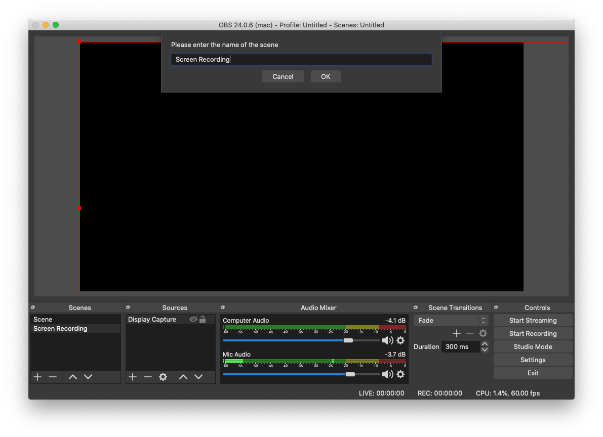
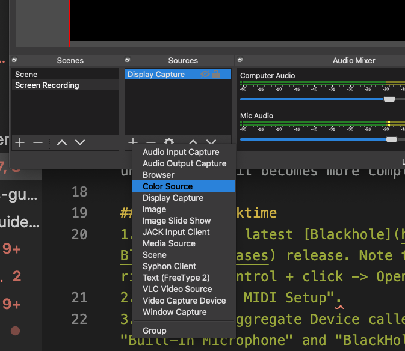
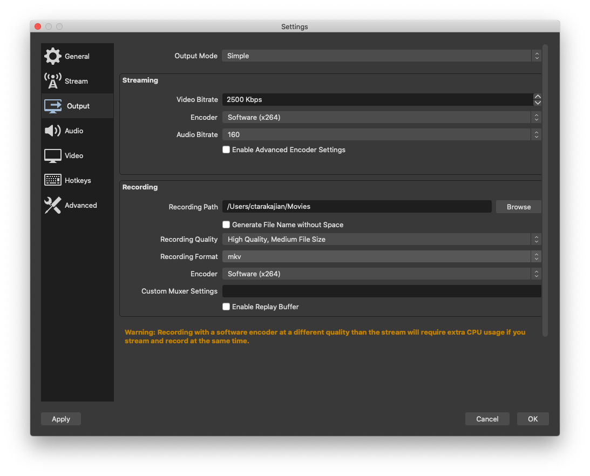
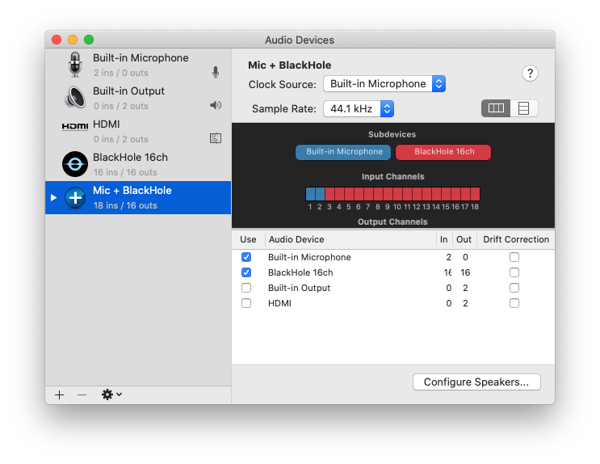
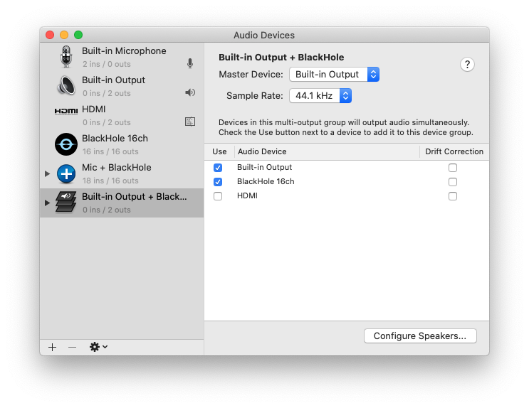
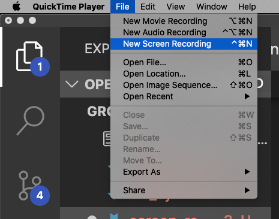
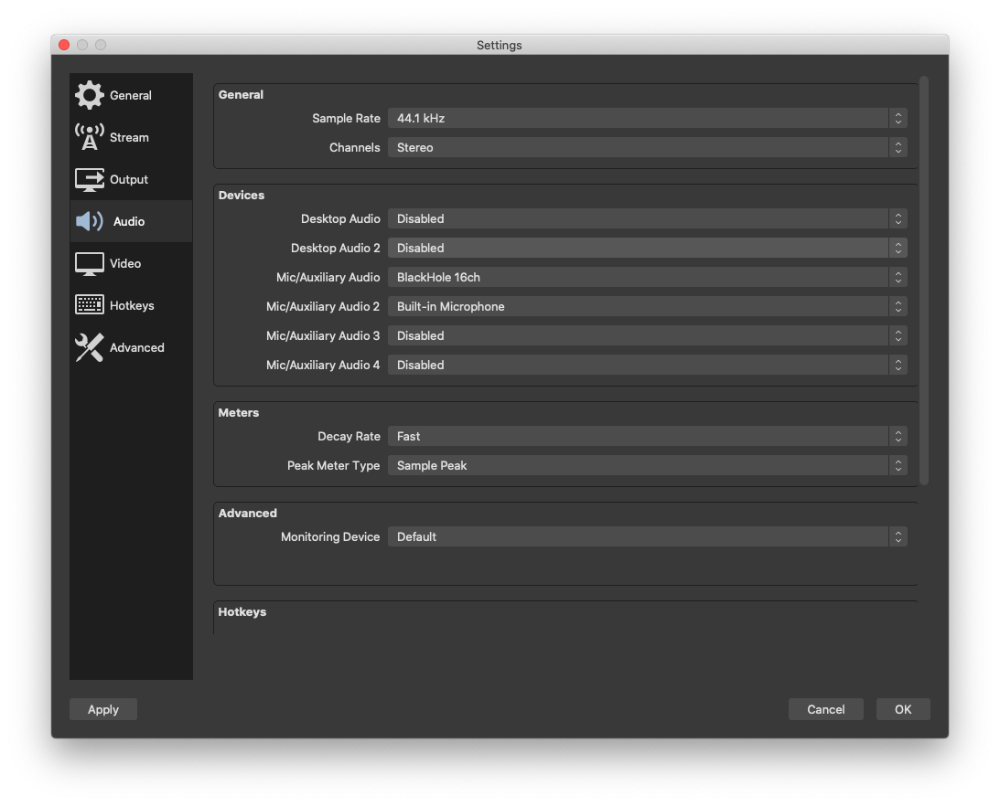
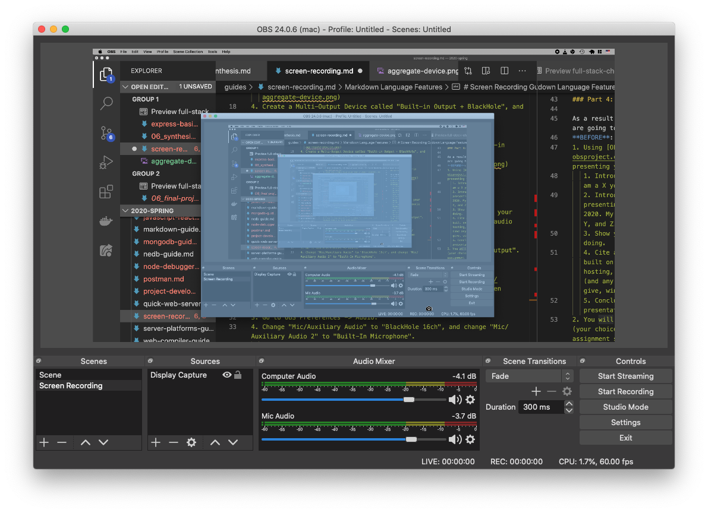

# Screen Recording Guide

Because our final presentations will now be remote, we will need to record them ahead of time. 

## Applications
* Quicktime (Mac Only), [Guide](https://blog.hubspot.com/marketing/how-to-record-your-screen). This is the recommended software as it comes with the Mac OS. 
* XBox Game Bar (Windows Only), [Guide](https://blog.hubspot.com/marketing/how-to-record-your-screen). Honestly, I would recommend OBS over this, even though you need to download additional software, because it is super confusing.
* [OBS](https://obsproject.com/) (Cross-Platform)

## OBS Guide
1. Download [OBS](https://obsproject.com/) and open it.
2. Under "Scenes" click "+" and add a new Scene called "Screen Recording".
   
3. Click "+" under Sources -> Display Capture
   
4. Go to Preferences -> Output, and check that (1) the path that videos are output to is okay, and (2) the videos are being saved as `.mkv`. 
   . 
   **Note**: To play back `mkv` files on Mac, you will need to install [VLC](https://www.videolan.org/vlc/index.html).
5. Make a test recording. Click "Start Recording" and then watch you video!

## Recording Computer and Mic Audio
If you screen recording needs both computer audio and screen audio, unfortunately it becomes more complicated.

### Mac + Quicktime
1. Install the latest [Blackhole](https://github.com/ExistentialAudio/BlackHole/releases) release. Note that when opening it, you'll have to right click/control + click -> Open with Installer.
2. Open "Audio MIDI Setup".
3. Create an Aggregate Device called "Mic + BlackHole", and check both "Built-In Microphone" (or "External Microphone", depending on how you're recording your voice) and "BlackHole 16ch".
   
4. Create a Multi-Output Device called "Built-in Output + BlackHole", and check both "Built-In Output" and "BlackHole 16ch".
   
5. Open System Preferences -> Sound, and set the Output to "Built-in Output + BlackHole".
   
6. Open QuickTime Player and go to File -> New Screen Recording.
   
7. Click Options -> Microphone -> Mic + BlackHole
8. Make a test recording. Click Record, and input audio from both your mic and computer. Play the video and make sure you can hear both audio from your mic and computer!
9. Do your actual recording.
10. When you're finished, switch your Sound Output to "Built-In Output". 

### Mac + OBS
1. Follow the [above guide](#obs-guide) to adding a screen recording scene to OBS.
2. Follow steps 1-5 of the **Mac + Quicktime** guide.
3. Go to OBS Preferences -> Audio.
4. Change "Mic/Auxiliary Audio" to "BlackHole 16ch", and change "Mic/Auxiliary Audio 2" to "Built-In Microphone".
    
5. Close the Preferences, and in the "Audio Mixer" Pane, rename the audio inputs so you know what they are.
   
6. Make a test recording, by clicking "Start Recording". Watch it and make sure you're able to hear audio from both sources!
7. Do your actual recording.
8. When you're finished, switch your Sound Output to "Built-In Output".

### Windows + OBS
Honestly not sure how to do audio routing on Windows. hlep.