# Web Design Process Guide

## Table of Contents
- [Web Design Process Guide](#web-design-process-guide)
  - [Table of Contents](#table-of-contents)
  - [Web Design(ing)](#web-designing)
  - [Research: User Research, Defining Requirements, Moodboards, and Inspiration](#research-user-research-defining-requirements-moodboards-and-inspiration)
    - [Research Examples](#research-examples)
    - [Requirements Examples](#requirements-examples)
  - [Sketching](#sketching)
  - [Wireframing](#wireframing)
  - [Visual Designing](#visual-designing)
  - [Style Guide](#style-guide)
  - [Grid Theory](#grid-theory)
  - [Reverse Engineering](#reverse-engineering)
  - [Design Tools](#design-tools)
  - [Resources](#resources)

## Web Design(ing)

Building front end web applications is about addressing both the **visual design** of the client facing interface and the **functionality** of the web application. 

In this class, we briefly introduce you to the the basic process and components of web design and then address how these designs come to materialize through code.

## Research: User Research, Defining Requirements, Moodboards, and Inspiration

**Moodboards & Inspiration**: Simultaneously while you're researching and defining and refining your requirements, it helps to being collecting materials that can inform your web application's design concept. You can use services like [Are.na](https://www.are.na/) or [Pinterest](https://www.pinterest.com/) or just use a folder full of images to collect inspiration of websites, images, interaction types, typography, colors, layouts, etc that might come to influence your visual design.

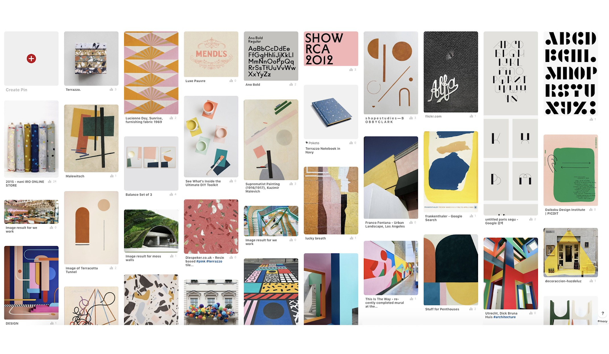

**Research**: Before anything else, any and every good design process will begin with **research**. Research about your users, their needs, their desires, their pain points, their delights, what motivates them, what inspires them, what scares them, what keeps them engaged, what truly benefits them, and so on. In ITP's [Designing Meaningful Interactions](https://itp.nyu.edu/classes/ux_bak/) you can get a deeper understanding and appreciation for UX design and UX design methods. Additionally, some methods and thinking in this direction can be found here in [This is Service Design Thinking](https://www.goodreads.com/book/show/9840969-this-is-service-design-thinking) and [Don Norman's The Design of Everyday Things](https://www.goodreads.com/book/show/840.The_Design_of_Everyday_Things?from_search=true&qid=HOCwRYeOac&rank=1).

### Research Examples
* **Nonprofit**
  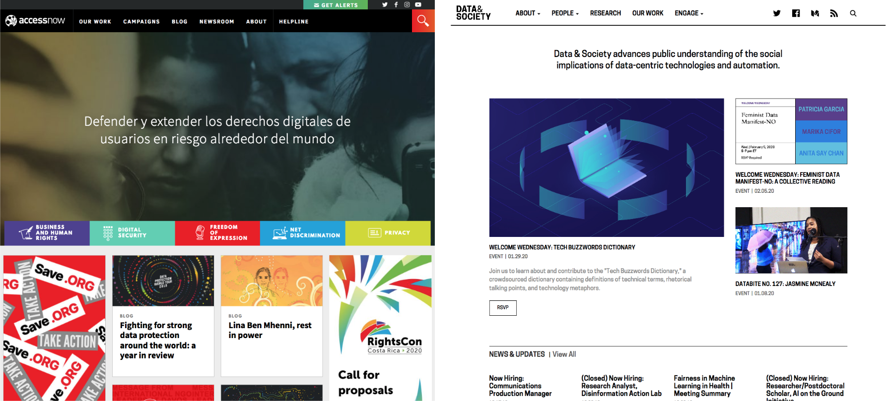
* **University**
  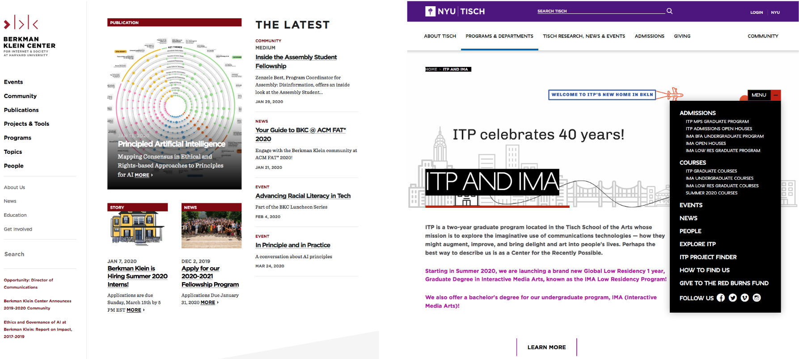
* **Studio**
  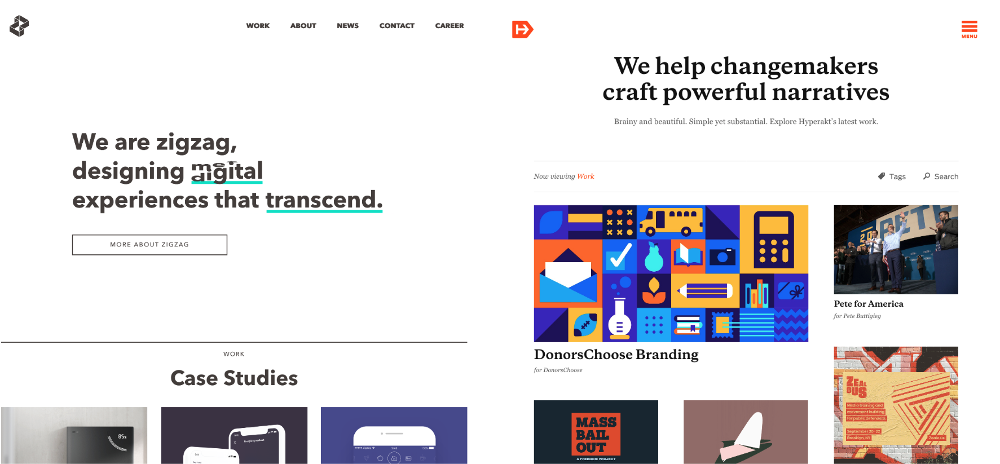
* **Product**
  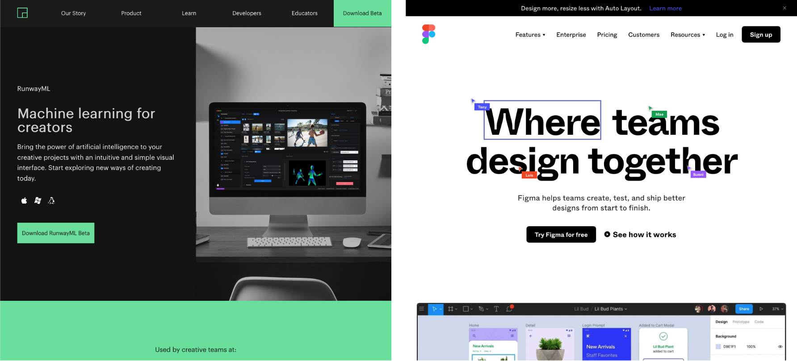
* **Information** Architecture
  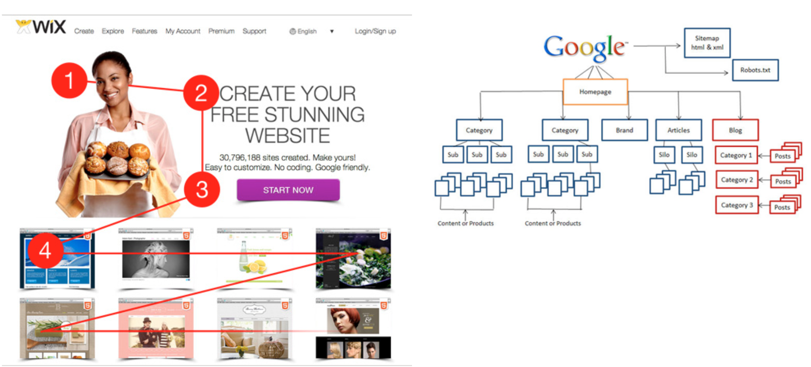

**Requirements**: Your research will inform **the requirements** for your application. Does your design need to be interactive or is it a passive interaction? Does the subject warrant a certain color palette? Do certain typographic considerations need to be made based on your users or based on the briefing from your client or company's style guide? Does your site need to allow people to log-in to a service? Do you need to display data on the site? Based on questions such as these, you will define a requirements list of what **features** and **functionality** the front-end of your site/application will need. You can also add your own "nice-to-haves" section!

The format of requirements documents can vary depending on the context. For example, for a small project, it may just be a list of **functionality** and **design** requirements. For a larger project, or a client project, it will include sections like **goals**, **phases**, **milestones**, and so on.

### Requirements Examples
* **Minimal**
  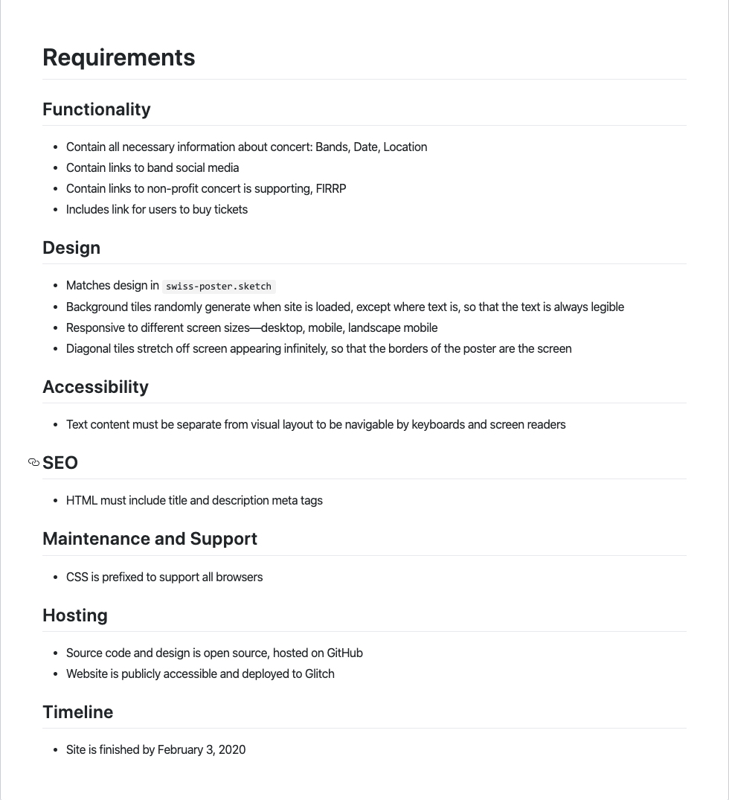
* In-depth guide: [Guide: Writing effective website specification documents](https://highrise.digital/blog/web-specification-guide/).

## Sketching

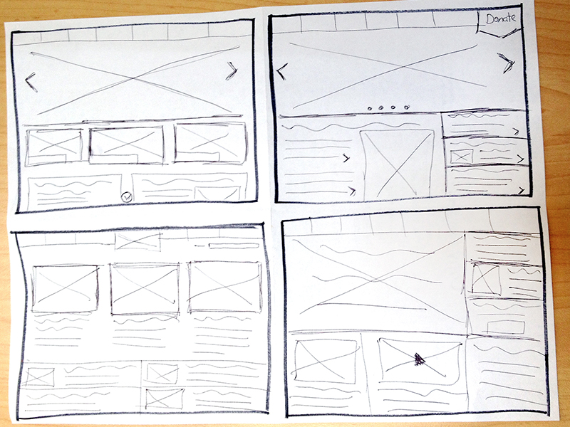

The reality is that there's a lot of overhead to coding, especially when it comes to refactoring and entire code base, updating entire layouts due to a change in design, having to change colors, typography, font-sizes, and more. The point of sketching is to help you put your ideas on paper, to get feedback on those ideas, to assess the viability and appropriateness of your solutions to your/incoming requirements and more. 

Your sketches can be as epic or as simple as you desire, but the point is to have visual material that you can use to ask yourself and others if the requirements you've defined are being addressed in your structure and layout. The structure and layout defined in your sketches can be made clearer when you create wireframes. What are wireframes you ask? Find out in the next section!

## Wireframing

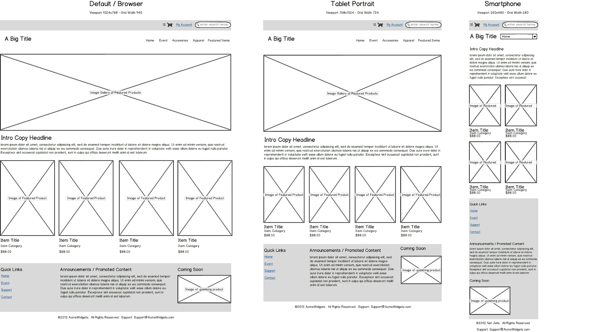
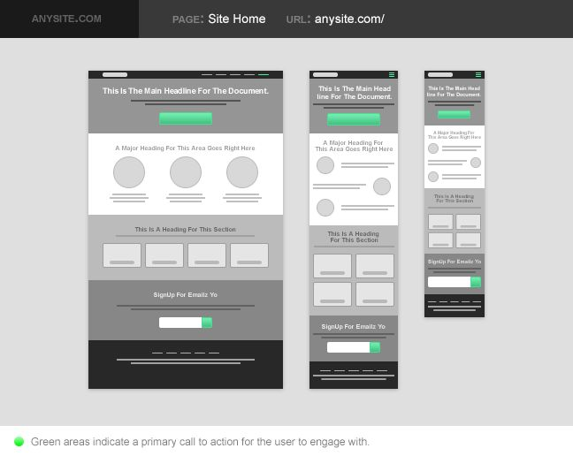

[Wireframing](https://en.wikipedia.org/wiki/Website_wireframe) is the process of taking what you've done in your sketches, considering your requirements, and beginning to translate those ideas into a more clear [information architecture](https://en.wikipedia.org/wiki/Information_architecture) which will eventually lead to a visual design. Wireframing is a *process* and not just a *product* of work that you do as a web designer/developer that allows you to identify "the practicality of a design concept" and to identify functionality, user flows, and experience of your application. It is by nature, iteritive and meant to help you reduce the overhead to major code changes downstream. The idea is to resolve your interactions and flows in the wireframes before moving on to production (though it can be helpful to begin *prototyping* with code in tandem).

As written in the [Wireframe Wikipedia](https://en.wikipedia.org/wiki/Website_wireframe):
> A website wireframe, also known as a page schematic or screen blueprint, is a visual guide that represents the skeletal framework of a website. Wireframes are created for the purpose of arranging elements to best accomplish a particular purpose...The website wireframe connects the underlying conceptual structure, or information architecture, to the surface, or visual design of the website. Wireframes help establish functionality and the relationships between different screen templates of a website. An iterative process, creating wireframes is an effective way to make rapid prototypes of pages, while measuring the practicality of a design concept. Wireframing typically begins between “high-level structural work—like flowcharts or site maps—and screen designs.” Within the process of building a website, wireframing is where thinking becomes tangible.*

Your wireframes should be devoid of extraneous details like colors and even typographic interventions (gasp!). The idea is to focus specifically on information architecture, layout, and flow.

Some helpful wireframe kits for the [Sketch App]() can be found here:
* ↳ [Simple Wireframe Kit Sketch Resource](https://www.sketchappsources.com/free-source/2749-simple-wireframe-kit-sketch-freebie-resource.html)
* ↳ [Wireframing UX Kit Sketch Resource](https://www.sketchappsources.com/free-source/3244-wireframing-ux-kit-sketch-freebie-resource.html)
* ↳ [Wireframe Kit for Atomic Design Sketch Resource](https://www.sketchappsources.com/free-source/3105-wireframe-kit-atomic-design-sketch-freebie-resource.html)

## Visual Designing

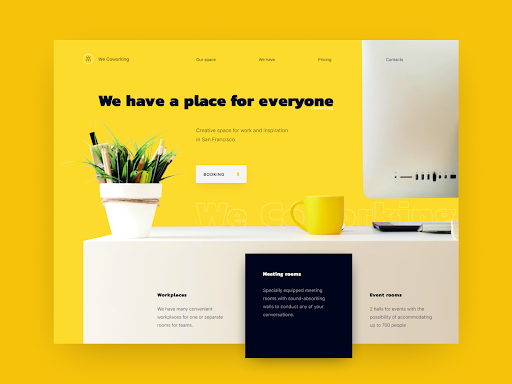

While wireframes are generally lower fidelity, higher fidelity wireframes will begin to look and feel like the a "design" of your application. As you move towards a final "design", you'll be moving towards what some might call as a **visual design** of your application -- i.e. what you envision your application to look like in the end. This means adding all of the elements that will be on the final pages, even the real copy (e.g. text). Your visual design will include the image assets, styled buttons, correct margin spacing, colors, and typography. The **visual design is your map** to how you will develop the front end of your web application and will be the metric of your success for your front end code.

## Style Guide

The style guide is your reference for all things related to the design of your application. This includes the specifications for all the aspects of your application that need specifying such as:
* logos
* colors
* typography
* iconography
* illustrations
* buttons/links
* input forms styles
* navigation
* and more...

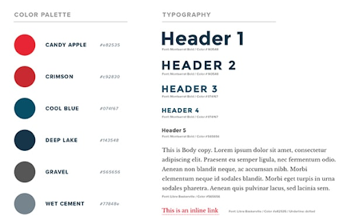

This document is a general reference for how different components of your site should look. 

You can look at different style guide examples here:
* [IBM Design Language](https://www.ibm.com/design/language/layout/overview)
* [BBC - GEL Design Patterns](https://www.bbc.co.uk/gel/guidelines/category/foundations)
* DuoLingo had a good one, but has been taken off the web!

## Grid Theory
* ↳ [See Building Better UI Designs with Layout Grids](https://www.smashingmagazine.com/2017/12/building-better-ui-designs-layout-grids/)

## Reverse Engineering

One tool used to practice creating the different components of designs is **reverse engineering**. This is the process of looking at an existing design and breaking it down into a grid and style guide.

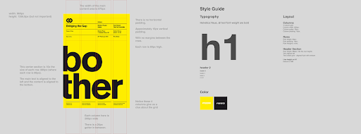

## Design Tools

There's no right tool to create designs with! Because some of them have a learning curve, or are not free, it's recommended you use whatever is easiest for you.

* **Keynote** - Comes with MacOS, easy to use, normally used to make slides
* **PowerPoint** - $139.99, easy to use, normally used to make slides
* **[Sketch](https://www.sketch.com/)** - $99, the tool used by Cassie and Joey, optimized for creating digital designs for web and mobile applications
* **[Figma](https://www.figma.com/)** - Free for individuals, optimized for web and mobile designs, generates some code. (Neither Cassie nor Joey has used it and can neither endorse nor renounce it)

## Resources
* [Design for Developers](https://www.taniarascia.com/design-for-developers/)