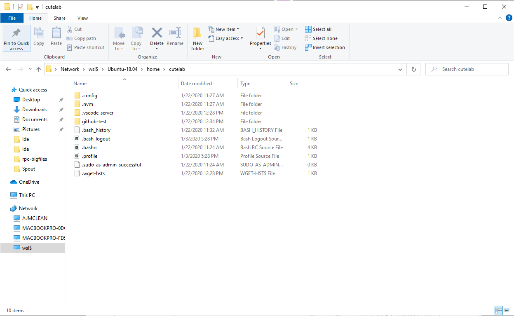
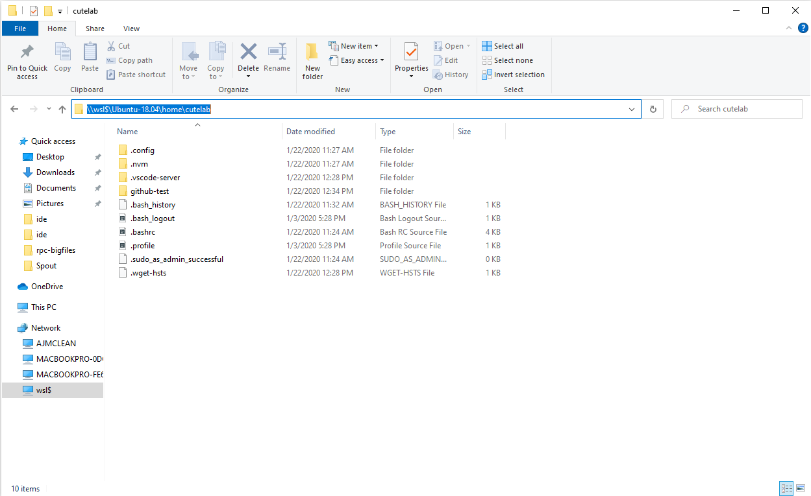

# Window Setup Guide

If you're using a Windows machine in this class, your setup will have a few more steps.

## Installing Linux on Windows

The recommended way to do Node.js development on Windows is to use Windows Subsystem for Linux 2. This allows you to run Linux on your Windows machine.

Please follow this guide, [Set up your Node.js development environment with WSL 2](https://docs.microsoft.com/en-us/windows/nodejs/setup-on-wsl2), up to and including the section "Install WSL 2." After following this guide myself, a few things were unclear to me:
- After following the first section, "Install Windows 10 Insider Preview Build," you'll need to go back to the Update Assistant to actually install the Windows 10 Preview Build. This section only takes you through *enabling* the Windows Insider updates.
- Once you've installed WSL2, to actually run Linux, you'll need to open the Windows Command Prompt and type
  ```sh
  $ wsl
  ```
  And this will take you to the Linux environment. **Any command line guides in this class are assuming you're using a Unix or Linux command line.**

## Using the File Explorer/Paths with WSL2

If you want to use the Windows File Explorer to see your Linux files, you'll need to launch the explorer from the command line. First, open WSL and make sure you're in your home directory `~`. Then run
```sh
$ explorer.exe .
```
When it opens, you should see a window that looks something like this:


When you click on the path at the top (the part that says "Network > wsl$ > Ubuntu-18.04...), it will give you the path as text:


**It's important you know how to get this path!** This is how you will connect programs like VSCode and GitHub Desktop to your projects. This is because when you enter `pwd` from within Linux, you'll see
```sh
$ pwd
/home/cutelab
```
which is where you are **relative to WSL**. It's missing the beginning part and also not in the Windows path format, \\\wsl$\Ubuntu-18.02\home\cutelab.

## Next Steps

Once you've installed WSL2, you can follow the test of the [Set up your Node.js development environment with WSL 2](https://docs.microsoft.com/en-us/windows/nodejs/setup-on-wsl2) guide to install `nvm`/`Node.js`, as well as configure VSCode properly. 
