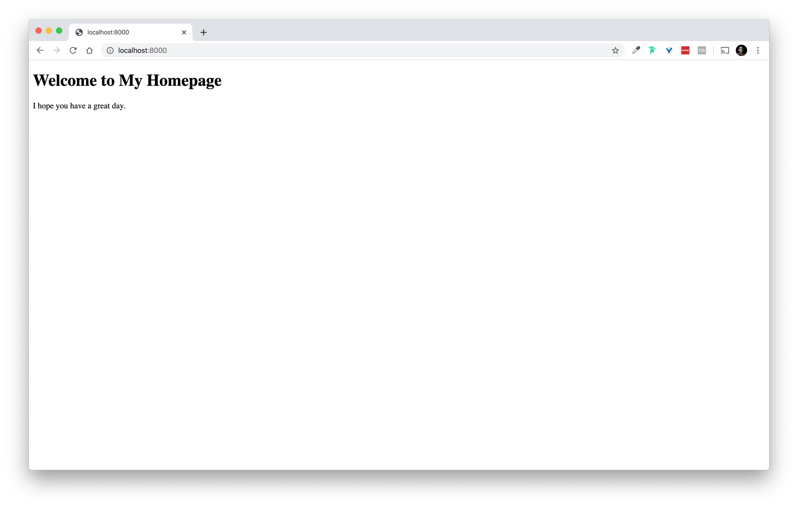
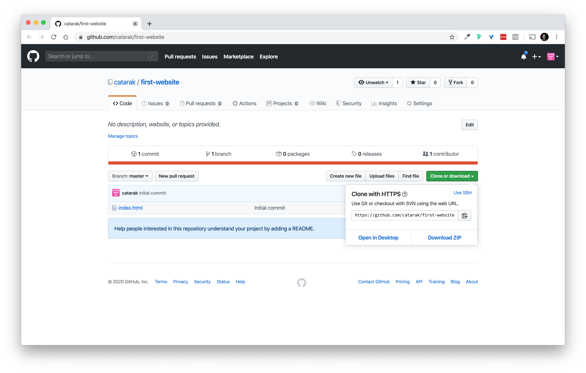
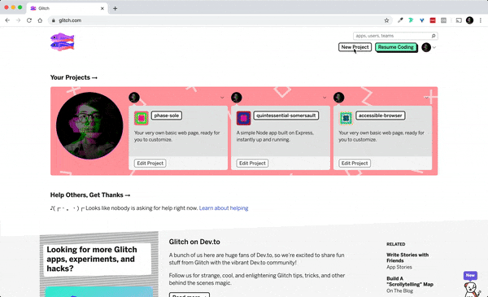
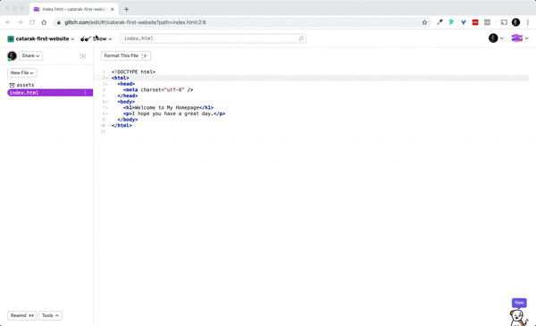

# Your First Website Guide

## About

If you're here, you've probably developed interactive "sketches" in p5.js in the web editor, but are now ready to start developing web sites and applications outside of web IDE (interactive development environment). This guide is meant to give you a perspective on how we (your instructors) might develop a *simple*, no-frills front end website or web application. 

Let's do this in 10 friendly steps:

## Prerequisites

First thing's first: make sure you've downloaded and installed the materials outlined here:
* [Developer Setup Guide](developer-setup-guide.md#materials)

Basically, we're looking to make sure you have *at least*:

* an modern text editor
* you know how to open your terminal/commandline
* you have an account on Github.com
* you have an account on Glitch.com
* the github desktop app

## Table of Contents

- [Your First Website Guide](#your-first-website-guide)
  - [About](#about)
  - [Prerequisites](#prerequisites)
  - [Table of Contents](#table-of-contents)
  - [10 Step Guide to Creating & Publishing Your First Webpage](#10-step-guide-to-creating--publishing-your-first-webpage)
    - [Step 1: Create your project folder and open it in VS Code](#step-1-create-your-project-folder-and-open-it-in-vs-code)
    - [Step 2: Create an `index.html` file](#step-2-create-an-indexhtml-file)
    - [Step 3: add HTML code to `index.html`](#step-3-add-html-code-to-indexhtml)
    - [Step 4: Create a local web server](#step-4-create-a-local-web-server)
    - [Step 5: Test your site](#step-5-test-your-site)
    - [Step 6: Start tracking with Git](#step-6-start-tracking-with-git)
    - [Step 7: Use Github Desktop make your code open source](#step-7-use-github-desktop-make-your-code-open-source)
    - [Step 8: Get your Github Repo's URL](#step-8-get-your-github-repos-url)
    - [Step 9: Create a "New Project" on Glitch from your git repository URL](#step-9-create-a-%22new-project%22-on-glitch-from-your-git-repository-url)
    - [Step 10: See your project live](#step-10-see-your-project-live)
  - [Conclusion ✨](#conclusion-%e2%9c%a8)

## 10 Step Guide to Creating & Publishing Your First Webpage

### Step 1: Create your project folder and open it in VS Code

Create a folder for your project. You can do so by navigating to wherever you choose to organize your projects (e.g. `~/Documents`) and then doing:

**Option 1:** Using the commandline

```sh
$ mkdir ~/Development/first-website
$ cd ~/Development/first-website
$ code .
```
**NOTE**: `code` opens VSCode from the command line. You may have to open VSCode and run "Shell Command: Install 'code' command in PATH".

**Option 2:** Manually 

1. Create a new folder: `right click` in the `~/Documents` directory > select: "new folder" 
2. Rename the folder: `right click` on `untitled folder` > select: "rename" > type: `first-website`
3. Open that folder in VS Code: Open VS Code and then...
   - drag and drop your folder into your VS Code window OR
   - menu: file > select: open > navigate and click on the folder you made in `~/Documents/myProject`

Now you'll have a new project called `first-website` in your `~/Documents` folder. It is in this folder where all your project files will live.
```txt
~/Documents/first-website
```

### Step 2: Create an `index.html` file

Create a new file and save it as `index.html`. You can do this by:

**Option 1**: via the commandline

```sh
$ touch index.html
```

**Option 2**: in VS Code

1. Create a new file: `right click` on the side panel > select: **new file** > type: e.g. `index.html`

### Step 3: add HTML code to `index.html`
Now in VS Code, click the `index.html` file in the sidebar and add the following code:

```html
<!DOCTYPE html>
<html>
  <head>
    <meta charset="utf-8" />
  </head>
  <body>
    <h1>Welcome to My Homepage</h1>
    <p>I hope you have a great day.</p>
  </body>
</html>
```

Remember to **save your code** by pressing: `command` + `s`

### Step 4: Create a local web server

Create a local web server to view the html page you just create in your project folder:

**If you're using python 2.X**
```sh
$ python -m SimpleHTTPServer
```

**or, if you are running Python 3**
```sh
$ python3 -m http.server 8000
```

### Step 5: Test your site
Test your site by navigating to following link in your web browser: [http://localhost:8000](http://localhost:8000)



Now if you make changes to your `index.html` file, refresh your browser at [http://localhost:8000](http://localhost:8000) and see those changes!

### Step 6: Start tracking with Git


The best thing you can do for yourself on your developer journey is to use version control and get into the good practice of tracking your project evolution with a version control system. At the time of this writing (and quite likely into the future) we use `git` to do version control.

You can read more about how git works in the [Git Guide](/guides/git.md) but you can think of git as a system that allows you to drop "breadcrumbs" along the process of your project development so that you can:

1. track how your project develops (e.g. when you add new files, make changes to those files, add new features, etc) and
2. go *back in time* in case you break something or want to return to a previous state of your project or retrieve the previous state of a file within your project history.

In order to "drop those breadcrumbs" you'll need to know a few commands, namely you'll need to know how to:
1. `git init`: initialize a git repository -- e.g. initialize the git system tracking changes in your folder
2. `git add .` or `git add index.html`: adding files to the git tracking system
3. `git commit -m "message"`: "committing" those files and any changes with a message indicating what was changed.

For the purpose of this guide, you can do the following now:

```sh
$ git init
$ git add .
$ git commit -m "Initial commit"
```

### Step 7: Use Github Desktop make your code open source

Use GitHub Desktop to push your repository to GitHub.


### Step 8: Get your Github Repo's URL
Get your repository's URL



### Step 9: Create a "New Project" on Glitch from your git repository URL




### Step 10: See your project live  

Click "Show" > "In a New Window" and you're done!




## Conclusion ✨

🎉 Hooray! You just built and deployed your first HTML webpage from scratch! 

From here you can continue to learn more to create more complex websites:
* [HTML Guide](html-guide.md)
* [CSS Guide](css-guide.md)
* [JavaScript Guide](javascript-frontend-guide.md)

<!-- 

Minimal scaffold for your structure:

It is helpful to "scaffold" out a structure for your project so you can fill in the code where it is relevant and you can keep your project tidy and consistent.

You may consider adopting a structure like this assuming you will have HTML/CSS/JavaScript:

```txt
/myProject
  index.html
  /js
    index.js
  /css
    main.css
  /assets
    (any images or other assets)
```

Git is Like, "wow" for a number of reasons namely:

1. your entire project lives in itself: 
   - Git branching: say good bye to crazy file and experimental feature testing gynastics like "myProject-final-1", "myProject-final-final", "myProject-version-with-rainbows" etc. Git provides you with ability to 

-->